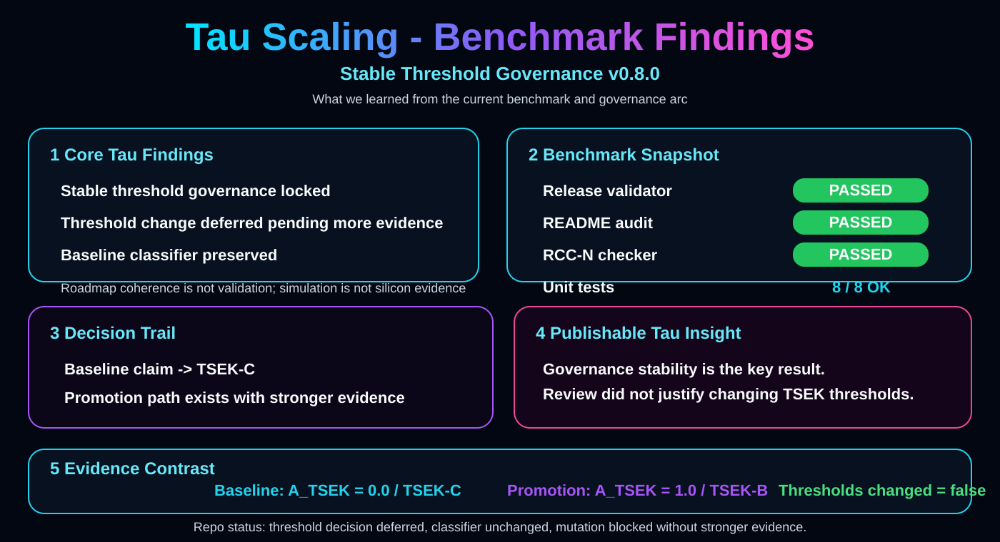

# Tau Scaling - Evidence-Gated Tau-Claim Runtime


Repository: `tau-scaling`  
Package / CLI: `tau_scaling` / `tau-scaling`  
Current checkpoint: **TAU-SCALING-SA v0.9.1 - Manuscript Draft Scaffold**  
Previous seal: **TAU-SCALING-SA v0.9.0 - Public Research Milestone Package**

Tau Scaling is a local-first, evidence-gated Python runtime for evaluating Tau Scaling claims through structured claim cards, workload declarations, tau vectors, LogicFolding survivability checks, energy / thermal / PDN / PVT gates, TSEK classification, evidence packages, and RCC-N / OMN-style repository navigation.

Core law:

- No workload, no tau claim.
- No baseline, no gain.
- No gates, no validation.
- No evidence, no strong class.

## Current Research Snapshot

This repository is now in the **v0.8 public Tau research spine**.

| Layer | What it answers | Primary output |
|---|---|---|
| v0.8.2 Public Tau Claim Ledger | What are the public Tau claims and current classes? | `reports/tau_claim_ledger/latest_tau_public_claim_ledger.md` |
| v0.8.3 LogicFolding Plausibility Sweep | Under what regimes is LogicFolding plausible or fragile? | `reports/logicfolding_plausibility/latest_logicfolding_plausibility_sweep.md` |
| v0.8.4 Evidence Sufficiency Matrix | What evidence would preserve, promote, downgrade, or reject each claim? | `reports/evidence_sufficiency/latest_evidence_sufficiency_matrix.md` |
| v0.8.4a Release Finding Zero-Finding Repair | Is the repo back to a zero-warning release state? | `reports/release/latest_release_readiness.md` |
| v0.8.4b README IA Compression | Did the README remain readable without weakening RCC-N? | `reports/readme_information_architecture/latest_readme_information_architecture_compression.md` |
| v0.8.4c Nexus Surface Sync Polish | Are current report surfaces mirrored into the Nexus directory spine? | `reports/nexus_surface_sync/latest_nexus_surface_sync_polish.md` |
| v0.8.5 Public Source Ledger | Which source category produced each claim, and how far can it carry the claim? | `reports/public_source_ledger/latest_public_source_ledger.md` |
| v0.8.6 Source Evidence Intake Cards | What exact source fields must be filled before claims can be reviewed? | `reports/source_evidence_intake/latest_source_evidence_intake_cards.md` |
| v0.8.6a README Render Spacing Polish | Did the public README render cleanly after source-intake insertion? | `reports/readme_render_spacing/latest_readme_render_spacing_polish.md` |
| v0.8.7 Primary Source Intake Queue | Which source records are ready to be manually populated and confirmed? | `reports/primary_source_intake/latest_primary_source_intake_queue.md` |
| v0.8.8 Public Source Population Pass | What public sources can populate the queue without claiming primary validation? | `reports/public_source_population/latest_public_source_population_pass.md` |
| v0.8.9 Primary Source Gap Review | What primary and independent validation is still missing? | `reports/primary_source_gap_review/latest_primary_source_gap_review.md` |
| v0.9.0 Public Research Milestone Package | What publishable package summarizes the v0.8 public Tau research spine? | `reports/public_research_milestone/latest_public_research_milestone.md` |
| v0.9.1 Manuscript Draft Scaffold | What paper-style draft is generated from the public research package? | `docs/manuscript/tau_scaling_public_claim_system_v0_9_1.md` |

Current public finding: Tau Scaling can be studied as an evidence-gated claim system. Public claims can be separated into methodology, reported metrics, roadmap projections, topology arguments, and independent evidence.

| Finding | Current result |
|---|---:|
| Public Tau claims | 8 |
| TSEK-A public claims | 0 |
| TSEK-B public claims | 0 |
| TSEK-C public claims | 6 |
| TSEK-D public claims | 2 |
| TSEK-E public claims | 0 |
| Average missing evidence gates | 6.375 |
| Evidence sufficiency average score | 0.375 |
| LogicFolding aggressive best-case prior | 100.0% joint pass |
| LogicFolding conservative public prior | 0.0% joint pass |
| Release findings | 0 |

Interpretation: LogicFolding is conditionally plausible, not automatically validated. The repo can test plausibility and evidence sufficiency; it does not validate Huawei silicon, products, manufacturing capability, process-node equivalence, benchmark superiority, or universal Tau Scaling law.

## Evidence Sufficiency Matrix v0.8.4

This layer converts public Tau claim classes into explicit promotion and downgrade requirements.

- TSEK-C is not failure; it means evidence is structurally plausible but incomplete.
- TSEK-B requires declared workload, baseline, method, and companion gate evidence.
- TSEK-A requires independent reproduction, measurement protocol, uncertainty bounds, and negative controls.
- TSEK-D/E pressure appears when roadmap, density, timing, or topology claims are treated as stronger than disclosed evidence permits.

Primary outputs:

- `reports/evidence_sufficiency/latest_evidence_sufficiency_matrix.md`
- `reports/evidence_sufficiency/latest_evidence_sufficiency_matrix.json`
- `reports/evidence_sufficiency/claim_matrices/`
- `visuals/evidence_sufficiency/v0_8_4/`

Boundary: evidence sufficiency matrices define promotion conditions only. They do not promote claims, mutate thresholds, validate silicon, validate products, prove benchmark superiority, or establish a universal Tau Scaling law.

## Public Source Ledger / Claim Provenance Map v0.8.5

This layer maps each public Tau claim to a source category, source-carry boundary, allowed carry, blocked carry, and promotion blockers.

Primary outputs:

- `reports/public_source_ledger/latest_public_source_ledger.md`
- `reports/public_source_ledger/latest_public_source_ledger.json`
- `reports/public_source_ledger/claim_sources/`
- `visuals/public_source_ledger/v0_8_5/`
- `docs/reflection/law_of_sufficient_form_v0_8_5.md`

Source categories:

- methodology_claim
- reported_metric
- roadmap_projection
- media_interpretation
- architecture_interpretation
- independent_evidence
- unknown_or_unresolved

Boundary: source provenance maps source-carry boundaries only. It does not promote claims, validate silicon, validate products, prove benchmark superiority, or establish a universal Tau Scaling law.

## Source Evidence Intake Cards v0.8.6

This layer converts source provenance into concrete source-intake cards. Every public Tau claim receives a card requiring source URL/citation, source type, publication/disclosure metadata, extracted claim or bounded paraphrase, allowed carry, blocked carry, and independent-evidence requirements.

Primary outputs:

- `reports/source_evidence_intake/latest_source_evidence_intake_cards.md`
- `reports/source_evidence_intake/latest_source_evidence_intake_cards.json`
- `reports/source_evidence_intake/cards/`
- `visuals/source_evidence_intake/v0_8_6/`

Boundary: source evidence intake cards are templates for source discipline. They do not promote claims, validate silicon, validate products, prove benchmark superiority, or establish a universal Tau Scaling law.

## Primary Source Intake Queue v0.8.7

This layer creates a governed manual queue for filling v0.8.6 source-intake cards with actual primary-source details. It intentionally does not invent URLs, scrape sources, or promote claims.

Primary outputs:

- `sources/primary_source_intake/source_seed_manifest_v0_8_7.json`
- `reports/primary_source_intake/latest_primary_source_intake_queue.md`
- `reports/primary_source_intake/latest_primary_source_intake_queue.json`
- `visuals/primary_source_intake/v0_8_7/`

Boundary: primary source intake queueing prepares source population only. It does not validate sources, promote claims, validate silicon, validate products, prove benchmark superiority, or establish a universal Tau Scaling law.

## Public Source Population Pass v0.8.8

This layer populates the v0.8.7 intake queue with bounded public source records. The initial source pool is treated as public secondary-source evidence unless a record explicitly marks `primary_source_confirmed: true`.

Primary outputs:

- `sources/primary_source_intake/source_population_manifest_v0_8_8.json`
- `reports/public_source_population/latest_public_source_population_pass.md`
- `reports/public_source_population/latest_public_source_population_pass.json`
- `visuals/public_source_population/v0_8_8/`

Boundary: source population is not source validation. Source validation is not claim promotion. Claim promotion requires evidence gates, independent support, and explicit review.

## Primary Source Validation Gap Review v0.8.9

This layer converts source population into a publishable validation-gap review. It asks what first-party, formal, or independent evidence is still missing before any public Tau claim can be reviewed for promotion.

Primary outputs:

- `reports/primary_source_gap_review/latest_primary_source_gap_review.md`
- `reports/primary_source_gap_review/latest_primary_source_gap_review.json`
- `reports/publishable_findings/latest_publishable_findings_brief.md`
- `visuals/primary_source_gap_review/v0_8_9/`

Publishable boundary: the current result is publishable as evidence-governance and source-provenance analysis. It is not silicon validation, product validation, benchmark superiority, or proof of a universal Tau Scaling law.

## Public Research Milestone Package v0.9.0

This layer packages the full v0.8 public Tau research spine into a release-quality research artifact.

Primary outputs:

- `releases/public_research_milestone_v0_9_0/README.md`
- `releases/public_research_milestone_v0_9_0/public_research_milestone_manifest_v0_9_0.json`
- `reports/public_research_milestone/latest_public_research_milestone.md`
- `reports/publishable_findings/latest_publishable_findings_brief.md`
- `visuals/public_research_milestone/v0_9_0/public_research_milestone.svg`

Publishable boundary: this is publishable as a repository-based evidence-governance and source-provenance artifact. It is not silicon validation, product validation, benchmark superiority, process-node equivalence, or proof of a universal Tau Scaling law.

## Manuscript Draft Scaffold v0.9.1

This layer converts the v0.9.0 public research milestone package into a paper-style manuscript scaffold.

Primary outputs:

- `docs/manuscript/tau_scaling_public_claim_system_v0_9_1.md`
- `docs/manuscript/tau_scaling_public_claim_system_v0_9_1.tex`
- `reports/manuscript_draft/latest_manuscript_draft_scaffold.md`
- `visuals/manuscript_draft/v0_9_1/manuscript_draft_scaffold.svg`

Publishable boundary: the manuscript is a source-provenance and evidence-governance draft. It is not silicon validation, product validation, benchmark superiority, process-node equivalence, or proof of a universal Tau Scaling law.
## Tau Doctrine Alignment

- Time is the shared metric, not automatic proof.
- Topology helps only when overheads are dominated.
- Industrial roadmap coherence is not independent validation.
- Energy, thermal, yield, PDN/PVT, workload, and method data are required.

These rules align the software runtime with TSEK v1.3: tau is treated as a cross-layer claim object that must survive workload, gate, method, and evidence constraints before promotion.

## Reflection: Law of Sufficient Form

> When enough governed form is in place, structure begins to hold itself.

Operational form: A system becomes self-stabilizing when its claims, evidence, routing, validation, memory, and non-claim locks are all visible to both humans and agents.

This reflection is part of the repository's operating memory. It can be expanded occasionally as the system matures, but it must remain bounded: reflection names process insight; it does not replace validation, evidence, source provenance, or non-claim locks.

Primary reflection surface:

- `docs/reflection/law_of_sufficient_form_v0_8_5.md`

## Human Director Box

### What this repository is

This repo is a governed claim-evaluation workbench:

claim -> source boundary -> claim card -> workload profile -> tau vector -> baseline/candidate manifests -> LogicFolding survivability -> energy/thermal/PDN/PVT gates -> TSEK classifier -> evidence package -> reports/ledgers/visuals -> release manifest

### What this repository is not

This repo does **not** independently validate silicon, Huawei product metrics, manufacturing capability, benchmark superiority, process-node equivalence, investment value, or a universal Tau Scaling law. It is a local runtime for evidence discipline and claim classification.

## Current Public Metrics

| Surface | Result |
|---|---:|
| Current checkpoint | TAU-SCALING-SA v0.9.1 |
| Release validator | passing / findings 0 / step failures 0 |
| README mini repo audit | passing / 0 warnings |
| RCC-N checker | passing / 0 warnings |
| Unit tests | 8 OK |
| Benchmark harness | 12 runs / 12 unique IDs / 0 duplicates |
| Public Tau claim ledger | `reports/tau_claim_ledger/latest_tau_public_claim_ledger.md` |
| LogicFolding plausibility sweep | `reports/logicfolding_plausibility/latest_logicfolding_plausibility_sweep.md` |
| Evidence sufficiency matrix | `reports/evidence_sufficiency/latest_evidence_sufficiency_matrix.md` |
| Law of Sufficient Form | `docs/reflection/law_of_sufficient_form_v0_8_5.md` |
| Source ledger visual | `visuals/public_source_ledger/v0_8_5/public_source_ledger.svg` |
| Public source ledger | `reports/public_source_ledger/latest_public_source_ledger.md` |
| Source evidence intake visual | `visuals/source_evidence_intake/v0_8_6/source_evidence_intake_cards.svg` |
| Source evidence intake cards | `reports/source_evidence_intake/latest_source_evidence_intake_cards.md` |
| Primary source intake visual | `visuals/primary_source_intake/v0_8_7/primary_source_intake_queue.svg` |
| Primary source intake manifest | `sources/primary_source_intake/source_seed_manifest_v0_8_7.json` |
| Primary source intake queue | `reports/primary_source_intake/latest_primary_source_intake_queue.md` |
| Public source population manifest | `sources/primary_source_intake/source_population_manifest_v0_8_8.json` |
| Public source population pass | `reports/public_source_population/latest_public_source_population_pass.md` |
| Publishable findings brief | `reports/publishable_findings/latest_publishable_findings_brief.md` |
| Public research milestone visual | `visuals/public_research_milestone/v0_9_0/public_research_milestone.svg` |
| Public research milestone release | `releases/public_research_milestone_v0_9_0/README.md` |
| Public research milestone package | `reports/public_research_milestone/latest_public_research_milestone.md` |
| Manuscript LaTeX | `docs/manuscript/tau_scaling_public_claim_system_v0_9_1.tex` |
| Manuscript Markdown | `docs/manuscript/tau_scaling_public_claim_system_v0_9_1.md` |
| Manuscript draft scaffold | `reports/manuscript_draft/latest_manuscript_draft_scaffold.md` |
| Primary source gap review | `reports/primary_source_gap_review/latest_primary_source_gap_review.md` |
| README render spacing polish | `reports/readme_render_spacing/latest_readme_render_spacing_polish.md` |
| Evidence sufficiency visual | `visuals/evidence_sufficiency/v0_8_4/evidence_sufficiency_matrix.svg` |
| Release readiness report | `reports/release/latest_release_readiness.md` |
| Nexus surface sync polish | `reports/nexus_surface_sync/latest_nexus_surface_sync_polish.md` |
| README IA compression | `reports/readme_information_architecture/latest_readme_information_architecture_compression.md` |
| Claim status | local runtime evidence + benchmark observability only |

## Quick Start

### Essential validation

```powershell
cd "C:\Users\jacks\OneDrive\Desktop\tau-scaling"
.\.venv\Scripts\Activate.ps1

python scripts/release/validate_release.py
python scripts/rcc/audit_readme_surface.py
python scripts/rcc/check_rcc_nexus.py
python -m unittest discover -s tests
```

### Current research generators

```powershell
python scripts/benchmarks/generate_tau_public_claim_ledger.py
python scripts/benchmarks/run_logicfolding_plausibility_sweep.py
python scripts/benchmarks/generate_evidence_sufficiency_matrix.py
python scripts/benchmarks/generate_public_source_ledger.py
python scripts/benchmarks/generate_source_evidence_intake_cards.py
python scripts/benchmarks/run_primary_source_intake_queue.py
python scripts/benchmarks/populate_public_source_intake_v0_8_8.py
python scripts/benchmarks/generate_primary_source_gap_review_v0_8_9.py
python scripts/release/build_public_research_milestone_v0_9_0.py
python scripts/release/build_manuscript_draft_scaffold_v0_9_1.py
```

### Baseline claim checks

```powershell
python -m tau_scaling run-claim --seed configs/seeds/logicfolding_claim_card.json
python -m tau_scaling run-claim --seed configs/seeds/logicfolding_promotion_path_claim_card.json
```

For historical benchmark commands, use the benchmark atlas and release lineage instead of expanding the root README into a command archive.

## Repository Layers

| Layer | Purpose | Main paths |
|---|---|---|
| Tau Scaling runtime | Executes claim cards, gates, classifier, evidence emission | `src/tau_scaling/`, `configs/seeds/`, `tests/` |
| Public Tau claim research | Claim ledger, LogicFolding sweep, evidence sufficiency matrix | `claims/public_tau/`, `reports/tau_claim_ledger/`, `reports/logicfolding_plausibility/`, `reports/evidence_sufficiency/` |
| RCC-N navigation | Makes the repo self-locating for humans and AI agents | `rcc/nexus/`, `docs/context/`, folder `README.md` files |
| Benchmark and evidence observability | Runs local benchmark loops and evidence package checks | `scripts/benchmarks/`, `reports/benchmarks/`, `artifacts/runs/` |
| Unified release readiness | Runs the full release gate before experiments | `scripts/release/`, `reports/release/` |
| Codex documentation shell | Records source boundaries, releases, architecture, non-claim locks | `docs/`, `reports/`, `releases/`, `visuals/` |

## Public Tau Claim Ledger v0.8.2

The repo begins source-bounded Tau Scaling research by turning public claims into explicit claim cards and a ledger.

Primary outputs:

- `claims/public_tau/`
- `reports/tau_claim_ledger/latest_tau_public_claim_ledger.md`
- `visuals/tau_claim_ledger/v0_8_2/`

Current public Tau claim status:

| TSEK class | Count |
|---|---:|
| TSEK-A | 0 |
| TSEK-B | 0 |
| TSEK-C | 6 |
| TSEK-D | 2 |
| TSEK-E | 0 |

Boundary: this ledger classifies disclosed evidence only. It does not validate silicon, products, manufacturing, process nodes, benchmark superiority, or universal Tau Scaling law.

## Benchmark Finding - Stable Tau Threshold Governance v0.8.0



The publishable result is **not** that Tau Scaling is independently validated. The publishable result is that Tau Scaling can be operationalized as an evidence-gated claim-governance runtime.

Current benchmark finding:

- Baseline claim remains TSEK-C.
- Promotion-path seed can reach TSEK-B with stronger disclosed evidence.
- v0.8.0 deferred threshold changes pending more evidence.
- No classifier mutation occurred.
- No threshold mutation occurred.
- This is local runtime governance, not silicon/product validation.

Publication lock phrase: **defer threshold change pending more evidence**.

## Historical Report Archive

The full historical chain remains available, but the root README now keeps only the current research spine and navigation essentials.

| Archive surface | Use |
|---|---|
| `docs/benchmarks/benchmark_atlas.md` | Historical benchmark and chart registry |
| `reports/readme_information_architecture/` | README information architecture compression reports |
| `reports/readme_render_spacing/` | README render-spacing polish reports |
| `docs/release_notes/` | Versioned release notes |
| `docs/reflection/` | Reflection notes including the Law of Sufficient Form |
| `reports/stable_tau_threshold_governance/` | v0.8.0 stable threshold milestone |
| `reports/threshold_governance_summary/` | v0.7.x threshold summary |
| `reports/approval_corridor/` | v0.6-v0.7 approval-governance corridor |
| `reports/release/latest_release_readiness.md` | Current release readiness report |
| `reports/readme/latest_readme_mini_repo_audit.md` | Current README / mini repo audit |
| `reports/rcc_nexus/latest_rcc_nexus_check.md` | Current RCC-N navigation check |
| `reports/nexus_surface_sync/latest_nexus_surface_sync_polish.md` | Nexus surface sync polish report |
| `docs/reflection/law_of_sufficient_form_v0_8_5.md` | Law of Sufficient Form reflection |
| `reports/public_source_ledger/latest_public_source_ledger.md` | Public source ledger and claim provenance map |
| `reports/source_evidence_intake/latest_source_evidence_intake_cards.md` | Source evidence intake card report |
| `reports/primary_source_intake/latest_primary_source_intake_queue.md` | Primary source intake queue report |
| `reports/public_source_population/latest_public_source_population_pass.md` | Public source population report |
| `reports/publishable_findings/latest_publishable_findings_brief.md` | Evidence-bounded publishable findings brief |
| `reports/public_research_milestone/latest_public_research_milestone.md` | Public research milestone package summary |
| `reports/manuscript_draft/latest_manuscript_draft_scaffold.md` | Manuscript draft scaffold report |
| `reports/primary_source_gap_review/latest_primary_source_gap_review.md` | Primary source validation gap review |
| `reports/readme_render_spacing/latest_readme_render_spacing_polish.md` | README render spacing polish report |
| `reports/readme_information_architecture/latest_readme_information_architecture_compression.md` | README IA compression report |
| `reports/evidence_sufficiency/latest_evidence_sufficiency_matrix.md` | Current evidence sufficiency matrix |

Historical detail should live in archive reports and mini READMEs, not in the root README body.

## PART I - Human README

### What Tau Scaling Tests

| Seed / surface | Purpose |
|---|---|
| `logicfolding_claim_card.json` | Tests global LogicFolding survivability and downgrade behavior. |
| `logicfolding_promotion_path_claim_card.json` | Demonstrates the evidence-promotion path to TSEK-B without weakening gates. |
| `edge_surface_boundary_toy.json` | Tests edge-bound resource starvation vs. surface-coupled scaling. |
| `gamma_tau_etp_toy.json` | Tests energy / thermal / PDN-normalized tau gain. |
| `monte_carlo_stress_toy.json` | Tests checker sensitivity under synthetic priors. |
| `codex_tau_vector_toy.json` | Tests Codex governance-latency analogy while preserving physical non-equivalence. |

Tau Scaling rewards bounded evidence emission, not confident overclaiming.

### Evidence Artifacts

Primary runtime artifacts are written under:

```
artifacts/runs/<unique-run-id>/
artifacts/runs/latest/
```

Mirrored evidence surfaces are written under:

```
outputs/evidence/
outputs/reports/
outputs/plots/
outputs/ledger/
```

Release and validation surfaces are written under:

```
releases/
reports/rcc_nexus/
reports/architecture/
reports/readme/
reports/benchmarks/
docs/benchmarks/
```

## PART II - RCC Nexus README

### RCC Nexus Identity

RCC tells the agent what the repository means.  
RCC-N tells the agent where it is.  
Validation tells the agent whether reality agreed.

### Repository Sphere

| Shell | Meaning |
|---|---|
| center | Source boundary, non-claim locks, architecture, context indexes. |
| inner | Runtime primitives: claim cards, tau vectors, gate records, schemas. |
| middle | Processes: CLI flow, examples, tests, scripts, checker workflows. |
| outer | Evidence / reflection: artifacts, outputs, ledgers, reports, visuals, release notes. |

### Nexus Meridians

`source`, `validation`, `evidence`, `drift`, `agent`, `safety`, `runtime`, `tau`, `release`, `documentation`

### Nexus Sectors

`core`, `schemas`, `tau`, `runtime`, `validation`, `evidence`, `rcc`, `agent`, `examples`, `release`

### Primary Nexus Files

| File | Role |
|---|---|
| `docs/context/repository_context_index.json` | Repository meaning map. |
| `docs/context/rcc_nexus_index.json` | Nexus route and coverage index. |
| `docs/context/validation_surface.md` | Validation commands and claim boundaries. |
| `rcc/nexus/README.md` | RCC-N local orientation. |
| `rcc/nexus/rcc_nexus_protocol.md` | Nexus protocol. |
| `rcc/nexus/route_map.json` | Machine-readable routing map. |
| `rcc/nexus/task_routing_matrix.md` | Task-to-validation routing. |
| `rcc/nexus/echo_location_template.md` | Mini README Echo Location template. |
| `rcc/nexus/agent_handoff_contract.md` | Agent handoff rules. |
| `scripts/rcc/check_rcc_nexus.py` | RCC-N checker. |
| `scripts/rcc/audit_readme_surface.py` | README / mini repo audit scanner. |
| `scripts/release/validate_release.py` | Unified release-readiness validator. |
| `reports/rcc_nexus/latest_rcc_nexus_check.md` | Latest RCC-N report. |
| `reports/readme/latest_readme_mini_repo_audit.md` | Latest README / mini repo audit report. |
| `reports/release/latest_release_readiness.md` | Latest unified release-readiness report. |

### RCC Nexus Echo Location

| Field | Value |
|---|---|
| Shell | center |
| Meridians | source, safety, agent, runtime, evidence |
| Sector | rcc |
| Version / TTL | RCC-N-v1.7 / 180 days |
| Last verified | 2026-05-28 |
| Local role | Root orientation surface for humans, RCC Nexus navigation, and AI agents. |

### RCC-N Status

The Nexus is working when the following command passes with zero warnings:

```powershell
python scripts/rcc/check_rcc_nexus.py
```

Expected current state:

```
passed: true
errors: 0
warnings: 0
mini_readme_coverage: 1.0
major_dirs_checked: 25
```

RCC-N checks repository navigation and context integrity. It does not prove code correctness, patch safety, independent silicon validation, product performance, process-node equivalence, AI understanding, or production readiness.

## PART III - AI Agent README

### AI Operating Contract

Before editing, an AI agent must read:

1. `README.md`
2. `README_90_SECONDS.md`
3. `AGENTS.md`
4. `docs/context/repository_context_index.json`
5. `docs/context/rcc_nexus_index.json`
6. `rcc/nexus/route_map.json`
7. the target folder `README.md`
8. relevant source and tests

After editing, run the validation command associated with the changed surface.

### Patch Routing Matrix

| Change type | Read first | Validate |
|---|---|---|
| Runtime patch | `src/tau_scaling/README.md`, `tests/` | compile + import + unit tests + baseline/promotion claims |
| Claim classifier patch | `src/tau_scaling/claims/README.md`, latest evidence | baseline/promotion claims + evidence package check |
| RCC docs patch | `README.md`, `docs/context/`, `rcc/nexus/` | `python scripts/rcc/check_rcc_nexus.py` |
| README / mini README patch | `README.md`, target mini README, route maps | `python scripts/rcc/audit_readme_surface.py` |
| Architecture docs patch | `docs/software_architecture/`, `docs/architecture/` | `python scripts/validation/validate_architecture_contracts.py` |
| Directory structure patch | root README directory box, affected mini READMEs, context indexes | RCC-N + README audit + architecture + tests |
| Release / benchmark patch | `releases/`, `docs/benchmarks/`, `reports/benchmarks/`, `reports/release/` | `python scripts/release/validate_release.py` |
| Synthetic gate test patch | `configs/seeds/tests/`, `reports/gates/`, `tests/`, `src/tau_scaling/gates/` | `python scripts/release/validate_release.py` + gate suite |
| Public claim replay patch | `configs/seeds/public_claims/`, `reports/public_claims/`, source boundary docs | release validator + claim replay report |
| Agent contract patch | `AGENTS.md`, `rcc/nexus/task_routing_matrix.md`, route map, README | README audit + release validator |

## README + Mini Repo Audit Map

This section tells AI agents exactly where to scan for gaps before editing or declaring the repository healthy.

### Audit Purpose

The repository is considered healthy only when its public surfaces, folder-level mini READMEs, route maps, validation reports, runtime checks, and benchmark evidence agree.

A patch is incomplete if it changes code, folders, benchmarks, reports, claim seeds, release state, or documentation meaning without updating the matching README and mini README surfaces.

### Required Gap Scan Order

| Scan step | Surface | What to check |
|---:|---|---|
| 1 | `README.md` | Current checkpoint, metrics, lineage, validation commands, non-claim locks, directory box, and AI rules. |
| 2 | `AGENTS.md` | Agent entry order, patch discipline, and validation expectations. |
| 3 | `README_90_SECONDS.md` | Compressed onboarding is not stale. |
| 4 | `docs/context/repository_context_index.json` | Repo meaning and route descriptions. |
| 5 | `docs/context/rcc_nexus_index.json` | Nexus shell/meridian/sector mapping. |
| 6 | `rcc/nexus/route_map.json` | Task routing and target surfaces. |
| 7 | `rcc/nexus/task_routing_matrix.md` | Human-readable task routing. |
| 8 | Target folder `README.md` | Local folder role, inputs, outputs, and validation command. |
| 9 | Sibling mini READMEs | Adjacent surfaces if routing or folder meaning changed. |
| 10 | Latest reports | `reports/rcc_nexus/`, `reports/architecture/`, `reports/readme/`, `reports/benchmarks/`, and `reports/release/`. |

### Gap Classes the AI Must Detect

| Gap class | Detection question | Required repair |
|---|---|---|
| README drift | Does the root README describe the current repo state? | Patch checkpoint, metrics, lineage, commands, and directory box. |
| Mini README drift | Did a folder change without its README changing? | Patch the affected folder README. |
| Route drift | Did task routing or folder purpose change? | Patch context indexes and route maps. |
| Validation drift | Do public claims lack fresh validation reports? | Rerun validation and refresh reports. |
| Runtime drift | Did Python code change without compile/import/test proof? | Run compile, import, tests, claims, and benchmarks. |
| Benchmark drift | Did benchmark behavior change without benchmark reports? | Rerun benchmark harness and update reports. |
| Evidence drift | Could one run overwrite another? | Verify collision-proof run IDs and latest evidence package. |
| Claim drift | Does language imply stronger proof than evidence allows? | Restore downgrade wording and non-claim locks. |
| Encoding drift | Do headings, arrows, paths, or code fences show mojibake? | Rewrite affected README surfaces using UTF-8 and ASCII-safe syntax unless Unicode is required by an audit anchor. |

### Executable README / Mini Repo Audit

Run:

```powershell
python scripts/rcc/audit_readme_surface.py
```

Expected pass:

```
passed: true
errors: 0
warnings: 0
```

Primary outputs:

```
reports/readme/latest_readme_mini_repo_audit.json
reports/readme/latest_readme_mini_repo_audit.md
```

### AI Failure Learning Rule

When a failure occurs, do not only patch the failing line. Add the lesson to the relevant public surface:

| Failure type | Also update |
|---|---|
| README/RCC drift | `README.md`, target mini README, `reports/readme/` |
| Runtime syntax failure | `README.md` AI learning ledger, `src/tau_scaling/core/README.md`, tests |
| Benchmark failure | `reports/benchmarks/README.md`, benchmark report, README metrics |
| Route/context failure | `rcc/nexus/README.md`, route map, context indexes |
| Encoding failure | README backup, README cleanup release note, and audit-visible anchor test |
| Claim overreach | README non-claim locks, claim card notes, release note |

Non-claim lock: README audits and mini repo audits improve context alignment. They do not prove runtime correctness, silicon validation, product validation, manufacturing validation, process-node equivalence, or universal Tau Scaling law.

### Required Validation

```powershell
python -m py_compile src/tau_scaling/core/runtime.py
python -c "from tau_scaling.core.runtime import TauScalingRuntime; print('TauScalingRuntime import OK')"
python scripts/rcc/check_rcc_nexus.py
python scripts/rcc/audit_readme_surface.py
python scripts/validation/validate_architecture_contracts.py
python -m unittest discover -s tests
python scripts/benchmarks/run_tau_scaling_benchmarks.py
python -m tau_scaling run-claim --seed configs/seeds/logicfolding_claim_card.json
python -m tau_scaling run-claim --seed configs/seeds/logicfolding_promotion_path_claim_card.json
python scripts/release/validate_release.py
```

## AI Failure Learning Ledger

This section is part of the repository's operating memory. When a patch fails, the failure must be compressed into a durable lesson so the next AI or human maintainer does not repeat it.

### Current Lessons

| Lesson ID | Failure observed | Root cause | Permanent rule |
|---|---|---|---|
| L-001 | RCC-N passed while runtime syntax was broken. | RCC-N validates navigation and context, not Python execution. | Runtime patches must run `py_compile`, import checks, unit tests, and CLI claims. |
| L-002 | Architecture validator passed while runtime syntax was broken. | Architecture validation checks contract surfaces, not executable behavior. | Architecture pass is necessary but never sufficient for release readiness. |
| L-003 | v0.3.2 introduced a concatenated import line. | Script patching merged two Python imports into one invalid statement. | Generated code patches must be compile-checked before any commit. |
| L-004 | v0.3.2a left a literal PowerShell backtick newline inside Python. | PowerShell string escaping injected raw escape text instead of an actual newline. | Scripts that patch code must avoid raw escape residue and must compile the patched file. |
| L-005 | Back-to-back baseline and promotion runs originally shared second-level run IDs. | Timestamp identity had insufficient granularity. | Run identity must use microsecond/token uniqueness and filesystem collision guards. |
| L-006 | Early v0.3.2 status text said complete even when validation failed. | Script wrote completion status after failed checks without hard stop semantics. | Failed validation must produce a failure status, not a completion seal. |
| L-007 | Benchmark evidence could be confused with product evidence. | Local runtime benchmarks can look stronger than their claim boundary. | Benchmark reports must state: local-runtime evidence only, not silicon/product validation. |
| L-008 | README audit failed on a visually correct AI Rule heading. | The heading used the wrong dash/encoding variant. | Audit-visible anchors must be written with exact expected Unicode or ASCII tokens. |
| L-009 | README became mojibake-contaminated after repeated Unicode patching. | Mixed console encodings and repeated copy/paste repair passes corrupted Unicode arrows/dashes/code blocks. | Public README should prefer ASCII-safe syntax except for explicitly audited Unicode anchors. |
| L-010 | v0.3.3 release validator passed with one non-blocking finding. | Release readiness can be true while warning-level readability/risk findings remain. | Passing release readiness must still be inspected before the next experimental layer. |
| L-011 | README release-state drift recurred after v0.3.3. | The release validator was added and pushed before the public README was fully synchronized. | Every release patch must update README checkpoint, metrics, lineage, next target, and process rules before promotion. |
| L-012 | v0.3.3b repair failed when pasted line by line. | PowerShell line wrapping split paths such as `reports\\readme` and `scripts\\release`. | Large scripts must be run from downloaded `.ps1` files using `powershell -ExecutionPolicy Bypass -File ...`. |
| L-013 | v0.3.3c README had out-of-order release lineage. | Emergency repair appended rows without chronological normalization. | Release lineage and lesson ledgers must be ordered before push. |
| L-014 | README contract became more advanced than AGENTS.md and task routing matrix. | Human-facing Nexus evolved faster than agent-facing operating contract. | Agent contracts and routing matrices must be synchronized before experiments begin. |
| L-015 | v0.4.0 synthetic suite generated charts but failed Markdown rendering. | The report renderer tried to make visual paths relative to `reports/benchmarks/v0_4_0`, although visuals live outside that subtree. | Benchmark reports must use repo-root-safe relative links for visuals, and failed synthetic-suite runs must be repaired before being treated as complete. |
| L-016 | v0.4.0a synthetic suite completed reports but one scenario failed. | The multi-gate stress seed expected TSEK-D even though the classifier correctly returns TSEK-E when only one of eleven hard gates survives. | Synthetic test expectations must be calibrated to the classifier algebra; incomplete suites must exit non-zero. |
| L-017 | Benchmark charts existed, but the README did not yet provide a versioned chart/finding atlas. | Visual evidence was distributed across reports and visuals folders without one public navigation surface per version. | Every benchmark version must maintain a benchmark atlas with chart registry, finding registry, version ledger, and non-claim boundary. |
| L-018 | v0.4.0c benchmark atlas passed but README audit found two warnings. | `docs/benchmarks/README.md` and `reports/benchmarks/README.md` lacked explicit AI/RCC update guidance. | Every benchmark mini README must include an AI/RCC update rule when benchmark charts, reports, or interpretation surfaces change. |
| L-019 | v0.4.0d attempted AI/RCC mini README repair but audit still reported two warnings. | The audit script searches exact tokens such as `README Update Rule`; the added heading `AI / RCC Update Rule` was semantically correct but not audit-recognized. | Mini README repair patches must use exact audit-visible anchor phrases, not merely equivalent wording. |
| L-020 | After v0.4.0e, README checkpoint advanced while AGENTS.md and task_routing_matrix.md still identified v0.3.3e. | Fast benchmark/readme repair layers advanced human-facing state faster than agent-facing contracts. | Every release-like change must re-sync AGENTS.md, task_routing_matrix.md, and route surfaces to the current checkpoint before the next experiment. |
| L-021 | v0.4.2 showed every paired hard-gate failure classified as TSEK-C. | The current classifier treats paired missing gates as controlled downgrade unless overclaim or severe collapse forces TSEK-E. | Do not harden classifier thresholds until explanation cards classify whether pair-policy behavior is expected, suspicious, or promotion-repairable. |
| L-022 | v0.4.3 produced 55 `review_pair_policy` cards and 1 `hard_reject_without_finding` card. | Explanation cards successfully exposed classifier-policy questions without mutating classifier behavior. | Pair-policy changes must pass through a non-enforcing policy review layer and then a dry-run simulator before classifier enforcement. |
| L-023 | v0.4.4 created policy candidates but the repo still needed a way to turn outputs into improvement priorities. | Validation, benchmark, explanation, and policy reports were readable, but not yet synthesized into a feedback surface for the next agent. | Every mature runtime should emit a Nexus feedback report that ranks improvement targets without mutating classifier behavior. |
| L-024 | v0.4.5 feedback emitted correct priorities but `health_passed` was false because it read validation surfaces before the final validators refreshed. | Reflective feedback can be logically correct while its health score is stale relative to the final seal. | Run prerequisite validators before Nexus feedback, then run Nexus feedback, then run final validators again before commit/push. |
| L-025 | v0.4.5a proved ordering was correct but `health_passed` stayed false. | The feedback scorer expected numeric `findings`, numeric `step_failures`, and top-level `total_points`, while actual reports used lists and `results`. | Feedback health checks must normalize report schemas before scoring; schema mismatch is not validation failure. |
| L-026 | v0.4.5b changed the feedback schema label but `health_score` still used the old comparisons. | Regex patching did not replace the intended function body, so labels advanced faster than executable logic. | Function repairs must verify the target function body changed, not just schema strings or docs. |
| L-027 | v0.4.5c repaired list counters but `sensitivity_sweep` still failed health scoring. | The persisted sensitivity JSON used `chart_paths` while the feedback health scorer checked only `chart_count`. | Feedback health scoring must normalize both count fields and evidence-list fields such as chart_paths. |
| L-028 | Nexus feedback v0.4.5d reached health 1.0 and ranked pair-policy pressure as the top next target. | Policy review pressure should not mutate the classifier directly. | Any classifier-policy change must first pass a dry-run simulator comparing current class vs simulated policy class. |
| L-029 | v0.4.6 produced 9 drift cases but drift alone is not an enforcement decision. | A dry-run simulator can show impact without explaining whether each impact is justified. | Any simulated classifier drift must receive an impact explanation card before enforcement is considered. |
| L-030 | v0.4.7 generated impact cards, but impact cards alone do not authorize classifier mutation. | Explanation artifacts identify drift reasons; they do not decide enforcement readiness. | Simulated policy impacts must be converted into a decision record with mutation_allowed=false until regression and over-penalty review pass. |
| L-031 | v0.4.8 approved six drift cases for regression review, but approval-for-review is not approval-for-enforcement. | Decision records classify readiness for review, not readiness for mutation. | Controlled downgrade candidates must pass regression and over-penalty review before any classifier enforcement candidate is allowed. |
| L-032 | v0.4.9 showed that all six controlled downgrade candidates triggered over-penalty review. | A review gate that blocks every candidate may indicate true policy harshness or heuristic over-sensitivity. | When regression review blocks every candidate, do not proceed to enforcement design; first promote the blocked state into a major enforcement-readiness gate with all mutation disabled. |
| L-033 | v0.5.0 completed the dry-run through enforcement-readiness chain, but Nexus still ranked the old v0.4.6 dry-run target as active. | A healthy feedback score can still carry stale priorities if completed targets are not retired. | Reflective feedback must retire completed targets and promote the current active blocker, or the repo will keep recommending already-completed work. |
| L-034 | v0.5.1 promoted the active blocker, but a blocker is not actionable until decomposed into causes. | Completed-signal retirement identifies what is next; it does not specify how to remediate the blocker. | When Nexus promotes a blocker, the next layer must convert the blocker into cause-specific remediation cards before any new policy design. |
| L-035 | v0.5.2 showed all blocked candidates were high-support / heuristic-sensitivity cases. | Cause cards identify why a blocker exists, but do not define the next safe work unit. | High-support downgrade pressure must become support-aware negative-control tasks before calibration or policy design. |
| L-036 | v0.5.3 converted all six blocked cases into support-aware negative-control tasks. | Remediation planning is not enough; high-support retention must be tested as a disabled/report-only control. | Before calibration or policy design, high-support downgrade pressure must pass support-aware negative controls with mutation disabled. |
| L-037 | v0.5.4 support-aware negative controls passed 6/6. | Passing support controls permit calibration planning, but not calibration application. | A calibration plan may only be drafted after support-aware controls pass, and it must preserve high-support retention as a hard constraint. |
| L-038 | v0.5.5 selected a report-only calibration threshold, but a threshold is not a classifier change. | Calibration planning can still hide drift unless tested counterfactually. | Any selected calibration threshold must pass report-only counterfactual testing before policy mutation can even be discussed. |
| L-039 | v0.5.6 counterfactuals passed, but a passing counterfactual is not an applied policy. | Successful simulations still need an explicit decision record to prevent silent promotion. | A successful counterfactual must become a decision record before any implementation pathway can be discussed. |
| L-040 | v0.5.7 produced SAFE_FOR_REVIEW_NOT_APPLICATION. | Safe-for-review can be mistaken for safe-for-application unless bundled explicitly. | A candidate that reaches SAFE_FOR_REVIEW_NOT_APPLICATION must be bundled into a review package before any implementation pathway is discussed. |
| L-041 | v0.5.8 produced a review-ready evidence bundle. | Review-ready bundles still require explicit signoff gates to prevent review from being mistaken for application. | A review package must pass a signoff checklist before a candidate branch or implementation pathway is discussed. |
| L-042 | v0.5.9 passed the signoff gate, but signoff readiness is still not branch creation. | A signoff-ready candidate needs an explicit human approval artifact before branch creation or implementation. | Candidate-branch gates must prepare proposals only; branches require explicit human approval and remain non-mutating by default. |
| L-043 | v0.6.0 allowed a branch proposal but confirmed human approval was absent. | Proposal-readiness can be mistaken for replay-readiness unless replay is separately blocked. | Candidate replay harnesses must remain blocked until an explicit human approval artifact exists. |
| L-044 | v0.6.1 correctly blocked replay because no human approval artifact existed. | Blocking replay is useful only if the system provides an explicit approval/denial artifact format. | Approval templates must be created before approval validation; templates alone do not authorize replay, branching, or mutation. |
| L-045 | v0.6.2 created a template, but a template is not approval. | Approval artifacts must be validated before replay can proceed. | Approval validators must reject UNSET/template-only artifacts and keep replay blocked until explicit approval fields pass. |
| L-046 | v0.6.3 rejected template-only approval. | A failed approval validator should produce a blocked replay dry-run rather than silently stopping the lineage. | Approval-gated replay layers must emit explicit blocked reports when approval is invalid, preserving audit continuity without execution. |
| L-047 | v0.6.4 emitted a blocked replay report because approval was invalid. | The system needs fixtures to prove approval, denial, and more-evidence decisions have distinct replay semantics. | Approval fixture validation must prove fixture semantics without treating fixtures as live approvals. |
| L-048 | v0.6.5 validated fixture semantics but fixtures are still not live approval. | Fixture-validity can be mistaken for live-approval validity unless handoff checks enforce path separation. | Live approval handoff must refuse fixtures and require a separate non-fixture live approval artifact before replay is considered. |
| L-049 | v0.6.6 confirmed no live approval existed. | A missing live approval should still reach the executor boundary and prove execution is blocked. | Replay executors must refuse to run when live approval handoff is invalid, emitting a blocked executor report instead of silently stopping. |
| L-050 | v0.6.7 blocked the executor because live approval handoff was invalid. | Repeated blocked execution states should be preserved as continuity evidence, not treated as no-op failures. | Blocked executor states must append to a continuity ledger so future agents can see why execution remained blocked across versions. |
| L-051 | v0.6.8 recorded blocked execution in a continuity ledger. | A ledger can accumulate blocked states without explaining whether the block is still valid or stale. | Blocked-state trend review must classify persistent blocks before continuing toward another execution or approval layer. |
| L-052 | v0.6.9 confirmed the governance block was still valid. | Continuing to add gates after a valid trend review risks ceremonial accumulation. | A completed approval-governance corridor should be packaged as a milestone before returning to core Tau mechanics. |
| L-053 | v0.7.0 sealed the approval-governance corridor. | Once containment is sealed, further progress must return to the object being governed. | Tau mechanics reviews should examine tau vectors, gate algebra, TSEK thresholds, sensitivity behavior, and evidence-card design before adding any new governance gate. |
| L-054 | v0.7.1 identified targeted Tau-mechanics gaps after the approval corridor was sealed. | The next repair should not mutate scoring; it should name and audit tau-vector semantics first. | Tau vector fields must be made explicit before gate algebra or TSEK thresholds are tightened. |
| L-055 | v0.7.2 named tau-vector semantic gaps without changing scoring. | Tau semantics alone are not enough; the next layer must map which gates consume or expose those semantics. | Gate algebra must be mapped before TSEK thresholds or policy penalties are tightened. |
| L-056 | v0.7.3 mapped gate-family visibility and found targeted gate gaps. | Gate mapping still does not authorize threshold changes. | TSEK threshold boundaries must be reviewed and explained before any classifier mutation or threshold tuning. |
| L-057 | v0.7.4 reviewed TSEK threshold boundaries without changing thresholds. | Boundary review identifies visibility, but humans and agents need class-level explanation cards before pressure testing penalties. | TSEK class boundaries must be explained as cards before over/under-penalty controls or threshold dry-runs. |
| L-058 | v0.7.5 generated boundary cards and flagged every class boundary for attention. | Explanation cards alone still do not test whether boundaries over-penalize or under-penalize claims. | TSEK boundary cards must be followed by report-only over/under-penalty controls before threshold dry-runs or classifier tuning. |
| L-059 | v0.7.6 defined report-only over/under-penalty controls. | Controls alone do not show which threshold pressures are high attention. | Threshold sensitivity must be dry-run in report-only mode before any decision record or classifier change is discussed. |
| L-060 | v0.7.7 dry-ran threshold sensitivity in report-only mode. | Dry-run pressure is not a decision by itself. | Threshold sensitivity outputs must be compiled into a decision record before any candidate branch or threshold tuning is considered. |
| L-061 | v0.7.8 deferred threshold changes pending more evidence because high-attention pressure remained. | A deferral decision should become a stable summary before any further threshold work. | Threshold governance must be summarized as a milestone before candidate-branch or tuning discussions resume. |
| L-062 | v0.7.9 locked threshold governance with a deferred threshold-change decision. | A locked governance summary should be promoted into a stable milestone before any new evidence-expansion path starts. | v0.8.0 must package v0.7.x as a stable no-mutation milestone and route future work to scenario evidence expansion. |
| L-064 | v0.8.2 created the public Tau claim ledger, but README audit failed because the AI Rule em-dash anchor was mojibake-corrupted. | Encoding drift can make a semantically correct README fail exact audit anchors. | Audit-visible headings must be repaired with exact Unicode anchors, and high-value findings should be showcased near the top of the README. |
| L-065 | v0.8.3 LogicFolding sweep succeeded, but README audit failed again on the em-dash AI Rule anchor. | Windows PowerShell read/write paths can reintroduce mojibake into UTF-8 README surfaces. | README repairs that must preserve Unicode audit anchors must use explicit UTF-8 patchers, then rerun release validator before commit. |
| L-066 | v0.8.3a passed all validators but README rendering still showed mojibake and broken code fences. | Passing exact anchors is not the same as human-readable public rendering. | After validator repair, inspect rendered README for mojibake, broken fences, duplicate lesson headers, stale metrics, and directory-box drift. |
| L-067 | v0.8.3b made validators clean but created visually heavy README boxes and visible text labels. | Repair optimized for validation and directory completeness instead of public readability. | Presentation repairs must preserve human-readable README layout: use bullets/tables for short findings and reserve fenced blocks for commands or true code. |
| L-068 | v0.8.3c restored the top README presentation, but the release lineage tail still had stale v0.8.3 text and a corrupt Next Recommended heading. | Top and bottom README sections can drift independently after surgical repairs. | Presentation repairs must inspect the README tail: release lineage, next-version block, duplicate sections, and stale version labels. |
| L-069 | v0.8.4 passed but release readiness emitted one path-break warning for a line beginning `eports/`. | Markdown presentation repairs can leave hard-wrapped bare paths that validators read as broken repo paths. | After adding new report paths, run release validator and repair any bare-path continuation lines before moving to the next research layer. |
| L-070 | v0.8.4a made the repo validator-clean, but the root README had become a historical command/report archive. | Root README accumulated every layer instead of routing historical detail to archive reports and mini READMEs. | Root README should present current research, essential validation, RCC-N anchors, and archive pointers; detailed history belongs in reports, release notes, and folder-level READMEs. |
| L-071 | v0.8.4b compressed the README successfully, but new current report surfaces needed to be mirrored into the directory/Nexus spine. | Compression improves readability but can hide new durable surfaces if the directory box and archive pointers are not updated. | After README compression, run a Nexus surface sync pass to ensure current reports, visuals, and verification dates are visible in the navigation spine. |
| L-072 | The Law of Sufficient Form emerged during the v0.8.4c stabilization sequence. | Once claim, evidence, routing, validation, memory, and non-claim locks were visible, the repo began acting like a self-stabilizing substrate. | Major process insights should be added to a reflection surface, but reflection must remain bounded by validation and source provenance. |
| L-073 | v0.8.5 mapped source provenance, but provenance categories still needed concrete source-intake fields. | A source category is not yet a citation, quote, date, author, or measurement package. | Source provenance must be followed by intake cards before any source-backed claim review or promotion discussion. |
| L-074 | v0.8.6 passed all validators, but generated README sections had minor heading-adjacency render risk. | Markdown can pass audits while still needing visual spacing polish. | After inserting generated README sections, run a render-spacing polish pass before starting the next research layer. |

| L-075 | v0.8.6 created source-intake cards, but actual source population should not be invented by automation. | A card scaffold is not a source; a TODO field is not evidence. | Create a manual primary-source intake queue before source population, and keep claim promotion disabled until source details are filled and reviewed. |

| L-076 | v0.8.8 can populate claims from public reporting, but public secondary reporting is not primary validation. | Source population, source validation, and claim promotion are three separate gates. | Always mark public media/source records as secondary unless first-party or independently reproduced evidence is present. |

| L-077 | v0.8.8 source-populated all public Tau claims, but primary and independent validation remain absent. | A publishable result can be a bounded gap map, not a validation claim. | Publish source-provenance and validation-gap findings without upgrading technical claims beyond the available evidence. |

| L-078 | v0.9.0 packages the v0.8 spine as a public research artifact. | A package can be publishable when it publishes evidence boundaries, not overclaims. | Milestone packages should preserve claim ledgers, source ledgers, validation gaps, visuals, release checks, and explicit non-claim locks. |

| L-079 | v0.9.1 converts the package into a manuscript scaffold. | A manuscript can publish the evidence machine without turning the evidence machine into a validation claim. | Paper drafts must keep abstract, results, limitations, reproducibility, and non-claim locks aligned. |

### Failure Response Protocol

When a failure occurs:

1. **Stop promotion.** Do not commit or push a failing runtime, checker, test, or benchmark state.
2. **Locate the failing surface.** Classify as runtime, syntax, RCC-N, architecture, benchmark, README, mini README, encoding, or evidence-output failure.
3. **Patch minimally.** Repair the smallest surface that caused the failure.
4. **Run the full validation set.** Compile, import, RCC-N, README audit, architecture, tests, benchmarks, baseline claim, and promotion-path claim.
5. **Log the lesson.** Update this ledger and the affected mini README if the failure teaches a reusable rule.
6. **Only then commit.** A passing run plus a logged lesson is a promotable repair.

### AI Patch Rule

Any AI patch that causes a failure must update this section before the repair is considered complete. Failure logs are repository memory, not blame records.

## Agent Geometry Layer

v0.3.3e synchronizes the agent-facing contract with the Nexus geometry before v0.4.0 experiments begin.

### Geometry Principle

The repo is treated as a navigable coherence field:

```
center  = source boundaries, non-claim locks, architecture, context indexes
inner   = claim cards, tau vectors, gates, schemas, classifier state
middle  = CLI flows, tests, scripts, benchmarks, release validator
outer   = reports, evidence packages, ledgers, visuals, release notes
```

Every patch must preserve route coherence:

```
intent -> shell -> meridian -> sector -> files -> validation -> evidence -> lesson
```

### Coherence Gate

A patch is coherent only when these surfaces agree:

```
README.md
AGENTS.md
rcc/nexus/task_routing_matrix.md
rcc/nexus/route_map.json
docs/context/repository_context_index.json
docs/context/rcc_nexus_index.json
target folder README.md
latest validation reports
```

### v0.4 Readiness Rule

Synthetic gate tests may begin only after the agent contract, task routing matrix, release validator, README audit, and unit tests all pass.

Non-claim lock: geometric routing improves repository orientation. It is not AI understanding, code correctness, silicon validation, product validation, manufacturing validation, process-node equivalence, or universal Tau Scaling proof.

## Process Alignment Layer

This layer keeps the repository synchronized after every evolution step.

### Alignment Rules

| Rule | Requirement |
|---|---|
| Version-state rule | After every commit that changes runtime, reports, validators, or public docs, the main README current checkpoint must be updated. |
| Release-readiness rule | `python scripts/release/validate_release.py` is the final local gate before commit/push. |
| Warning-inspection rule | A passing validator with warnings is not ignored; warning findings must be inspected and either repaired or explicitly classified as non-blocking. |
| Directory-box rule | The Full Directory Box must not contain duplicate top-level or durable child entries. |
| File-run rule | Large repair scripts must be run with `powershell -File`, not pasted line by line. |
| Experiment-start rule | No v0.4+ Tau Scaling experiment starts until release readiness, README audit, and unit tests pass. |
| Boundary rule | Process alignment is repository hygiene. It is not silicon validation, product validation, manufacturing validation, process-node equivalence, or universal-law proof. |

### Render and Ordering Discipline

Before push, inspect the public README for:

```
- current checkpoint matches latest commit intent
- release lineage is chronological
- failure lessons are numerically ordered
- directory box has no duplicate durable entries
- Quick Start includes the release validator
- next recommended version points to the actual next layer
```

### Pre-Experiment Checklist

```powershell
python scripts/release/validate_release.py
python scripts/rcc/audit_readme_surface.py
python -m unittest discover -s tests
```

Expected minimum state:

```
release_readiness: passed
step_failures: 0
README audit: passed
unit_tests: OK
```

## AI Rule — Directory Box and Mini README Synchronization

This exact heading uses a Unicode em dash (U+2014) because `scripts/rcc/audit_readme_surface.py` checks this anchor literally.

This repository uses RCC-N style navigation. Repository structure is part of the public interface.

Any AI or human patch that adds, removes, renames, or repurposes a folder must update these surfaces in the same commit:

1. The root README Full Directory Box.
2. The affected folder-level mini `README.md`.
3. `docs/context/repository_context_index.json` if route meaning changes.
4. `docs/context/rcc_nexus_index.json` if Nexus position changes.
5. `rcc/nexus/route_map.json` if task routing changes.
6. Relevant validation reports after rerunning checks.

Non-claim lock: directory navigation is not correctness, but stale navigation is repository drift.

## Full Directory Box

This section is intentionally compact. The full repository is validated by RCC-N and mini READMEs; this box gives the human/AI navigation spine without creating a giant rendered block.

| Surface | Purpose |
|---|---|
| `src/tau_scaling/` | Runtime, gates, claims, evidence, schemas, simulation, tau utilities |
| `configs/seeds/` | Claim seeds and demo/promotion-path claim cards |
| `claims/public_tau/` | Public Tau claim cards created in v0.8.2 |
| `sources/primary_source_intake/` | Manual primary-source intake manifest |
| `scripts/benchmarks/` | Benchmark, sweep, report, and governance generators |
| `scripts/rcc/` | RCC-N checker and README audit scanner |
| `scripts/release/` | Unified release readiness validator |
| `reports/tau_claim_ledger/` | Public Tau claim ledger reports |
| `reports/logicfolding_plausibility/` | LogicFolding plausibility sweep outputs |
| `reports/evidence_sufficiency/` | Evidence sufficiency matrix reports and claim-level promotion/downgrade requirements |
| `reports/public_source_ledger/` | Public source provenance and source-carry boundary reports |
| `reports/source_evidence_intake/` | Source evidence intake card reports |
| `reports/primary_source_intake/` | Primary source intake queue reports |
| `reports/public_source_population/` | Public source population reports |
| `reports/primary_source_gap_review/` | Primary source validation gap reports |
| `reports/publishable_findings/` | Evidence-bounded publishable findings briefs |
| `reports/public_research_milestone/` | Public research milestone package reports |
| `reports/manuscript_draft/` | Manuscript draft scaffold reports |
| `reports/release_finding_repair/` | Release warning inspection and zero-finding repair reports |
| `visuals/logicfolding_plausibility/` | LogicFolding sweep charts |
| `visuals/evidence_sufficiency/` | Evidence sufficiency charts |
| `visuals/public_source_ledger/` | Public source ledger charts |
| `visuals/source_evidence_intake/` | Source evidence intake charts |
| `visuals/primary_source_intake/` | Primary source intake charts |
| `visuals/public_source_population/` | Public source population charts |
| `visuals/primary_source_gap_review/` | Primary source validation gap charts |
| `visuals/public_research_milestone/` | Public research milestone charts |
| `visuals/manuscript_draft/` | Manuscript draft charts |
| `visuals/stable_tau_threshold_governance/` | Stable threshold governance charts |
| `reports/readme_information_architecture/` | README information architecture compression reports |
| `reports/readme_render_spacing/` | README render-spacing polish reports |
| `docs/release_notes/` | Versioned release notes |
| `docs/reflection/` | Reflection notes including the Law of Sufficient Form |
| `rcc/nexus/` | Route map, task matrix, Nexus handoff surfaces |
| `tests/` | Unit tests |

Update this section when a durable top-level research/report surface becomes part of the public interface.

## Unified Release Readiness Layer

v0.3.3 adds one authoritative local release gate before deeper Tau Scaling experiments.

Primary command:

```powershell
python scripts/release/validate_release.py
```

Primary outputs:

```
reports/release/latest_release_readiness.json
reports/release/latest_release_readiness.md
```

Current expected state:

```
schema: tau-scaling-unified-release-readiness-v0.3.3
passed: true
step_failures: 0
baseline_claim: TSEK-C / A_TSEK 0.0000
promotion_path_claim: TSEK-B / A_TSEK 1.0000
benchmark_runs: 12
unique_run_ids: 12
duplicate_run_ids: []
```

The release validator checks compile, import, RCC-N, README audit, architecture validation, unit tests, benchmark harness, baseline claim, promotion-path claim, expected artifact existence, and README encoding/path-break risk.

Non-claim lock: release readiness validates repository/runtime hygiene only. It is not silicon validation, product validation, manufacturing validation, process-node equivalence, benchmark superiority proof, or universal Tau Scaling proof.

## Public Non-Claim Locks

These exact phrases and machine-readable lock IDs are audit-visible and must remain in the root README.

Human-readable locks:

- Roadmap coherence is not validation.
- Simulation is not silicon validation.
- Simulation is not silicon evidence.
- Documentation is not correctness.
- RCC-N navigation is not code correctness.
- Navigation is not validation.
- Density equivalence is not node equivalence.
- Local path win is not full-chip win.
- Context reconstruction is not correctness proof.
- Evidence packages are task-bounded artifacts, not universal proof.
- Tau Scaling runtime outputs do not independently validate silicon, product metrics, manufacturing capability, benchmark superiority, process-node equivalence, or universal physical law.
- Validation remains required.

Machine-readable lock IDs:

```
roadmap_coherence_is_not_validation
simulation_is_not_silicon_validation
simulation_is_not_silicon_evidence
documentation_is_not_correctness
navigation_is_not_validation
context_reconstruction_is_not_correctness_proof
density_equivalence_is_not_node_equivalence
local_path_win_is_not_full_chip_win
validation_remains_required
```

## Release Lineage

| Version | Meaning |
|---|---|
| v0.1 | Minimal Tau Scaling runtime scaffold. |
| v0.2-RCCN | RCC-N / OMN-style repository structure injection. |
| v0.2.1 | Root cleanup and identity guard. |
| v0.2.2 | Version seal and release manifest layer. |
| v0.2.3 | README / Nexus public polish layer. |
| v0.2.3a | RCC-N trisection anchor repair. |
| v0.3 | Evidence Promotion Path + Directory Governance. |
| v0.3.1 | Public README directory-box repair and durable map cleanup. |
| v0.3.2b | Collision-proof run identity and benchmark validation. |
| v0.3.2c | AI failure-learning README ledger and protocol. |
| v0.3.2d | README + mini repo audit map and executable gap scanner. |
| v0.3.2e | README / mini repo audit repair and visible lock restoration. |
| v0.3.2f | README / mini repo audit visibility repair. |
| v0.3.2g | Exact Unicode README anchor repair. |
| v0.3.2h | README mojibake cleanup and audit surface consolidation. |
| v0.3.3 | Unified release validator and release-readiness reports. |
| v0.3.3a | Main README release-state synchronization. |
| v0.3.3c | Safe README process alignment repair after pasted-script path break. |
| v0.3.3d | README render, lineage, and validator-warning polish. |
| v0.3.3e | Agent contract geometry sync and v0.4 routing readiness. |
| v0.4.0 | Synthetic gate suite with benchmark charts and finding charts. |
| v0.4.0a | Synthetic gate report link repair and complete report regeneration. |
| v0.4.0b | Synthetic gate expectation calibration and hard-fail incomplete suite semantics. |
| v0.4.0c | Benchmark atlas and per-version chart/finding registry. |
| v0.4.0d | Benchmark mini README AI/RCC warning repair. |
| v0.4.0e | Exact mini README audit-anchor repair for benchmark docs. |
| v0.4.0f | Coherence reflection and agent contract re-sync after benchmark atlas sequence. |
| v0.4.1 | Synthetic gate sensitivity sweep and threshold curves. |
| v0.4.2 | Gate interaction matrix and paired gate-failure heatmaps. |
| v0.4.3 | Threshold explanation cards and promotion-repair hints. |
| v0.4.4 | Pair policy review gate for non-enforcing classifier-governance candidates. |
| v0.4.5 | Nexus reflective feedback loop for ranked improvement signals. |
| v0.4.5a | Feedback health ordering repair so Nexus feedback reads fresh validation surfaces. |
| v0.4.5b | Nexus feedback health schema alignment for list-valued findings and derived sensitivity points. |
| v0.4.5c | Nexus feedback function-block repair to ensure health scorer logic actually updates. |
| v0.4.5d | Nexus feedback chart-path health repair for sensitivity sweep chart evidence. |
| v0.4.6 | Pair policy dry-run simulator for non-mutating classifier-policy impact analysis. |
| v0.4.7 | Policy impact explanation cards for dry-run drift cases. |
| v0.4.8 | Policy decision record for non-mutating enforcement readiness classification. |
| v0.4.9 | Regression and over-penalty review for controlled downgrade candidates. |
| v0.5.0 | Enforcement readiness gate for blocked policy candidates with classifier mutation disabled. |
| v0.5.1 | Nexus target refresh and completed-signal retirement after v0.5.0. |
| v0.5.1a | Public alignment polish for README metrics and AGENTS validation chain. |
| v0.5.2 | Over-penalty cause decomposition and remediation cards for blocked controlled downgrades. |
| v0.5.3 | Cause-specific remediation plan for high-support blocked downgrade candidates. |
| v0.5.4 | Support-aware negative controls for high-support blocked downgrade candidates. |
| v0.5.5 | Disabled calibration plan preserving support-aware retention constraints. |
| v0.5.6 | Calibration counterfactuals for the selected report-only threshold. |
| v0.5.7 | Counterfactual decision record for safe-review classification without application. |
| v0.5.8 | Review package and evidence bundle for v0.5.2-v0.5.7. |
| v0.5.9 | Review checklist and signoff gate for the evidence bundle. |
| v0.6.0 | Human-approved candidate branch gate; proposal only, no branch by default. |
| v0.6.1 | Candidate branch replay harness; replay blocked until explicit approval artifact exists. |
| v0.6.2 | Human approval artifact template; template only, no approval by default. |
| v0.6.3 | Human approval artifact validator; rejects UNSET/template-only approval by default. |
| v0.6.4 | Approval-gated replay dry-run; emits blocked report unless approval validates. |
| v0.6.5 | Approval fixture and denial fixture validator; fixtures only, no live approval. |
| v0.6.6 | Live approval handoff check; refuses fixtures as live approval. |
| v0.6.7 | Approval-gated replay executor; refuses execution when handoff is invalid. |
| v0.6.8 | Blocked-state continuity ledger; records blocked execution as evidence. |
| v0.6.9 | Blocked-state trend review; classifies whether block remains valid or stale. |
| v0.7.0 | Approval-governance corridor milestone; packages v0.6.0-v0.6.9 and returns focus to Tau mechanics. |
| v0.7.1 | Tau mechanics return review; inspects tau vectors, gate algebra, thresholds, and evidence surfaces. |
| v0.7.2 | Tau vector semantics ledger; maps tau terms, seed coverage, and evidence surface gaps. |
| v0.7.3 | Gate algebra map; maps gate-family visibility before threshold changes. |
| v0.7.4 | TSEK threshold boundary review; reviews class-boundary visibility without mutation. |
| v0.7.5 | TSEK boundary explanation cards; explains each class boundary before penalty controls. |
| v0.7.6 | Over/under-penalty negative controls; defines report-only controls before threshold dry-runs. |
| v0.7.7 | Threshold sensitivity dry-run; models threshold pressure without changing classifier behavior. |
| v0.7.8 | Threshold decision record; converts dry-run pressure into a non-mutating decision. |
| v0.7.9 | Threshold governance summary; summarizes v0.7.x and freezes threshold mutation pending more evidence. |
| v0.8.0 | Stable Tau threshold governance milestone; packages v0.7.x and routes future work to evidence expansion. |
| v0.8.1 | README benchmark publication surface for stable Tau threshold findings. |
| v0.8.1a | README benchmark publication lock repair with exact public anchors. |
| v0.8.2 | Public Tau claim ledger; source-bounded classification of company/public claims. |
| v0.8.2a | README showcase and audit-anchor repair for public Tau findings. |
| v0.8.3 | LogicFolding plausibility sweep; synthetic proof/falsification regime test. |
| v0.8.3a | README UTF-8 audit-anchor repair after LogicFolding sweep. |
| v0.8.3b | README render/alignment repair after remaining mojibake and directory-box drift. |
| v0.8.3c | README presentation restore; compact human-readable layout. |
| v0.8.3d | README bottom versioning and final presentation tail repair. |
| v0.8.4 | Evidence Sufficiency Matrix; defines promotion/downgrade evidence requirements for public Tau claims. |
| v0.8.4a | Release Finding Zero-Finding Repair; removes remaining path-break warning after v0.8.4. |
| v0.8.4b | README Information Architecture Compression; compresses the public README while preserving RCC-N anchors and archive routing. |
| v0.8.4c | Nexus Surface Sync Polish; mirrors current report surfaces into the directory box and RCC echo state. |
| v0.8.5 | Public Source Ledger / Claim Provenance Map; maps source categories, source-carry boundaries, and reflection law into the public Tau claim spine. |
| v0.8.6 | Source Evidence Intake Cards; creates per-claim source-intake cards with required source fields and promotion blockers. |
| v0.8.6a | README Render Spacing Polish; repairs GitHub-rendering spacing after v0.8.6 section insertion. |
| v0.8.7 | Primary Source Intake Queue; creates manual source-population manifest without inventing or validating sources. |
| v0.8.8 | Public Source Population Pass; populates source queue with bounded public secondary-source records while preserving primary-validation locks. |
| v0.8.9 | Primary Source Validation Gap Review; converts public source population into publishable validation-gap findings. |
| v0.9.0 | Public Research Milestone Package; packages the full v0.8 public Tau research spine into a release-quality artifact. |
| v0.9.1 | Manuscript Draft Scaffold; converts the public research milestone package into Markdown and LaTeX manuscript drafts. |

## Next Recommended Version

**TAU-SCALING-SA v0.9.2 - Manuscript Evidence Table and Figure Pack**

Recommended goals:

- Add manuscript-ready tables and figure captions.
- Generate a compact evidence table for the paper body.
- Generate figure index, caption list, and limitations table.
- Preserve source-fidelity and non-claim locks.
- Keep threshold and classifier mutation disabled.
- Preserve `mutation_allowed: false`.
