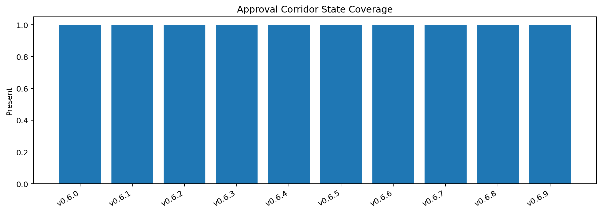
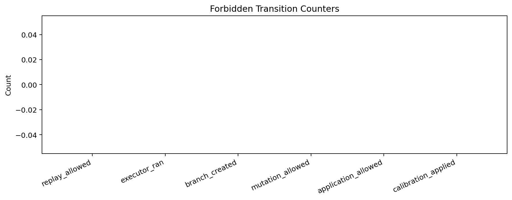
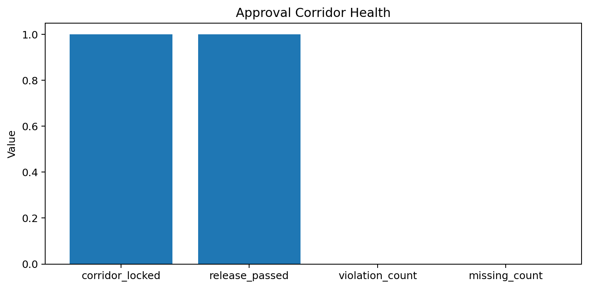

# Tau Scaling v0.7.0 Approval-Governance Corridor Milestone

Generated: `2026-05-28T08:15:15.923500+00:00`

## Milestone Result

- Corridor status: `APPROVAL_CORRIDOR_MILESTONE_LOCKED__NO_EXECUTION_NO_MUTATION`
- Corridor locked: `True`
- Release passed: `True`
- Violation count: `0`
- Missing count: `0`

## Corridor State Chain

| Version | State | Status | Replay | Executed | Mutation | Application |
|---|---|---|---:|---:|---:|---:|
| `v0.6.0` | `candidate_branch` | `CANDIDATE_BRANCH_PROPOSAL_READY__HUMAN_APPROVAL_REQUIRED` | `False` | `False` | `False` | `False` |
| `v0.6.1` | `candidate_replay` | `REPLAY_BLOCKED__HUMAN_APPROVAL_ARTIFACT_REQUIRED` | `False` | `False` | `False` | `False` |
| `v0.6.2` | `human_approval_template` | `TEMPLATE_CREATED__NOT_APPROVED` | `False` | `False` | `False` | `False` |
| `v0.6.3` | `approval_validator` | `APPROVAL_INVALID_OR_TEMPLATE_ONLY` | `False` | `False` | `False` | `False` |
| `v0.6.4` | `approval_gated_replay` | `DRY_RUN_BLOCKED__APPROVAL_NOT_VALID` | `False` | `False` | `False` | `False` |
| `v0.6.5` | `approval_fixtures` | `FIXTURES_VALIDATED__NO_LIVE_APPROVAL_CREATED` | `False` | `False` | `False` | `False` |
| `v0.6.6` | `live_approval_handoff` | `HANDOFF_BLOCKED__NO_LIVE_APPROVAL` | `False` | `False` | `False` | `False` |
| `v0.6.7` | `replay_executor` | `EXECUTOR_BLOCKED__LIVE_APPROVAL_HANDOFF_NOT_VALID` | `False` | `False` | `False` | `False` |
| `v0.6.8` | `blocked_continuity` | `BLOCKED_STATE_RECORDED__NO_EXECUTION` | `False` | `False` | `False` | `False` |
| `v0.6.9` | `blocked_trend` | `TREND_REVIEW_CONFIRMED__GOVERNANCE_BLOCK_STILL_VALID` | `False` | `False` | `False` | `False` |

## Forbidden Transitions

- `review_to_application`
- `signoff_to_branch_creation`
- `template_to_approval`
- `fixture_to_live_approval`
- `handoff_to_mutation`
- `replay_readiness_to_execution`
- `blocked_state_to_failure`
- `local_runtime_evidence_to_silicon_validation`

## Hard Locks

```text
replay_allowed: false
executor_ran: false
branch_created: false
mutation_allowed: false
application_allowed: false
calibration_applied: false
policy_enforced: false
```

## Charts







## Boundary

Approval-governance corridor milestones are local classifier-governance milestone artifacts. They summarize authority boundaries and execution locks. They do not create live approval, execute replay commands, create branches, mutate classifier behavior, apply calibration, or validate silicon, products, manufacturing, process nodes, benchmark superiority, or universal Tau Scaling law.

## Tau Return Plan

Shift back to core Tau Scaling: inspect tau-vector semantics, gate algebra, TSEK thresholds, synthetic gate suite, sensitivity sweeps, evidence-card design, and classifier calibration boundaries. Do not add more approval gates unless a real live approval workflow is intentionally introduced.
