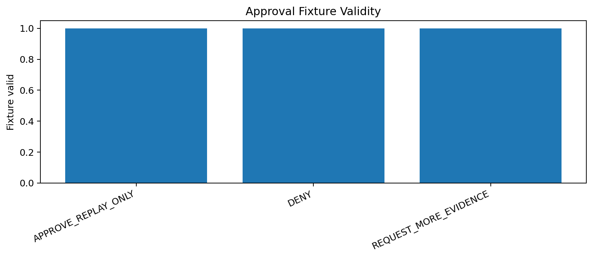
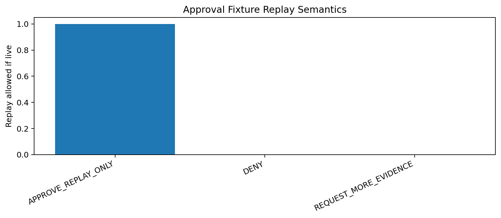
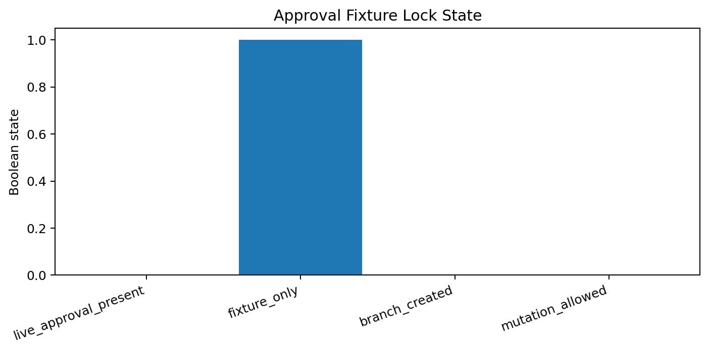

# Tau Scaling v0.6.5 Approval Fixture and Denial Fixture Validator

Generated: `2026-05-28T07:54:58.265792+00:00`

## Fixture Result

- Fixture status: `FIXTURES_VALIDATED__NO_LIVE_APPROVAL_CREATED`
- Fixture count: `3`
- Valid fixture count: `3`
- Live approval present: `False`
- Branch created: `False`
- Mutation allowed: `False`

## Fixture Matrix

| Fixture | Decision | Valid | Expected outcome | Replay if live |
|---|---|---|---|---|
| `approve_replay_only_fixture` | `APPROVE_REPLAY_ONLY` | `True` | `VALID_FOR_REPLAY_ONLY_FIXTURE` | `True` |
| `deny_fixture` | `DENY` | `True` | `DENIAL_FIXTURE_BLOCKS_REPLAY` | `False` |
| `request_more_evidence_fixture` | `REQUEST_MORE_EVIDENCE` | `True` | `MORE_EVIDENCE_FIXTURE_BLOCKS_REPLAY` | `False` |

## Fixture Files

- `reports/approval_fixtures/fixtures/v0_6_5/approve_replay_only_fixture.json`
- `reports/approval_fixtures/fixtures/v0_6_5/deny_fixture.json`
- `reports/approval_fixtures/fixtures/v0_6_5/request_more_evidence_fixture.json`

## Charts

## Boundary

Approval fixtures are local classifier-governance test fixtures. They are not live approvals, do not create branches, do not mutate classifier behavior, do not apply calibration, and do not validate silicon, products, manufacturing, process nodes, benchmark superiority, or universal Tau Scaling law.
