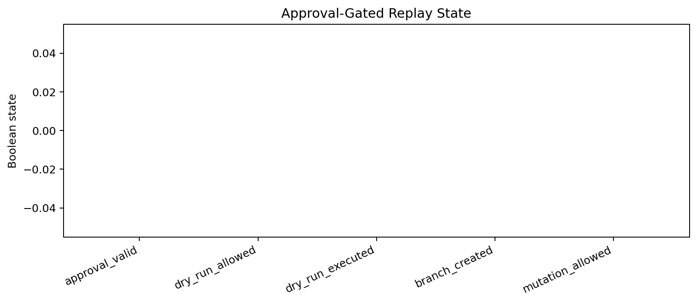
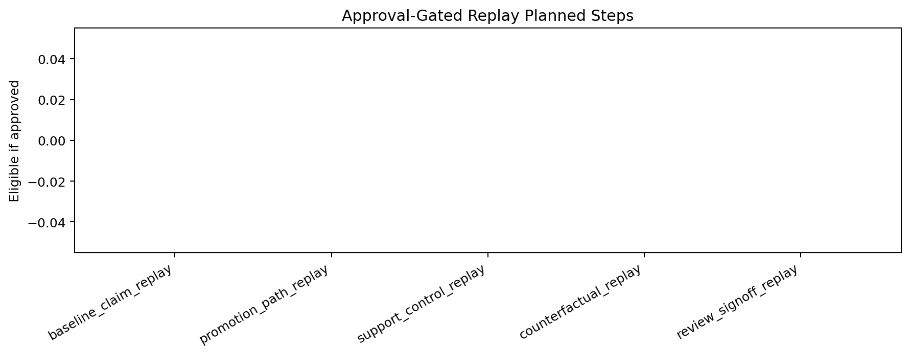
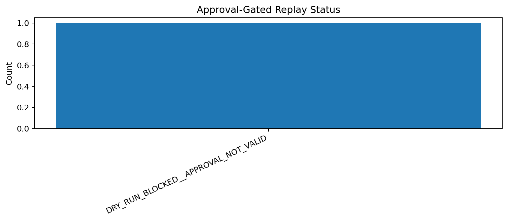

# Tau Scaling v0.6.4 Approval-Gated Replay Dry-Run

Generated: `2026-05-28T07:52:48.060919+00:00`

## Dry-Run Result

- Dry-run status: `DRY_RUN_BLOCKED__APPROVAL_NOT_VALID`
- Approval valid: `False`
- Dry-run allowed: `False`
- Dry-run executed: `False`
- Branch created: `False`
- Mutation allowed: `False`
- Application allowed: `False`
- Calibration applied: `False`

## Planned Replay Steps

| Step | Eligible if approved | Executed now | Command |
|---|---|---|---|
| `baseline_claim_replay` | `False` | `False` | `python -m tau_scaling run-claim --seed configs/seeds/logicfolding_claim_card.json` |
| `promotion_path_replay` | `False` | `False` | `python -m tau_scaling run-claim --seed configs/seeds/logicfolding_promotion_path_claim_card.json` |
| `support_control_replay` | `False` | `False` | `python scripts/benchmarks/run_support_aware_negative_controls.py` |
| `counterfactual_replay` | `False` | `False` | `python scripts/benchmarks/run_calibration_counterfactuals.py` |
| `review_signoff_replay` | `False` | `False` | `python scripts/benchmarks/run_review_signoff_gate.py` |

## Block Reason

Approval validator did not produce approval_valid=true. Replay remains blocked.

## Charts

## Boundary

Approval-gated replay dry-runs are local classifier-governance planning artifacts. They do not create branches by default, do not mutate classifier behavior, do not apply calibration, and do not validate silicon, products, manufacturing, process nodes, benchmark superiority, or universal Tau Scaling law.
