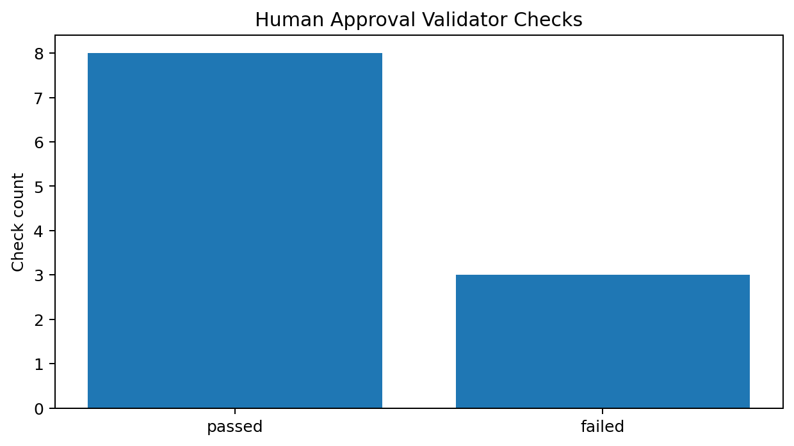
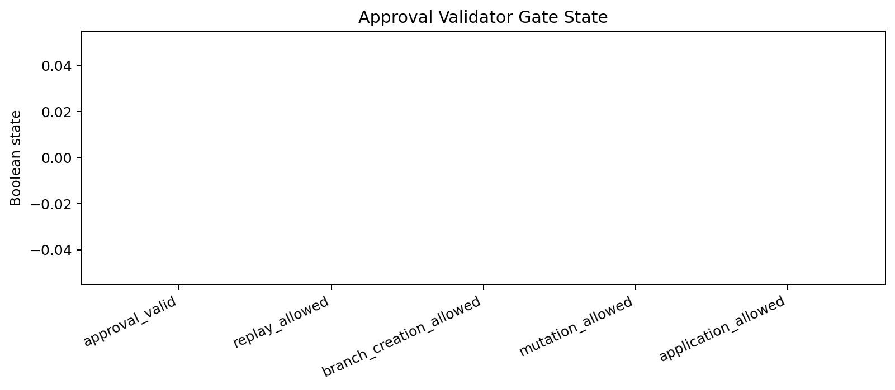
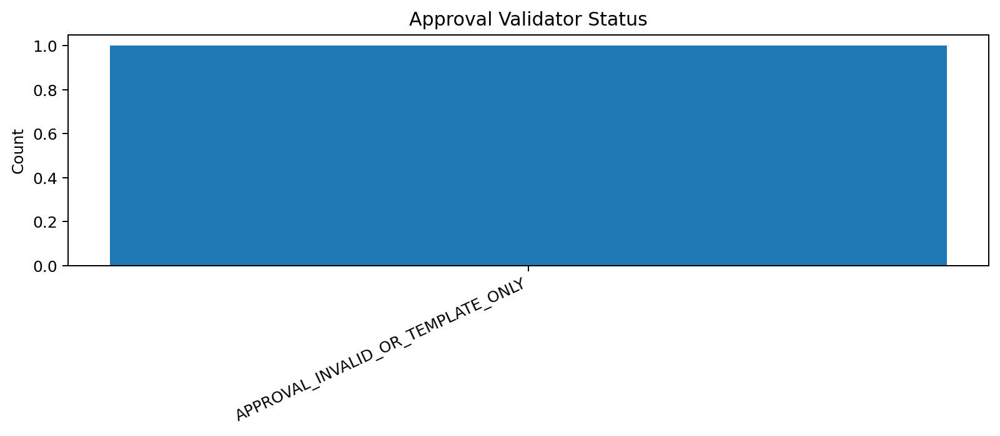

# Tau Scaling v0.6.3 Human Approval Artifact Validator

Generated: `2026-05-28T07:49:45.189682+00:00`

## Validator Result

- Validator status: `APPROVAL_INVALID_OR_TEMPLATE_ONLY`
- Approval decision: `UNSET`
- Approval valid: `False`
- Replay allowed: `False`
- Branch creation allowed: `False`
- Mutation allowed: `False`
- Application allowed: `False`
- Calibration applied: `False`

## Validation Checks

| Check | Passed | Observed | Required |
|---|---|---|---|
| `schema_is_v0_6_2` | `True` | `tau-scaling-human-approval-artifact-v0.6.2` | `True` |
| `decision_is_explicit` | `False` | `UNSET` | `True` |
| `approver_present` | `False` | `missing` | `True` |
| `timestamp_present` | `False` | `missing` | `True` |
| `scope_replay_only` | `True` | `candidate_branch_replay_only` | `True` |
| `required_statement_present` | `True` | `present` | `True` |
| `runtime_mutation_locked` | `True` | `False` | `True` |
| `classifier_mutation_locked` | `True` | `False` | `True` |
| `application_locked` | `True` | `False` | `True` |
| `calibration_unapplied` | `True` | `False` | `True` |
| `policy_unenforced` | `True` | `False` | `True` |

## Charts

## Boundary

Human approval validators are local classifier-governance validation artifacts. They do not create branches by default, do not mutate classifier behavior, do not apply calibration, and do not validate silicon, products, manufacturing, process nodes, benchmark superiority, or universal Tau Scaling law.
