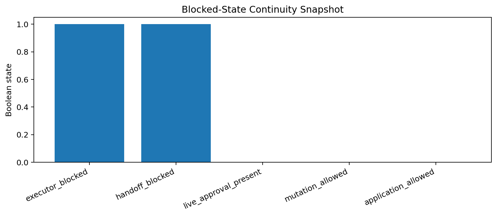
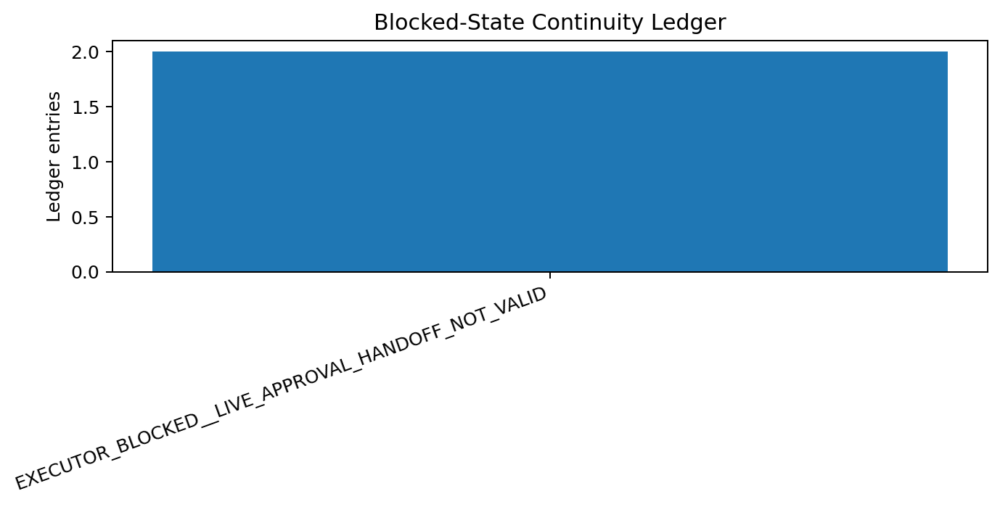
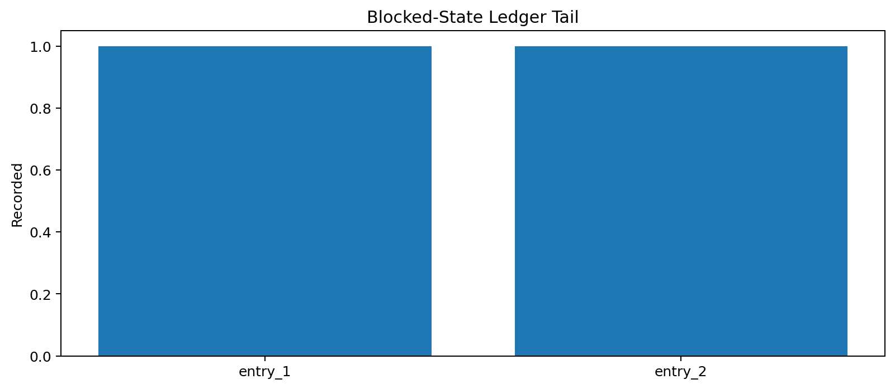

# Tau Scaling v0.6.8 Blocked-State Continuity Ledger

Generated: `2026-05-28T08:04:52.287049+00:00`

## Continuity Result

- Continuity status: `BLOCKED_STATE_RECORDED__NO_EXECUTION`
- Executor status: `EXECUTOR_BLOCKED__LIVE_APPROVAL_HANDOFF_NOT_VALID`
- Handoff status: `HANDOFF_BLOCKED__NO_LIVE_APPROVAL`
- Ledger path: `reports/blocked_continuity/blocked_state_continuity_ledger.jsonl`
- Ledger entries: `2`
- Executor blocked: `True`
- Handoff blocked: `True`
- Mutation allowed: `False`
- Application allowed: `False`

## Current Block Reason

Live approval handoff is not valid for replay. Executor remains blocked.

## Ledger Tail

| Index | Version | Executor status | Handoff status | Replay allowed |
|---:|---|---|---|---|
| 1 | `v0.6.8` | `EXECUTOR_BLOCKED__LIVE_APPROVAL_HANDOFF_NOT_VALID` | `HANDOFF_BLOCKED__NO_LIVE_APPROVAL` | `False` |
| 2 | `v0.6.8` | `EXECUTOR_BLOCKED__LIVE_APPROVAL_HANDOFF_NOT_VALID` | `HANDOFF_BLOCKED__NO_LIVE_APPROVAL` | `False` |

## Charts

## Boundary

Blocked-state continuity ledgers are local classifier-governance memory artifacts. They preserve why execution was blocked. They do not create live approval, execute replay commands, create branches, mutate classifier behavior, apply calibration, or validate silicon, products, manufacturing, process nodes, benchmark superiority, or universal Tau Scaling law.
