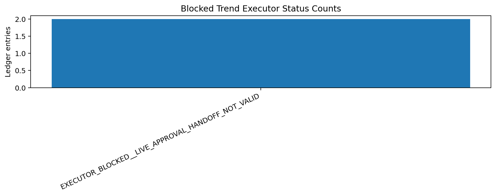
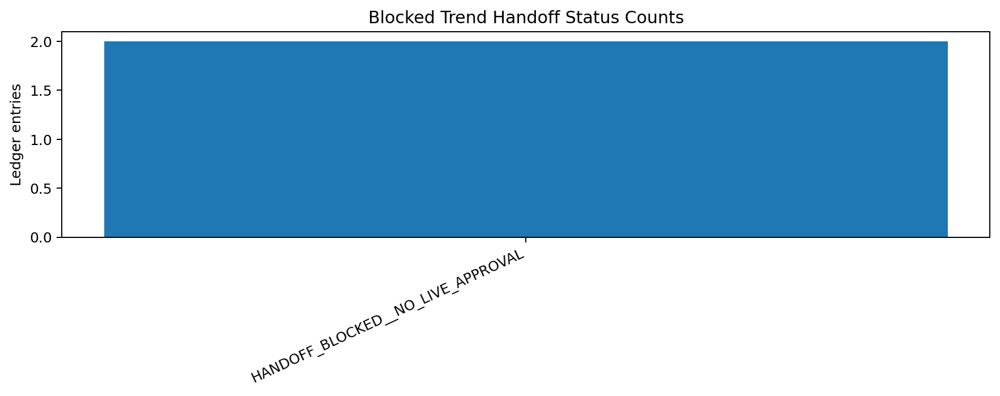
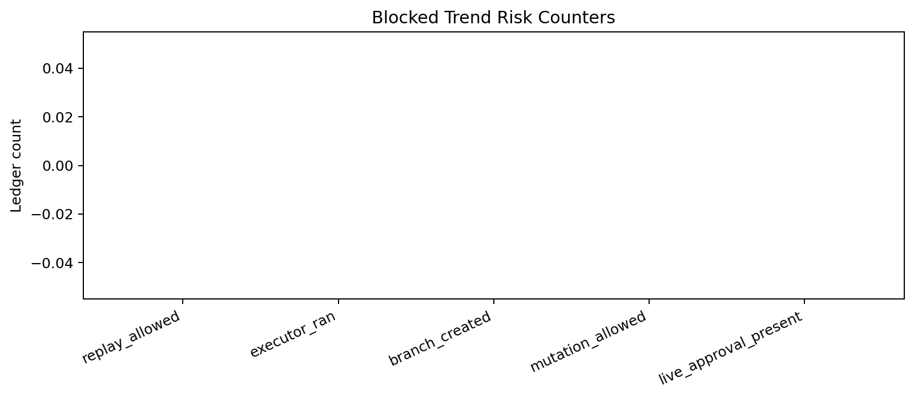

# Tau Scaling v0.6.9 Blocked-State Trend Review

Generated: `2026-05-28T08:12:43.538835+00:00`

## Trend Result

- Trend status: `TREND_REVIEW_CONFIRMED__GOVERNANCE_BLOCK_STILL_VALID`
- Ledger entries: `2`
- Current executor status: `EXECUTOR_BLOCKED__LIVE_APPROVAL_HANDOFF_NOT_VALID`
- Current handoff status: `HANDOFF_BLOCKED__NO_LIVE_APPROVAL`
- Replay allowed entries: `0`
- Executor-ran entries: `0`
- Branch-created entries: `0`
- Mutation-allowed entries: `0`

## Recommendation

Continue only with blocked-state observability or live-approval preparation; do not replay.

## Status Counts

### Executor Status Counts

| Executor status | Count |
|---|---:|
| `EXECUTOR_BLOCKED__LIVE_APPROVAL_HANDOFF_NOT_VALID` | 2 |

### Handoff Status Counts

| Handoff status | Count |
|---|---:|
| `HANDOFF_BLOCKED__NO_LIVE_APPROVAL` | 2 |

## Charts

## Boundary

Blocked-state trend reviews are local classifier-governance analysis artifacts. They review blocked execution continuity. They do not create live approval, execute replay commands, create branches, mutate classifier behavior, apply calibration, or validate silicon, products, manufacturing, process nodes, benchmark superiority, or universal Tau Scaling law.
