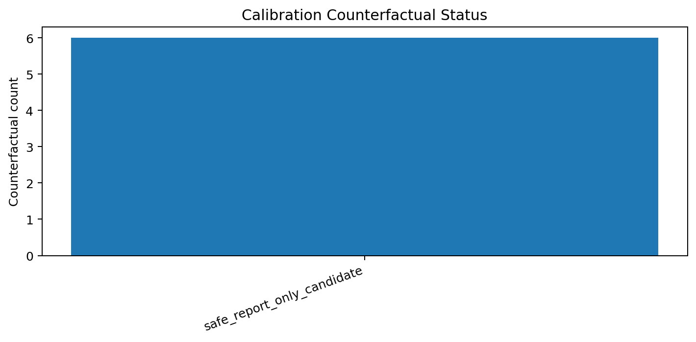
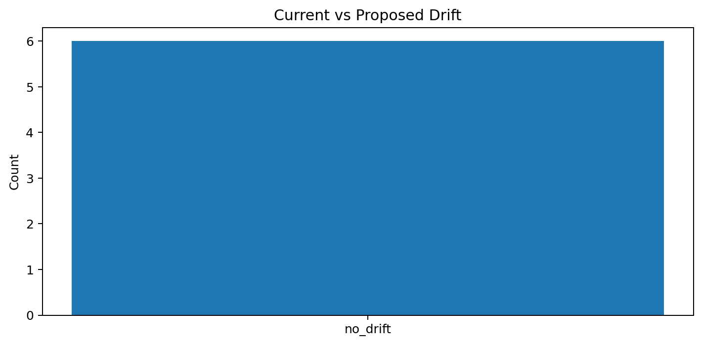
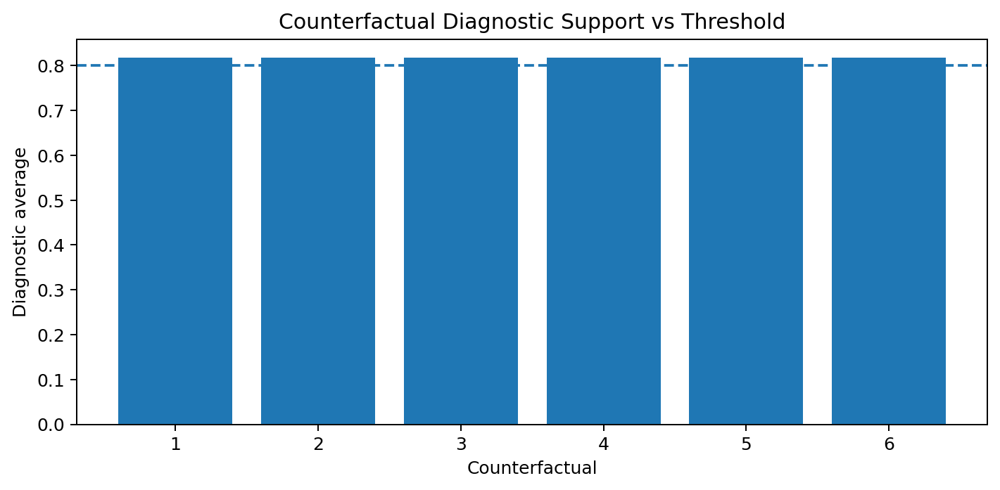

# Tau Scaling v0.5.6 Calibration Counterfactuals

Generated: `2026-05-28T07:30:05.228973+00:00`

## Result

- Selected report-only threshold: `0.8`
- Counterfactual count: `6`
- Safe report-only candidates: `6`
- Rejected counterfactuals: `0`
- Drift count: `0`
- Final recommendation: `counterfactual_candidate_safe_for_review_not_application`
- Mutation allowed: `False`
- Policy enforced: `False`
- Calibration applied: `False`

## Counterfactual Rows

| Control | Gate pair | Diagnostic | Current behavior | Proposed behavior | Drift | Support preserved | Status |
|---|---|---:|---|---|---|---|---|
| `negative-control-v0-5-3-001` | `B_baseline+B_tau` | `0.8182` | `retain_blocked_no_downgrade` | `retain_blocked_no_downgrade` | `False` | `True` | `safe_report_only_candidate` |
| `negative-control-v0-5-3-002` | `B_method+B_evidence` | `0.8182` | `retain_blocked_no_downgrade` | `retain_blocked_no_downgrade` | `False` | `True` | `safe_report_only_candidate` |
| `negative-control-v0-5-3-003` | `B_workload+B_tau` | `0.8182` | `retain_blocked_no_downgrade` | `retain_blocked_no_downgrade` | `False` | `True` | `safe_report_only_candidate` |
| `negative-control-v0-5-3-004` | `B_LF+B_ETP` | `0.8182` | `retain_blocked_no_downgrade` | `retain_blocked_no_downgrade` | `False` | `True` | `safe_report_only_candidate` |
| `negative-control-v0-5-3-005` | `B_PVT+B_evidence` | `0.8182` | `retain_blocked_no_downgrade` | `retain_blocked_no_downgrade` | `False` | `True` | `safe_report_only_candidate` |
| `negative-control-v0-5-3-006` | `B_yield+B_evidence` | `0.8182` | `retain_blocked_no_downgrade` | `retain_blocked_no_downgrade` | `False` | `True` | `safe_report_only_candidate` |

## Charts

## Boundary

Calibration counterfactuals are local report-only classifier-governance simulations. They do not change classifier behavior and do not validate silicon, products, manufacturing, process nodes, benchmark superiority, or universal Tau Scaling law.
