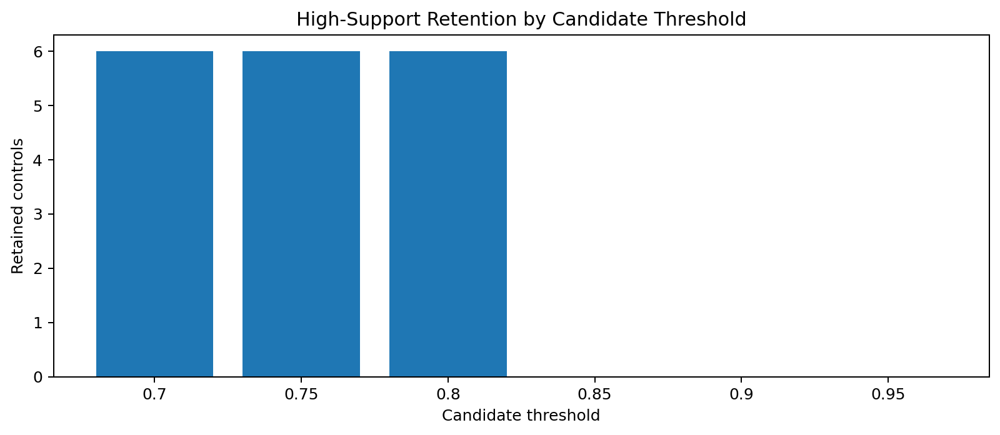
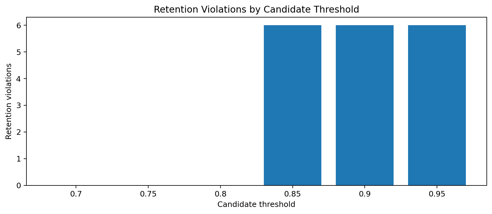
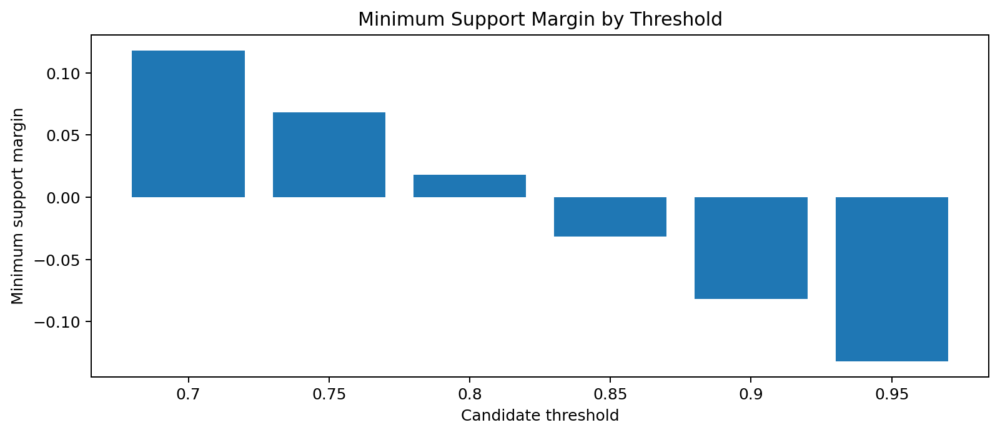

# Tau Scaling v0.5.5 Disabled Calibration Plan

Generated: `2026-05-28T07:25:59.561175+00:00`

## Result

- Source negative controls: `6`
- Passing source controls: `6`
- Candidate thresholds: `6`
- Admissible report-only thresholds: `3`
- Rejected thresholds: `3`
- Selected report-only threshold: `0.8`
- Final recommendation: `draft_report_only_calibration_candidate_preserving_support_controls`
- Mutation allowed: `False`
- Policy enforced: `False`

## Threshold Results

| Threshold | Retained controls | Violations | Minimum margin | Status |
|---:|---:|---:|---:|---|
| 0.7 | 6 | 0 | 0.1182 | `admissible_report_only` |
| 0.75 | 6 | 0 | 0.0682 | `admissible_report_only` |
| 0.8 | 6 | 0 | 0.0182 | `admissible_report_only` |
| 0.85 | 0 | 6 | -0.0318 | `rejected_retention_violation` |
| 0.9 | 0 | 6 | -0.0818 | `rejected_retention_violation` |
| 0.95 | 0 | 6 | -0.1318 | `rejected_retention_violation` |

## Charts

## Boundary

Disabled calibration planning is local report-only classifier-governance analysis. It does not change classifier behavior and does not validate silicon, products, manufacturing, process nodes, benchmark superiority, or universal Tau Scaling law.
