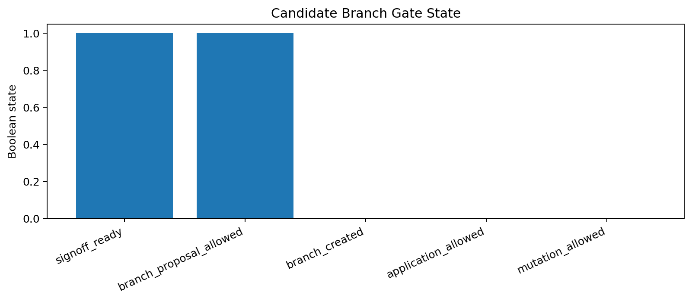
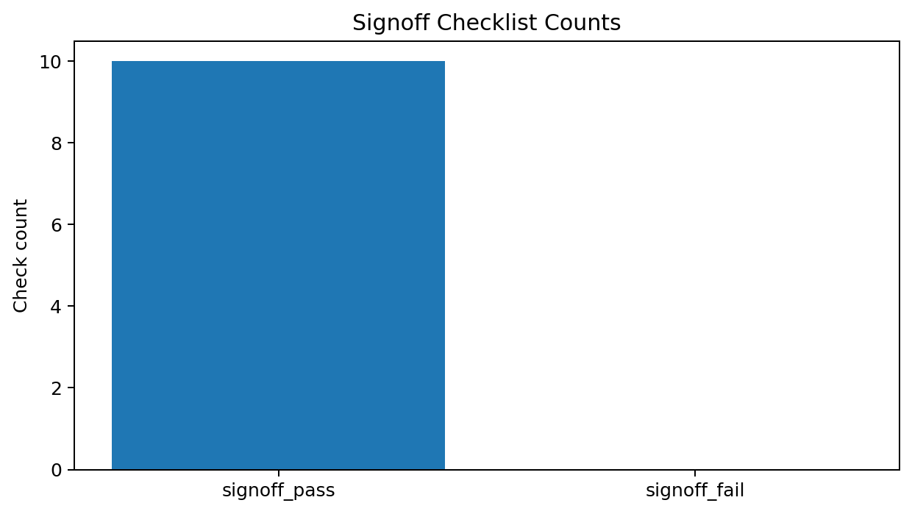
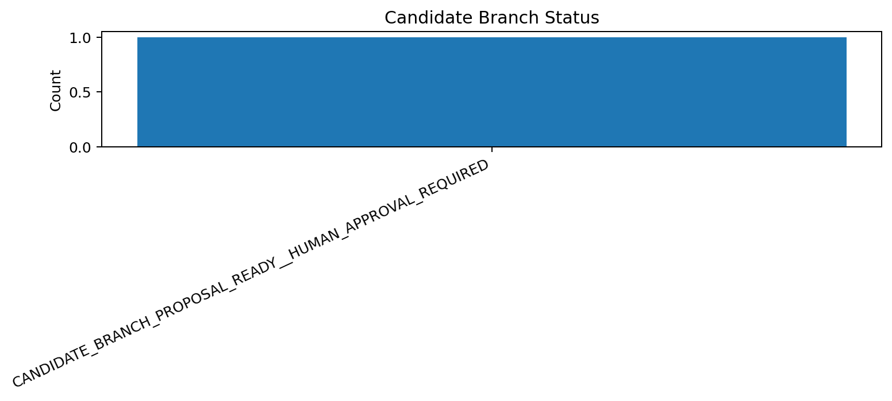

# Tau Scaling v0.6.0 Human-Approved Candidate Branch Gate

Generated: `2026-05-28T07:37:34.626150+00:00`

## Gate Result

- Candidate branch status: `CANDIDATE_BRANCH_PROPOSAL_READY__HUMAN_APPROVAL_REQUIRED`
- Selected report-only threshold: `0.8`
- Signoff ready: `True`
- Branch proposal allowed: `True`
- Branch created: `False`
- Application allowed: `False`
- Mutation allowed: `False`
- Calibration applied: `False`

## Human Approval Requirement

A human approval artifact must be added before creating any candidate branch or implementation pathway. This gate only prepares a proposal.

## Candidate Branch Proposal

| Field | Value |
|---|---|
| Proposed branch name | `candidate/v0.6.0-threshold-0.8-review-only` |
| Source signoff | `reports/review_signoff/latest_review_signoff_gate.json` |
| Source review package | `reports/review_package/latest_review_package.json` |
| Default branch creation | `False` |
| Runtime behavior changed | `false` |

## Charts

## Boundary

Human-approved candidate branch gates are local classifier-governance proposal artifacts. They do not create a branch by default, do not change classifier behavior, and do not validate silicon, products, manufacturing, process nodes, benchmark superiority, or universal Tau Scaling law.
