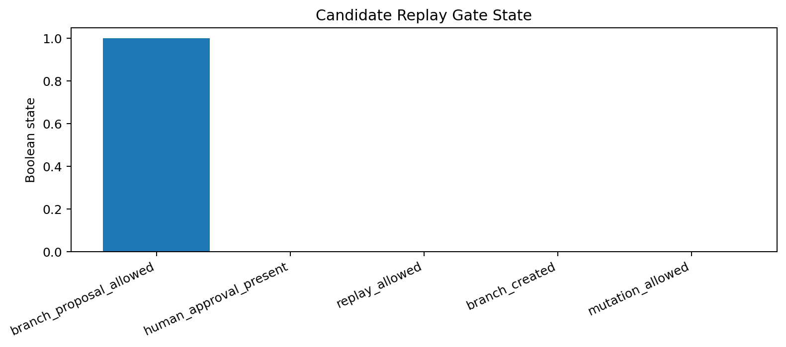
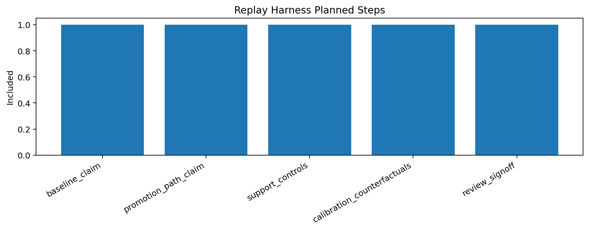
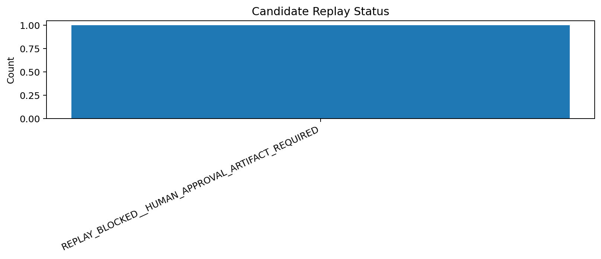

# Tau Scaling v0.6.1 Candidate Branch Replay Harness

Generated: `2026-05-28T07:45:58.673049+00:00`

## Replay Gate Result

- Replay status: `REPLAY_BLOCKED__HUMAN_APPROVAL_ARTIFACT_REQUIRED`
- Replay allowed: `False`
- Human approval present: `False`
- Branch proposal allowed: `True`
- Branch created: `False`
- Application allowed: `False`
- Mutation allowed: `False`
- Calibration applied: `False`

## Replay Plan

| Step | Included | Command | Purpose |
|---|---|---|---|
| `baseline_claim` | `True` | `python -m tau_scaling run-claim --seed configs/seeds/logicfolding_claim_card.json` | Replay baseline/candidate evidence without changing default runtime behavior. |
| `promotion_path_claim` | `True` | `python -m tau_scaling run-claim --seed configs/seeds/logicfolding_promotion_path_claim_card.json` | Replay baseline/candidate evidence without changing default runtime behavior. |
| `support_controls` | `True` | `python scripts/benchmarks/run_support_aware_negative_controls.py` | Replay baseline/candidate evidence without changing default runtime behavior. |
| `calibration_counterfactuals` | `True` | `python scripts/benchmarks/run_calibration_counterfactuals.py` | Replay baseline/candidate evidence without changing default runtime behavior. |
| `review_signoff` | `True` | `python scripts/benchmarks/run_review_signoff_gate.py` | Replay baseline/candidate evidence without changing default runtime behavior. |

## Approval Boundary

Replay is intentionally blocked until a separate explicit human approval artifact exists. This v0.6.1 layer prepares the replay harness and proves the block.

## Charts

## Boundary

Candidate branch replay harnesses are local classifier-governance planning artifacts. They do not create branches by default, do not change classifier behavior, and do not validate silicon, products, manufacturing, process nodes, benchmark superiority, or universal Tau Scaling law.
