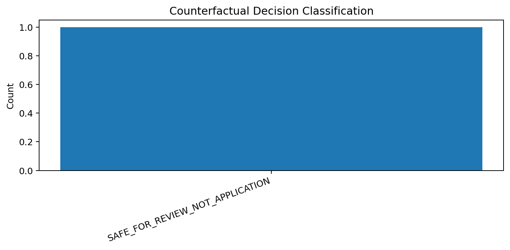
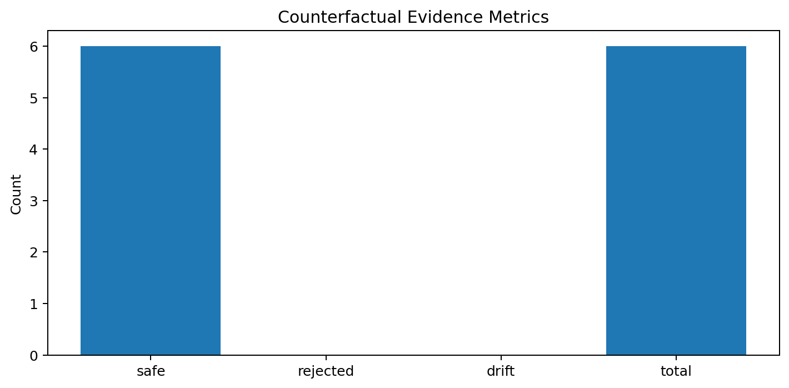
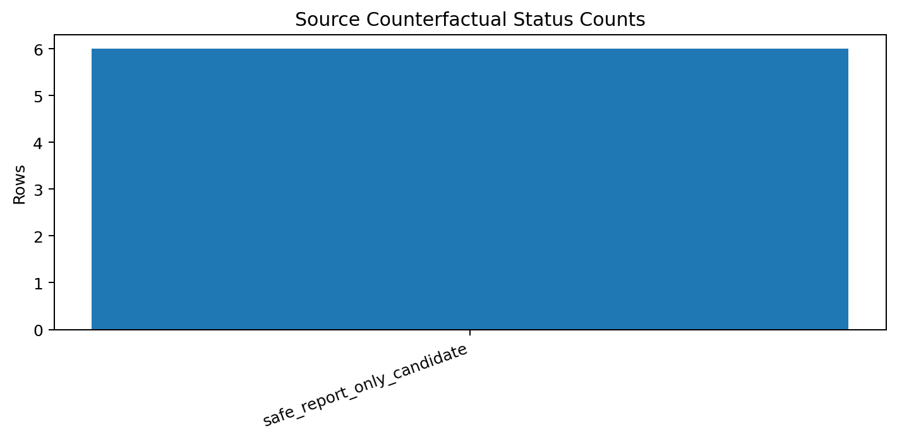

# Tau Scaling v0.5.7 Counterfactual Decision Record

Generated: `2026-05-28T07:30:06.560444+00:00`

## Decision

- Decision: `SAFE_FOR_REVIEW_NOT_APPLICATION`
- Selected report-only threshold: `0.8`
- Reason: All counterfactual rows preserved support controls with zero drift and zero rejected rows.
- Next step: Bundle evidence for review; do not apply classifier mutation.

## Evidence Summary

- Counterfactual count: `6`
- Safe candidates: `6`
- Rejected candidates: `0`
- Drift count: `0`
- Review allowed: `True`
- Application allowed: `False`
- Mutation allowed: `False`
- Calibration applied: `False`

## Charts

## Boundary

Counterfactual decision records are local classifier-governance decision artifacts. They do not change classifier behavior and do not validate silicon, products, manufacturing, process nodes, benchmark superiority, or universal Tau Scaling law.
