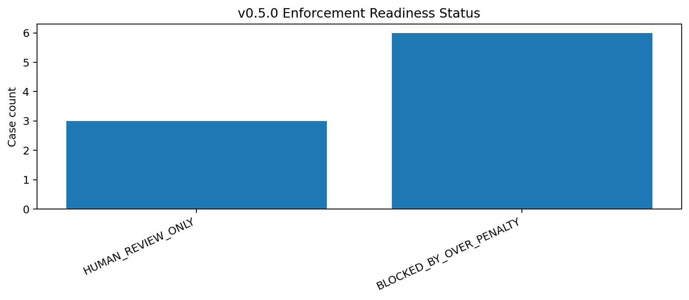
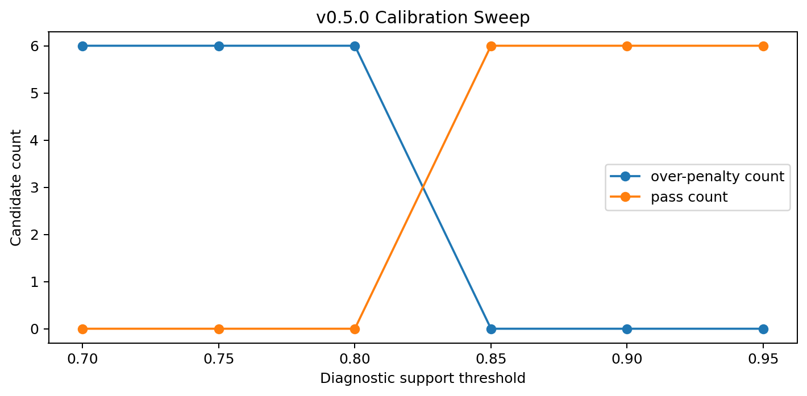
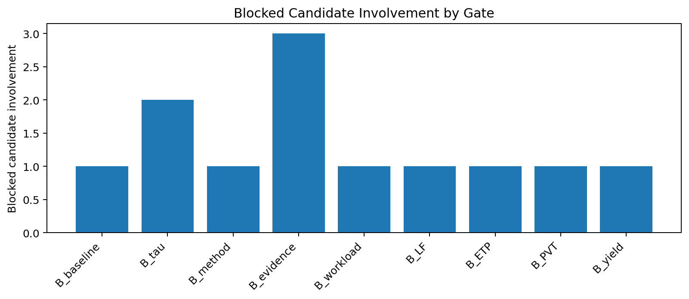

# Tau Scaling v0.5.0 Enforcement Readiness Gate

Generated: `2026-05-27T17:35:32.392363+00:00`

## Result

- Input review rows: `9`
- Controlled downgrade candidates: `6`
- Blocked by over-penalty: `6`
- Human review only: `3`
- Eligible for disabled candidate design: `0`
- Enforcement candidate enabled: `False`
- Mutation allowed: `False`
- Policy enforced: `False`
- Final recommendation: `do_not_design_enforcement_candidate__all_controlled_downgrades_blocked`

## Readiness Status Counts

| Status | Count |
|---|---:|
| `HUMAN_REVIEW_ONLY` | 3 |
| `BLOCKED_BY_OVER_PENALTY` | 6 |

## Readiness Rows

| Gate pair | Decision | Status | Reasons | Action |
|---|---|---|---|---|
| `B_source+B_metric` | `DEFER_TO_HUMAN_REVIEW` | `HUMAN_REVIEW_ONLY` | `high_diagnostic_support, high_drift_severity` | Preserve human-review routing. Do not convert to automatic downgrade. |
| `B_source+B_baseline` | `DEFER_TO_HUMAN_REVIEW` | `HUMAN_REVIEW_ONLY` | `high_diagnostic_support, high_drift_severity` | Preserve human-review routing. Do not convert to automatic downgrade. |
| `B_source+B_evidence` | `DEFER_TO_HUMAN_REVIEW` | `HUMAN_REVIEW_ONLY` | `high_diagnostic_support, high_drift_severity` | Preserve human-review routing. Do not convert to automatic downgrade. |
| `B_baseline+B_tau` | `APPROVE_FOR_REGRESSION_REVIEW` | `BLOCKED_BY_OVER_PENALTY` | `high_diagnostic_support` | Do not enforce. Candidate must be calibrated or narrowed before any enforcement design. |
| `B_method+B_evidence` | `APPROVE_FOR_REGRESSION_REVIEW` | `BLOCKED_BY_OVER_PENALTY` | `high_diagnostic_support` | Do not enforce. Candidate must be calibrated or narrowed before any enforcement design. |
| `B_workload+B_tau` | `APPROVE_FOR_REGRESSION_REVIEW` | `BLOCKED_BY_OVER_PENALTY` | `high_diagnostic_support` | Do not enforce. Candidate must be calibrated or narrowed before any enforcement design. |
| `B_LF+B_ETP` | `APPROVE_FOR_REGRESSION_REVIEW` | `BLOCKED_BY_OVER_PENALTY` | `high_diagnostic_support` | Do not enforce. Candidate must be calibrated or narrowed before any enforcement design. |
| `B_PVT+B_evidence` | `APPROVE_FOR_REGRESSION_REVIEW` | `BLOCKED_BY_OVER_PENALTY` | `high_diagnostic_support` | Do not enforce. Candidate must be calibrated or narrowed before any enforcement design. |
| `B_yield+B_evidence` | `APPROVE_FOR_REGRESSION_REVIEW` | `BLOCKED_BY_OVER_PENALTY` | `high_diagnostic_support` | Do not enforce. Candidate must be calibrated or narrowed before any enforcement design. |

## Calibration Sweep

| Threshold | Over-penalty | Pass count | High support | Missing findings | High severity |
|---:|---:|---:|---:|---:|---:|
| 0.70 | 6 | 0 | 6 | 0 | 0 |
| 0.75 | 6 | 0 | 6 | 0 | 0 |
| 0.80 | 6 | 0 | 6 | 0 | 0 |
| 0.85 | 0 | 6 | 0 | 0 | 0 |
| 0.90 | 0 | 6 | 0 | 0 | 0 |
| 0.95 | 0 | 6 | 0 | 0 | 0 |

## Charts







## v0.5.0 Lock

v0.5.0 is a major governance checkpoint, not classifier activation.

```text
enforcement_candidate_enabled: false
mutation_allowed: false
policy_enforced: false
```

## Boundary

Enforcement readiness is local classifier-governance analysis only. It does not change classifier behavior and does not validate silicon, products, manufacturing, process nodes, benchmark superiority, or universal Tau Scaling law.
