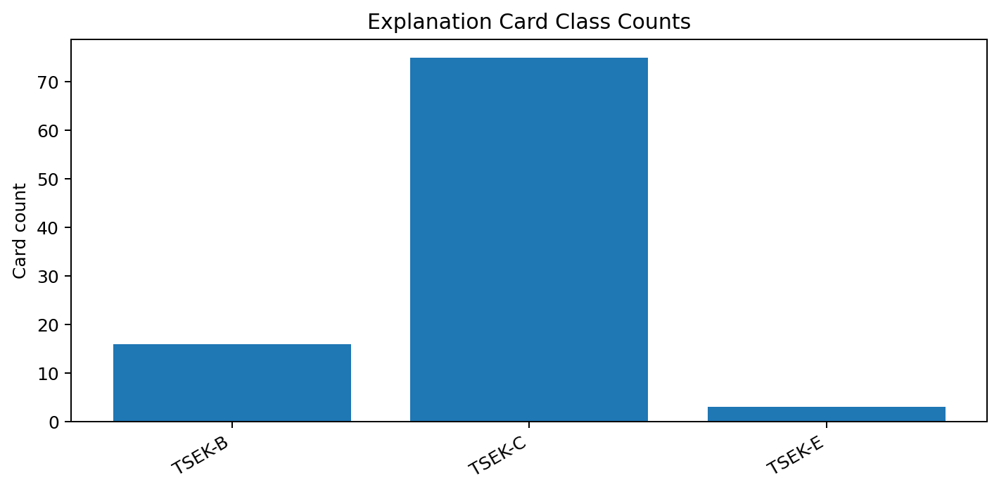
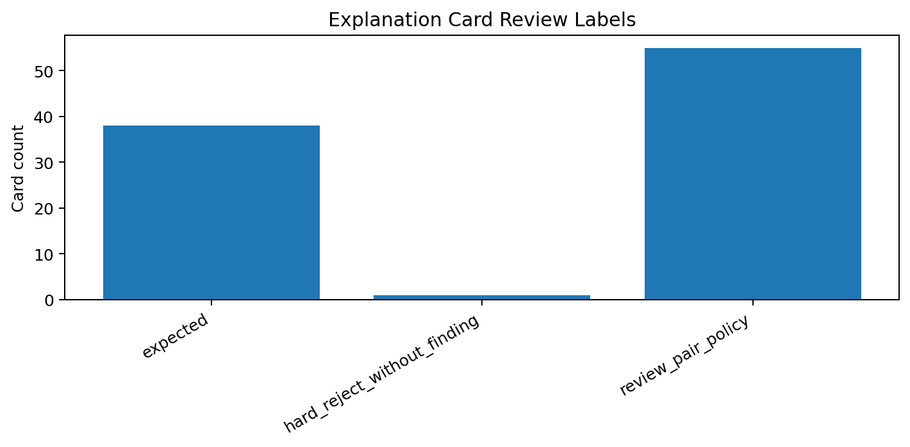
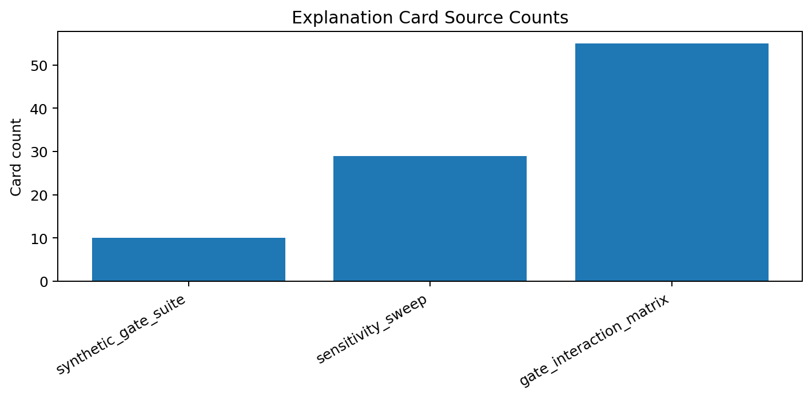
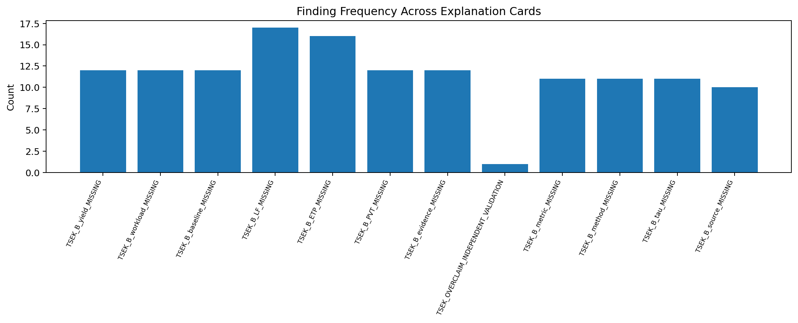

# Tau Scaling v0.4.3 Threshold Explanation Cards

Generated: `2026-05-26T15:16:15.136282+00:00`

## Result

- Card count: `94`
- Card directory: `reports/explanations/cards/v0_4_3`
- Chart count: `4`

## Source Counts

| Source | Count |
|---|---:|
| `gate_interaction_matrix` | 55 |
| `sensitivity_sweep` | 29 |
| `synthetic_gate_suite` | 10 |

## Class Counts

| Class | Count |
|---|---:|
| `TSEK-B` | 16 |
| `TSEK-C` | 75 |
| `TSEK-E` | 3 |

## Review Labels

| Label | Count | Meaning |
|---|---:|---|
| `expected` | 38 | Classifier behavior matches current policy. |
| `hard_reject_without_finding` | 1 | Hard reject occurred without clear finding; inspect immediately. |
| `review_pair_policy` | 55 | Paired failures remained controlled downgrade; review whether this should become stricter. |

## Review Examples

| Source | Subject | Class | Review label | Why |
|---|---|---|---|---|
| `sensitivity_sweep` | `overclaim_pressure:overclaim=1.0` | `TSEK-E` | `hard_reject_without_finding` | Rejected or severe downgrade to TSEK-E because classifier support collapsed. A_TSEK=0.0, diagnostic_average=1.0. |
| `gate_interaction_matrix` | `B_source+B_metric` | `TSEK-C` | `review_pair_policy` | Downgraded to TSEK-C because one or more required evidence gates are missing while the claim remains interpretable. A_TSEK=0.0, diagnostic_average=0.8182. |
| `gate_interaction_matrix` | `B_source+B_baseline` | `TSEK-C` | `review_pair_policy` | Downgraded to TSEK-C because one or more required evidence gates are missing while the claim remains interpretable. A_TSEK=0.0, diagnostic_average=0.8182. |
| `gate_interaction_matrix` | `B_source+B_method` | `TSEK-C` | `review_pair_policy` | Downgraded to TSEK-C because one or more required evidence gates are missing while the claim remains interpretable. A_TSEK=0.0, diagnostic_average=0.8182. |
| `gate_interaction_matrix` | `B_source+B_workload` | `TSEK-C` | `review_pair_policy` | Downgraded to TSEK-C because one or more required evidence gates are missing while the claim remains interpretable. A_TSEK=0.0, diagnostic_average=0.8182. |
| `gate_interaction_matrix` | `B_source+B_tau` | `TSEK-C` | `review_pair_policy` | Downgraded to TSEK-C because one or more required evidence gates are missing while the claim remains interpretable. A_TSEK=0.0, diagnostic_average=0.8182. |
| `gate_interaction_matrix` | `B_source+B_LF` | `TSEK-C` | `review_pair_policy` | Downgraded to TSEK-C because one or more required evidence gates are missing while the claim remains interpretable. A_TSEK=0.0, diagnostic_average=0.8182. |
| `gate_interaction_matrix` | `B_source+B_ETP` | `TSEK-C` | `review_pair_policy` | Downgraded to TSEK-C because one or more required evidence gates are missing while the claim remains interpretable. A_TSEK=0.0, diagnostic_average=0.8182. |
| `gate_interaction_matrix` | `B_source+B_PVT` | `TSEK-C` | `review_pair_policy` | Downgraded to TSEK-C because one or more required evidence gates are missing while the claim remains interpretable. A_TSEK=0.0, diagnostic_average=0.8182. |
| `gate_interaction_matrix` | `B_source+B_yield` | `TSEK-C` | `review_pair_policy` | Downgraded to TSEK-C because one or more required evidence gates are missing while the claim remains interpretable. A_TSEK=0.0, diagnostic_average=0.8182. |
| `gate_interaction_matrix` | `B_source+B_evidence` | `TSEK-C` | `review_pair_policy` | Downgraded to TSEK-C because one or more required evidence gates are missing while the claim remains interpretable. A_TSEK=0.0, diagnostic_average=0.8182. |
| `gate_interaction_matrix` | `B_metric+B_baseline` | `TSEK-C` | `review_pair_policy` | Downgraded to TSEK-C because one or more required evidence gates are missing while the claim remains interpretable. A_TSEK=0.0, diagnostic_average=0.8182. |
| `gate_interaction_matrix` | `B_metric+B_method` | `TSEK-C` | `review_pair_policy` | Downgraded to TSEK-C because one or more required evidence gates are missing while the claim remains interpretable. A_TSEK=0.0, diagnostic_average=0.8182. |
| `gate_interaction_matrix` | `B_metric+B_workload` | `TSEK-C` | `review_pair_policy` | Downgraded to TSEK-C because one or more required evidence gates are missing while the claim remains interpretable. A_TSEK=0.0, diagnostic_average=0.8182. |
| `gate_interaction_matrix` | `B_metric+B_tau` | `TSEK-C` | `review_pair_policy` | Downgraded to TSEK-C because one or more required evidence gates are missing while the claim remains interpretable. A_TSEK=0.0, diagnostic_average=0.8182. |
| `gate_interaction_matrix` | `B_metric+B_LF` | `TSEK-C` | `review_pair_policy` | Downgraded to TSEK-C because one or more required evidence gates are missing while the claim remains interpretable. A_TSEK=0.0, diagnostic_average=0.8182. |
| `gate_interaction_matrix` | `B_metric+B_ETP` | `TSEK-C` | `review_pair_policy` | Downgraded to TSEK-C because one or more required evidence gates are missing while the claim remains interpretable. A_TSEK=0.0, diagnostic_average=0.8182. |
| `gate_interaction_matrix` | `B_metric+B_PVT` | `TSEK-C` | `review_pair_policy` | Downgraded to TSEK-C because one or more required evidence gates are missing while the claim remains interpretable. A_TSEK=0.0, diagnostic_average=0.8182. |
| `gate_interaction_matrix` | `B_metric+B_yield` | `TSEK-C` | `review_pair_policy` | Downgraded to TSEK-C because one or more required evidence gates are missing while the claim remains interpretable. A_TSEK=0.0, diagnostic_average=0.8182. |
| `gate_interaction_matrix` | `B_metric+B_evidence` | `TSEK-C` | `review_pair_policy` | Downgraded to TSEK-C because one or more required evidence gates are missing while the claim remains interpretable. A_TSEK=0.0, diagnostic_average=0.8182. |
| `gate_interaction_matrix` | `B_baseline+B_method` | `TSEK-C` | `review_pair_policy` | Downgraded to TSEK-C because one or more required evidence gates are missing while the claim remains interpretable. A_TSEK=0.0, diagnostic_average=0.8182. |
| `gate_interaction_matrix` | `B_baseline+B_workload` | `TSEK-C` | `review_pair_policy` | Downgraded to TSEK-C because one or more required evidence gates are missing while the claim remains interpretable. A_TSEK=0.0, diagnostic_average=0.8182. |
| `gate_interaction_matrix` | `B_baseline+B_tau` | `TSEK-C` | `review_pair_policy` | Downgraded to TSEK-C because one or more required evidence gates are missing while the claim remains interpretable. A_TSEK=0.0, diagnostic_average=0.8182. |
| `gate_interaction_matrix` | `B_baseline+B_LF` | `TSEK-C` | `review_pair_policy` | Downgraded to TSEK-C because one or more required evidence gates are missing while the claim remains interpretable. A_TSEK=0.0, diagnostic_average=0.8182. |
| `gate_interaction_matrix` | `B_baseline+B_ETP` | `TSEK-C` | `review_pair_policy` | Downgraded to TSEK-C because one or more required evidence gates are missing while the claim remains interpretable. A_TSEK=0.0, diagnostic_average=0.8182. |

## Charts

## Boundary

Explanation cards explain local classifier behavior only. They are not silicon validation, product validation, manufacturing validation, process-node equivalence, benchmark superiority proof, or universal Tau Scaling proof.
