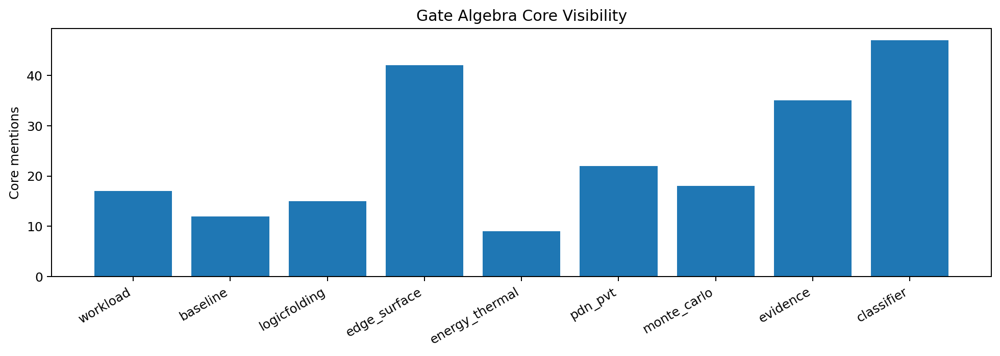
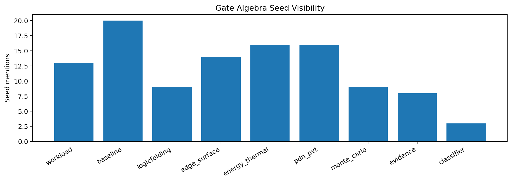
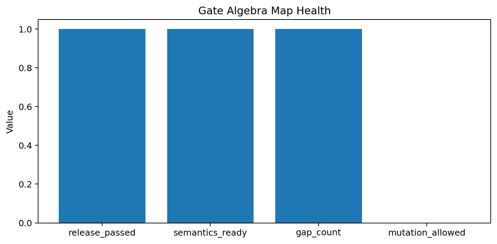

# Tau Scaling v0.7.3 Gate Algebra Map

Generated: `2026-05-28T08:36:00.883345+00:00`

## Map Result

- Gate algebra status: `GATE_ALGEBRA_MAP_READY__TARGETED_GATE_GAPS_IDENTIFIED`
- Release passed: `True`
- Semantics ready: `True`
- Source files scanned: `8`
- Seed count: `6`
- Gap count: `1`

## Gate Family Map

| Gate family | Core count | Seed count | Visibility |
|---|---:|---:|---|
| `workload` | 17 | 13 | `core_and_seed_visible` |
| `baseline` | 12 | 20 | `core_and_seed_visible` |
| `logicfolding` | 15 | 9 | `core_and_seed_visible` |
| `edge_surface` | 42 | 14 | `core_and_seed_visible` |
| `energy_thermal` | 9 | 16 | `core_and_seed_visible` |
| `pdn_pvt` | 22 | 16 | `core_and_seed_visible` |
| `monte_carlo` | 18 | 9 | `core_and_seed_visible` |
| `evidence` | 35 | 8 | `core_and_seed_visible` |
| `classifier` | 47 | 3 | `core_and_seed_visible` |

## Seed Gate Matrix

| Seed | Visible families |
|---|---:|
| `configs/seeds/codex_tau_vector_toy.json` | 4 |
| `configs/seeds/edge_surface_boundary_toy.json` | 1 |
| `configs/seeds/gamma_tau_etp_toy.json` | 3 |
| `configs/seeds/logicfolding_claim_card.json` | 9 |
| `configs/seeds/logicfolding_promotion_path_claim_card.json` | 9 |
| `configs/seeds/monte_carlo_stress_toy.json` | 4 |

## Targeted Gaps

- `some_seed_cards_have_sparse_gate_family_visibility`

## Next Tau Work

1. Build a gate-to-tau-vector mapping table.
2. Separate evidence-required gates from classifier-weighted gates.
3. Identify gate families that can over-penalize high-support claims.
4. Add tests for gate-family downgrade behavior before changing thresholds.

## Charts

## Boundary

Gate algebra maps are local classifier-governance analysis artifacts. They map gate visibility and evidence surfaces. They do not create live approval, execute replay commands, create branches, mutate classifier behavior, apply calibration, or validate silicon, products, manufacturing, process nodes, benchmark superiority, or universal Tau Scaling law.
