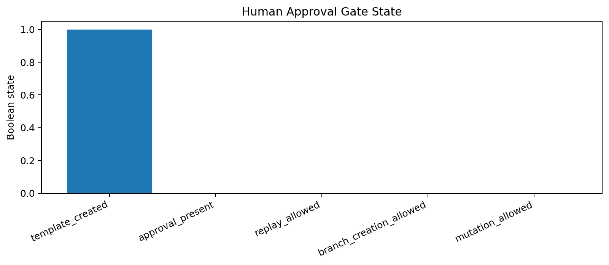
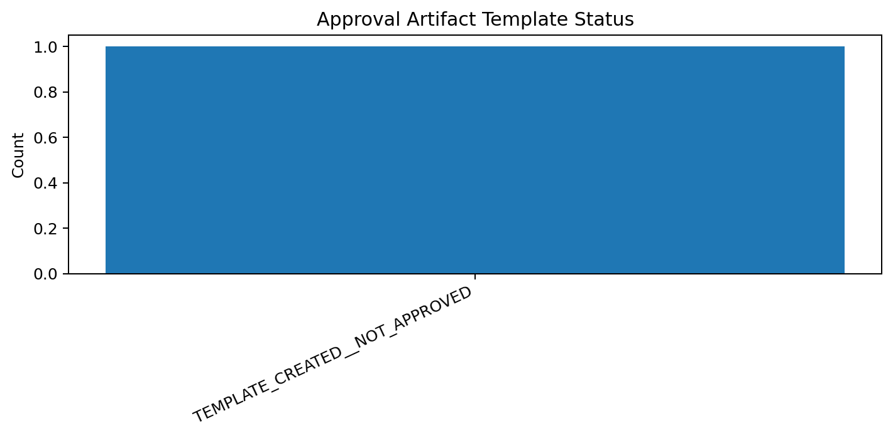
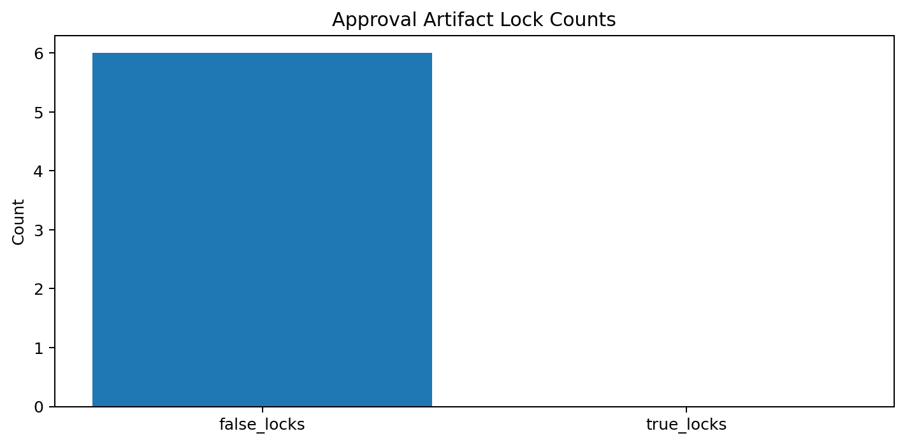

# Tau Scaling v0.6.2 Human Approval Artifact Template

Generated: `2026-05-28T07:49:43.681397+00:00`

## Approval Template Result

- Approval template status: `TEMPLATE_CREATED__NOT_APPROVED`
- Template path: `reports/human_approval/human_approval_artifact_template_v0_6_2.json`
- Human approval present: `False`
- Replay allowed: `False`
- Branch creation allowed: `False`
- Mutation allowed: `False`
- Calibration applied: `False`

## Template Instructions

To approve replay in a future layer, copy the template to a local approval artifact, set approval_decision to APPROVE_REPLAY_ONLY, fill approver and timestamp, and preserve every explicit lock unless a separate stronger governance artifact exists.

## Approval Boundary

This v0.6.2 layer creates a template only. It does not approve replay, create a branch, apply calibration, or mutate classifier behavior.

## Charts

## Boundary

Human approval artifact templates are local classifier-governance templates. They do not create approval by themselves, do not change classifier behavior, and do not validate silicon, products, manufacturing, process nodes, benchmark superiority, or universal Tau Scaling law.
