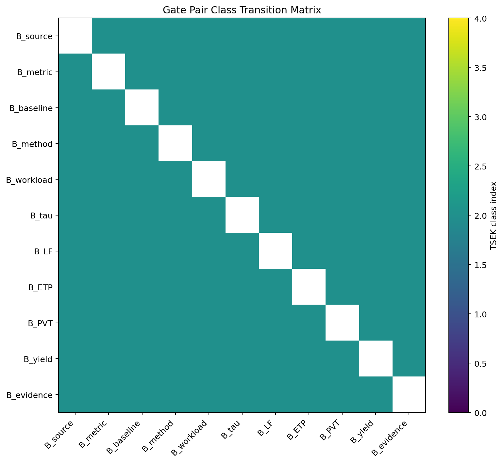
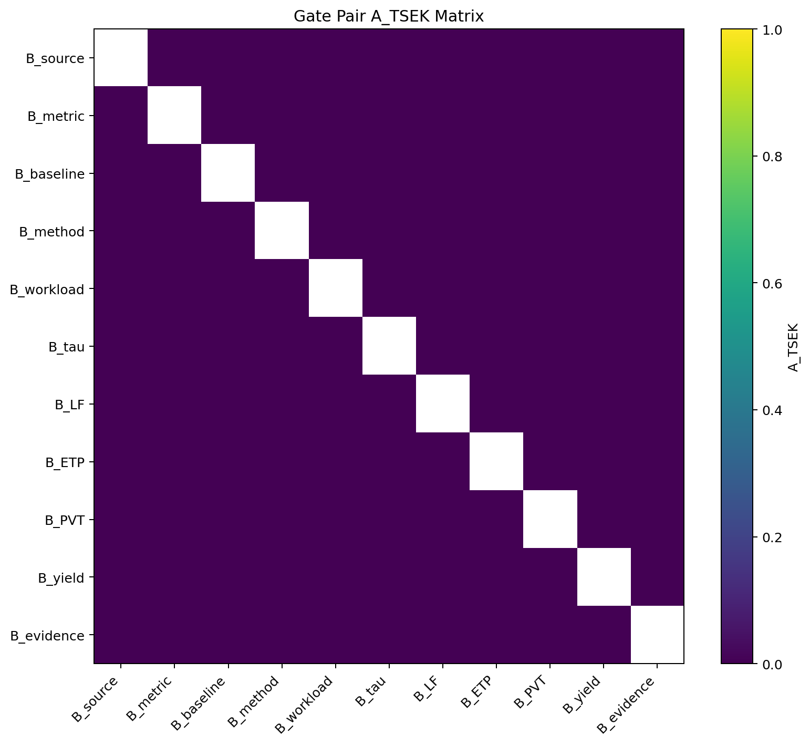
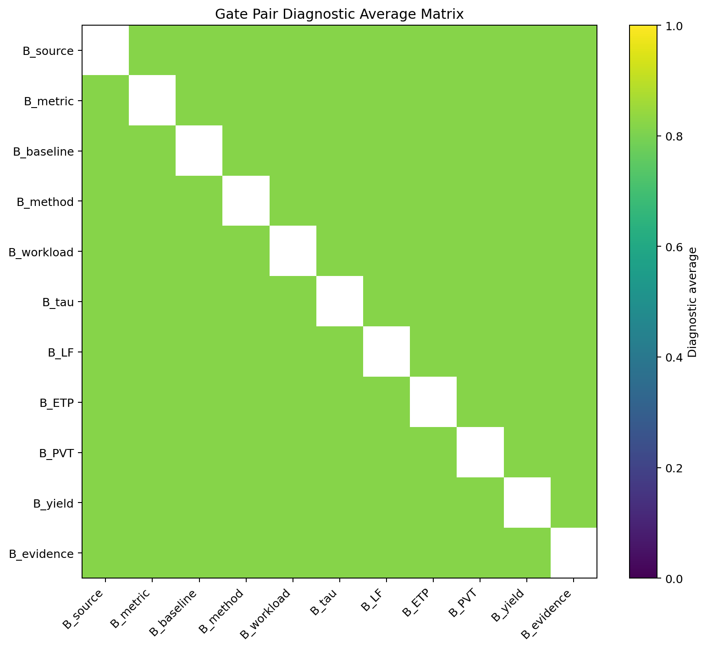
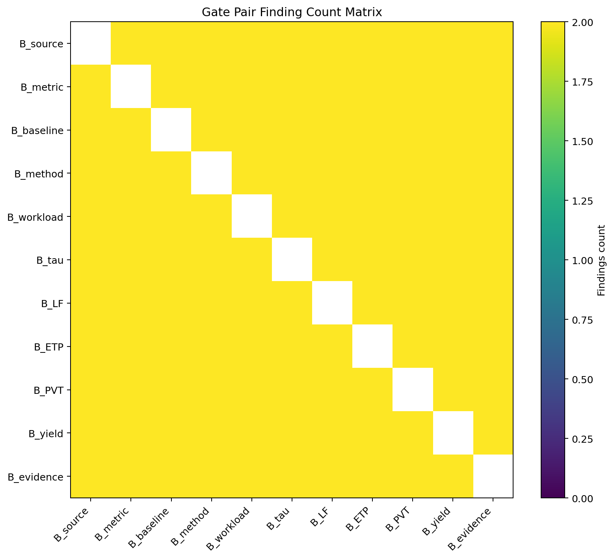
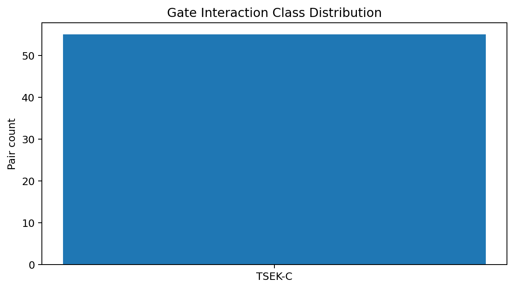
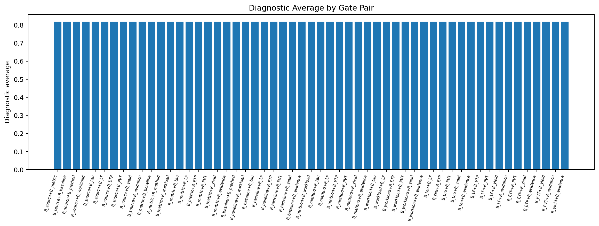

# Tau Scaling v0.4.2 Gate Interaction Matrix

Generated: `2026-05-27T14:55:58.390778+00:00`

## Result

- Gates: `11`
- Gate pairs: `55`
- All pairs executed: `True`
- Mean A_TSEK: `0.0`
- Mean diagnostic average: `0.8182`
- Chart count: `6`

## Class Counts

| Class | Count |
|---|---:|
| `TSEK-C` | 55 |

## Strongest Downgrade Pairs

| Gate A | Gate B | Class | A_TSEK | Diagnostic avg | Findings |
|---|---|---|---:|---:|---:|
| `B_source` | `B_metric` | TSEK-C | 0.0 | 0.8182 | 2 |
| `B_source` | `B_baseline` | TSEK-C | 0.0 | 0.8182 | 2 |
| `B_source` | `B_method` | TSEK-C | 0.0 | 0.8182 | 2 |
| `B_source` | `B_workload` | TSEK-C | 0.0 | 0.8182 | 2 |
| `B_source` | `B_tau` | TSEK-C | 0.0 | 0.8182 | 2 |
| `B_source` | `B_LF` | TSEK-C | 0.0 | 0.8182 | 2 |
| `B_source` | `B_ETP` | TSEK-C | 0.0 | 0.8182 | 2 |
| `B_source` | `B_PVT` | TSEK-C | 0.0 | 0.8182 | 2 |
| `B_source` | `B_yield` | TSEK-C | 0.0 | 0.8182 | 2 |
| `B_source` | `B_evidence` | TSEK-C | 0.0 | 0.8182 | 2 |

## Least Severe Pairs

| Gate A | Gate B | Class | A_TSEK | Diagnostic avg | Findings |
|---|---|---|---:|---:|---:|
| `B_source` | `B_metric` | TSEK-C | 0.0 | 0.8182 | 2 |
| `B_source` | `B_baseline` | TSEK-C | 0.0 | 0.8182 | 2 |
| `B_source` | `B_method` | TSEK-C | 0.0 | 0.8182 | 2 |
| `B_source` | `B_workload` | TSEK-C | 0.0 | 0.8182 | 2 |
| `B_source` | `B_tau` | TSEK-C | 0.0 | 0.8182 | 2 |
| `B_source` | `B_LF` | TSEK-C | 0.0 | 0.8182 | 2 |
| `B_source` | `B_ETP` | TSEK-C | 0.0 | 0.8182 | 2 |
| `B_source` | `B_PVT` | TSEK-C | 0.0 | 0.8182 | 2 |
| `B_source` | `B_yield` | TSEK-C | 0.0 | 0.8182 | 2 |
| `B_source` | `B_evidence` | TSEK-C | 0.0 | 0.8182 | 2 |

## Charts

## Boundary

Gate interaction matrices are synthetic local runtime diagnostics only. They are not silicon validation, product validation, manufacturing validation, process-node equivalence, benchmark superiority proof, or universal Tau Scaling proof.
