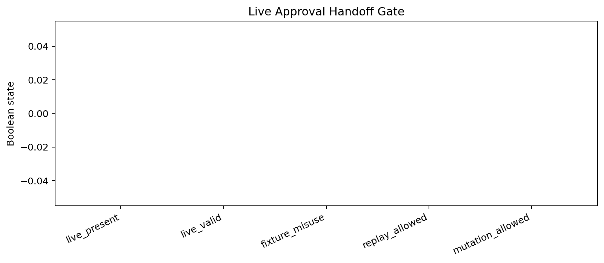
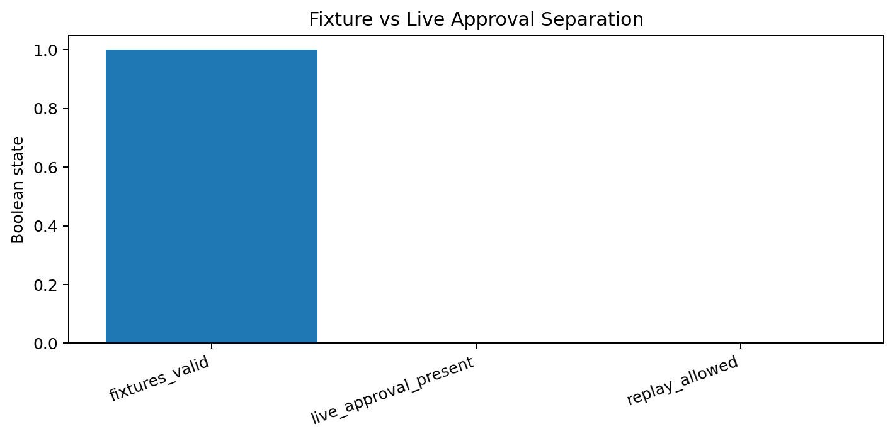
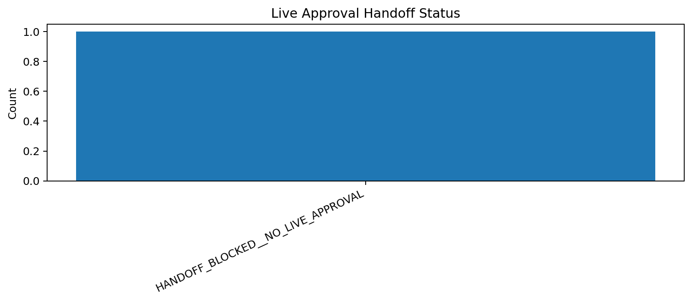

# Tau Scaling v0.6.6 Live Approval Handoff Check

Generated: `2026-05-28T07:57:32.694741+00:00`

## Handoff Result

- Handoff status: `HANDOFF_BLOCKED__NO_LIVE_APPROVAL`
- Live approval path: `MISSING`
- Live approval present: `False`
- Live approval valid: `False`
- Fixture misuse detected: `False`
- Approval decision: `MISSING`
- Replay allowed: `False`
- Branch created: `False`
- Mutation allowed: `False`
- Application allowed: `False`

## Reason

No live approval artifact was found in reports/human_approval/live/.

## Charts

## Boundary

Live approval handoff checks are local classifier-governance boundary artifacts. They do not create branches by default, do not mutate classifier behavior, do not apply calibration, and do not validate silicon, products, manufacturing, process nodes, benchmark superiority, or universal Tau Scaling law.
