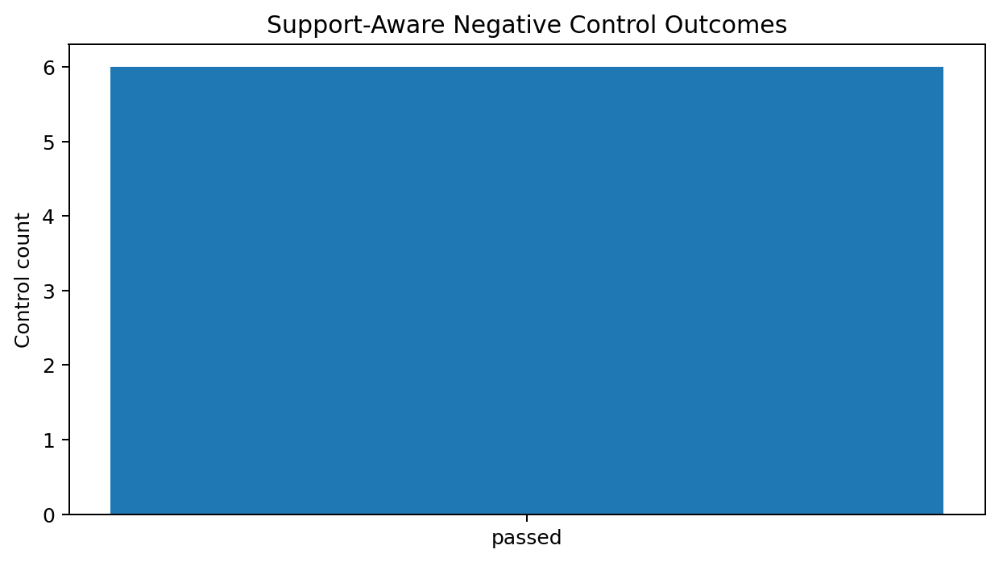
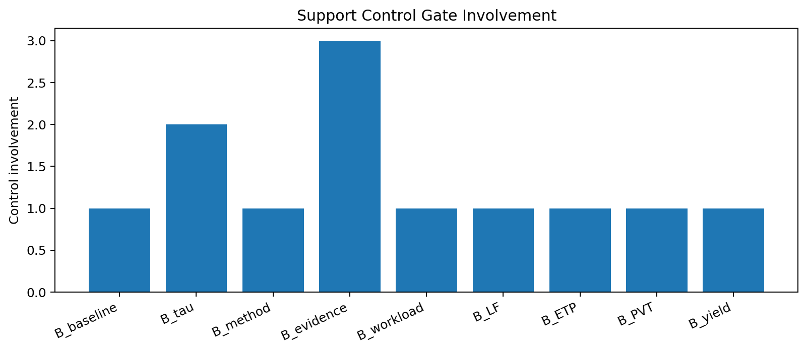
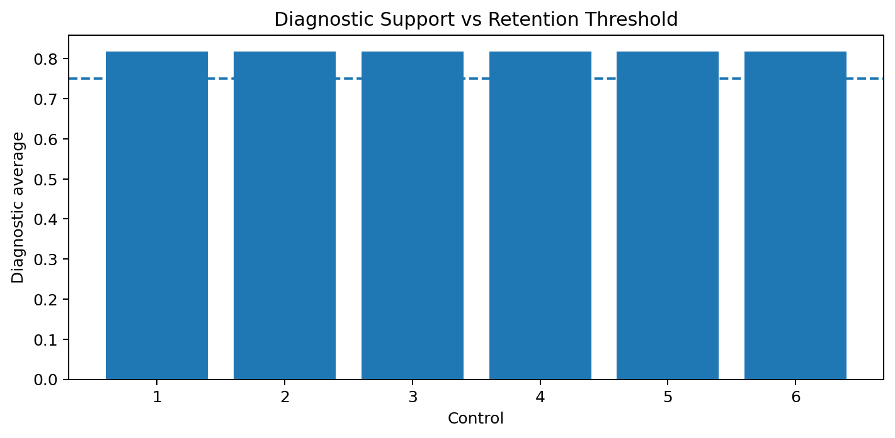

# Tau Scaling v0.5.4 Support-Aware Negative Controls

Generated: `2026-05-27T17:53:46.940203+00:00`

## Result

- Source remediation tasks: `6`
- Negative control count: `6`
- Passed controls: `6`
- Failed controls: `0`
- Final recommendation: `retain_block__support_controls_confirm_high_support_retention`
- Mutation allowed: `False`
- Policy enforced: `False`

## Control Outcomes

| Control | Gate pair | Diagnostic average | High support | Passed | Observed behavior |
|---|---|---:|---|---|---|
| `negative-control-v0-5-3-001` | `B_baseline+B_tau` | `0.8182` | `True` | `True` | `retain_blocked_no_downgrade` |
| `negative-control-v0-5-3-002` | `B_method+B_evidence` | `0.8182` | `True` | `True` | `retain_blocked_no_downgrade` |
| `negative-control-v0-5-3-003` | `B_workload+B_tau` | `0.8182` | `True` | `True` | `retain_blocked_no_downgrade` |
| `negative-control-v0-5-3-004` | `B_LF+B_ETP` | `0.8182` | `True` | `True` | `retain_blocked_no_downgrade` |
| `negative-control-v0-5-3-005` | `B_PVT+B_evidence` | `0.8182` | `True` | `True` | `retain_blocked_no_downgrade` |
| `negative-control-v0-5-3-006` | `B_yield+B_evidence` | `0.8182` | `True` | `True` | `retain_blocked_no_downgrade` |

## Charts

## Boundary

Support-aware negative controls are disabled/report-only local classifier-governance tests. They do not change classifier behavior and do not validate silicon, products, manufacturing, process nodes, benchmark superiority, or universal Tau Scaling law.
