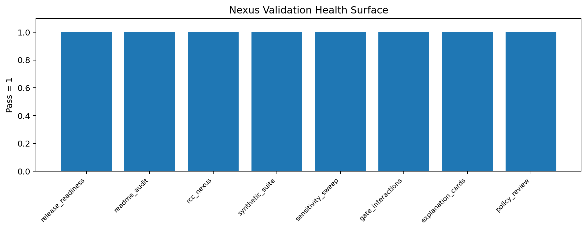
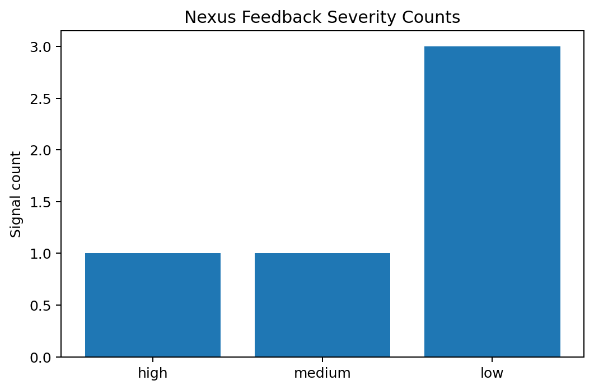
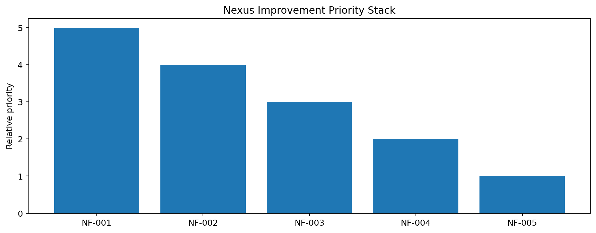

# Tau Scaling v0.4.5b Nexus Feedback Health Schema Alignment

Generated: `2026-05-26T15:27:00.877371+00:00`

## Result

- Health score: `0.75`
- Health passed: `False`
- Feedback signal count: `5`
- Chart count: `3`

## Health Checks

| Check | Passed |
|---|---:|
| `release_readiness` | `False` |
| `readme_audit` | `True` |
| `rcc_nexus` | `True` |
| `synthetic_suite` | `True` |
| `sensitivity_sweep` | `False` |
| `gate_interactions` | `True` |
| `explanation_cards` | `True` |
| `policy_review` | `True` |

## Improvement Priorities

| Rank | Signal | Severity | Surface | Recommendation | Target next |
|---:|---|---|---|---|---|
| 1 | `pair_policy_escalation_pressure` | `high` | `pair_policy` | Run a dry-run simulator before enforcing pair-policy changes. | TAU-SCALING-SA v0.4.6 - Pair Policy Dry-Run Simulator |
| 2 | `hard_reject_without_finding` | `medium` | `explanations` | Add explicit finding provenance for any TSEK-E collapse path that currently emits no finding code. | Diagnostic finding provenance repair |
| 3 | `agent_contract_current` | `low` | `agent_contract` | Generalize the AGENTS experiment-start rule so future layers do not carry stale version-specific language. | Agent contract feedback sync |
| 4 | `feedback_route_present` | `low` | `rcc_nexus` | Keep a route-map entry for Nexus feedback so agents know where reflective reports live. | Route-map feedback continuity |
| 5 | `feedback_command_present` | `low` | `readme` | Expose Nexus feedback as a first-class README command. | README feedback command sync |

## Feedback Signals

| ID | Surface | Severity | Signal | Evidence | Recommendation |
|---|---|---|---|---|---|
| `NF-001` | `pair_policy` | `high` | `pair_policy_escalation_pressure` | `{"escalation_ratio": 0.1636, "pair_count": 55, "policy_counts": {"HUMAN_REVIEW": 3, "TSEK-C_RETAIN": 46, "TSEK-D_CANDIDATE": 6}}` | Run a dry-run simulator before enforcing pair-policy changes. |
| `NF-002` | `explanations` | `medium` | `hard_reject_without_finding` | `{"count": 1, "review_counts": {"expected": 38, "hard_reject_without_finding": 1, "review_pair_policy": 55}}` | Add explicit finding provenance for any TSEK-E collapse path that currently emits no finding code. |
| `NF-003` | `agent_contract` | `low` | `agent_contract_current` | `{"found_v0_4_1_specific_rule": false}` | Generalize the AGENTS experiment-start rule so future layers do not carry stale version-specific language. |
| `NF-004` | `rcc_nexus` | `low` | `feedback_route_present` | `{"route_exists": true}` | Keep a route-map entry for Nexus feedback so agents know where reflective reports live. |
| `NF-005` | `readme` | `low` | `feedback_command_present` | `{"command_present": true}` | Expose Nexus feedback as a first-class README command. |

## Charts

## Boundary

Nexus feedback is repository self-observation and improvement prioritization only. It does not mutate classifier behavior and does not validate silicon, products, manufacturing, process nodes, benchmark superiority, AI understanding, or universal Tau Scaling law.
