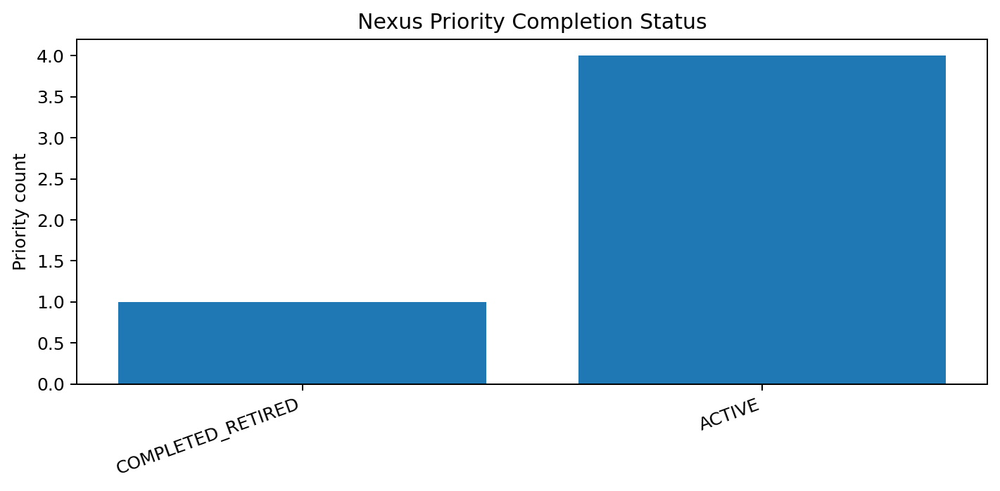
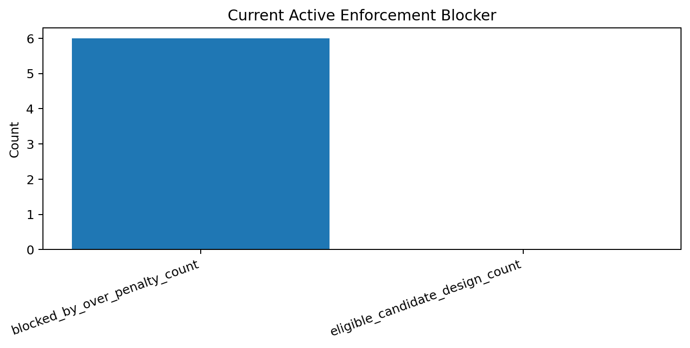
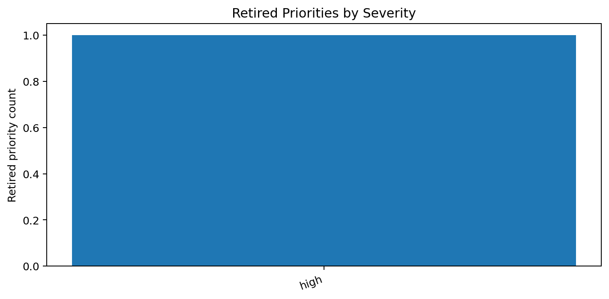

# Tau Scaling v0.5.1 Nexus Target Refresh and Completed-Signal Retirement

Generated: `2026-05-27T16:21:00.476421+00:00`

## Result

- Input Nexus priorities: `5`
- Completed/retired priorities: `1`
- Active priorities retained from old Nexus: `4`
- Current active blocker: `all_controlled_downgrades_blocked`
- Next current target: `TAU-SCALING-SA v0.5.2 - Over-Penalty Cause Decomposition`
- Mutation allowed: `False`
- Policy enforced: `False`

## Retired / Active Old Priorities

| ID | Old target | Status | Reason |
|---|---|---|---|
| `NF-001` | `TAU-SCALING-SA v0.4.6 - Pair Policy Dry-Run Simulator` | `COMPLETED_RETIRED` | Target evidence exists; recommendation should be retired from active Nexus queue. |
| `NF-002` | `Diagnostic finding provenance repair` | `ACTIVE` | No completion evidence found for target. |
| `NF-003` | `Agent contract feedback sync` | `ACTIVE` | No completion evidence found for target. |
| `NF-004` | `Route-map feedback continuity` | `ACTIVE` | No completion evidence found for target. |
| `NF-005` | `README feedback command sync` | `ACTIVE` | No completion evidence found for target. |

## New Active Blocker

- ID: `NF-ACTIVE-001`
- Surface: `enforcement_readiness`
- Signal: `all_controlled_downgrades_blocked`
- Severity: `high`
- Recommendation: Decompose why all controlled downgrades are blocked before any enforcement-candidate design.
- Target next: `TAU-SCALING-SA v0.5.2 - Over-Penalty Cause Decomposition`

## Charts

## Boundary

Nexus target refresh is repository self-observation and queue hygiene only. It does not change classifier behavior and does not validate silicon, products, manufacturing, process nodes, benchmark superiority, or universal Tau Scaling law.
