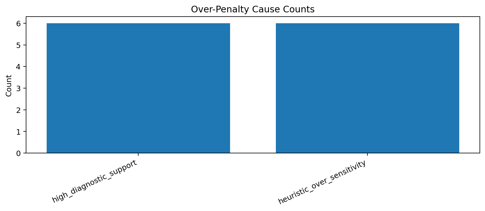
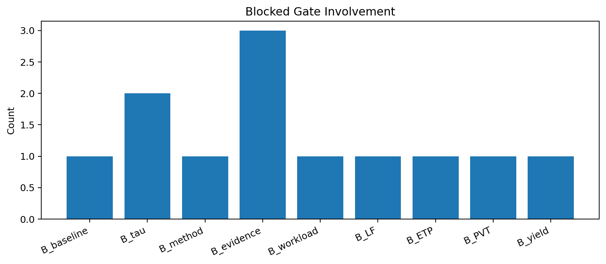

# Tau Scaling v0.5.2 Over-Penalty Cause Decomposition

Generated: `2026-05-27T17:35:35.176659+00:00`

## Result

- Blocked candidate count: `6`
- Cause card count: `6`
- Final recommendation: `prepare_disabled_calibration_plan`
- Mutation allowed: `False`
- Policy enforced: `False`

## Cause Counts

| Cause | Count |
|---|---:|
| `high_diagnostic_support` | 6 |
| `heuristic_over_sensitivity` | 6 |

## Cards

| Card | Gate pair | Primary cause | Remediation |
|---|---|---|---|
| `over-penalty-cause-v0-5-2-001` | `B_baseline+B_tau` | `high_diagnostic_support` | Add a secondary evidence-pressure test before downgrading high-support cases. |
| `over-penalty-cause-v0-5-2-002` | `B_method+B_evidence` | `high_diagnostic_support` | Add a secondary evidence-pressure test before downgrading high-support cases. |
| `over-penalty-cause-v0-5-2-003` | `B_workload+B_tau` | `high_diagnostic_support` | Add a secondary evidence-pressure test before downgrading high-support cases. |
| `over-penalty-cause-v0-5-2-004` | `B_LF+B_ETP` | `high_diagnostic_support` | Add a secondary evidence-pressure test before downgrading high-support cases. |
| `over-penalty-cause-v0-5-2-005` | `B_PVT+B_evidence` | `high_diagnostic_support` | Add a secondary evidence-pressure test before downgrading high-support cases. |
| `over-penalty-cause-v0-5-2-006` | `B_yield+B_evidence` | `high_diagnostic_support` | Add a secondary evidence-pressure test before downgrading high-support cases. |

## Charts

## Boundary

Over-penalty cause decomposition is local classifier-governance analysis only. It does not change classifier behavior and does not validate silicon, products, manufacturing, process nodes, benchmark superiority, or universal Tau Scaling law.
