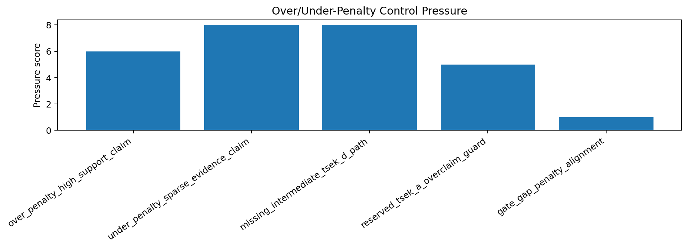
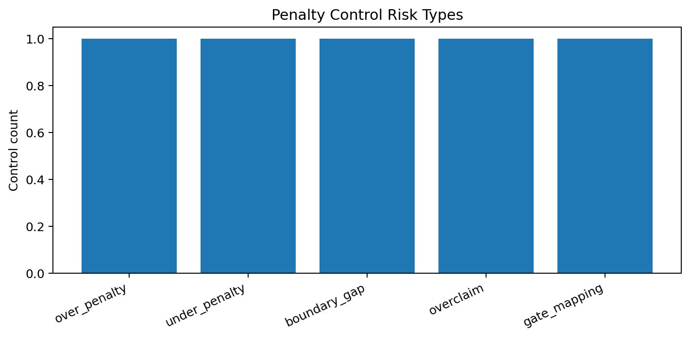
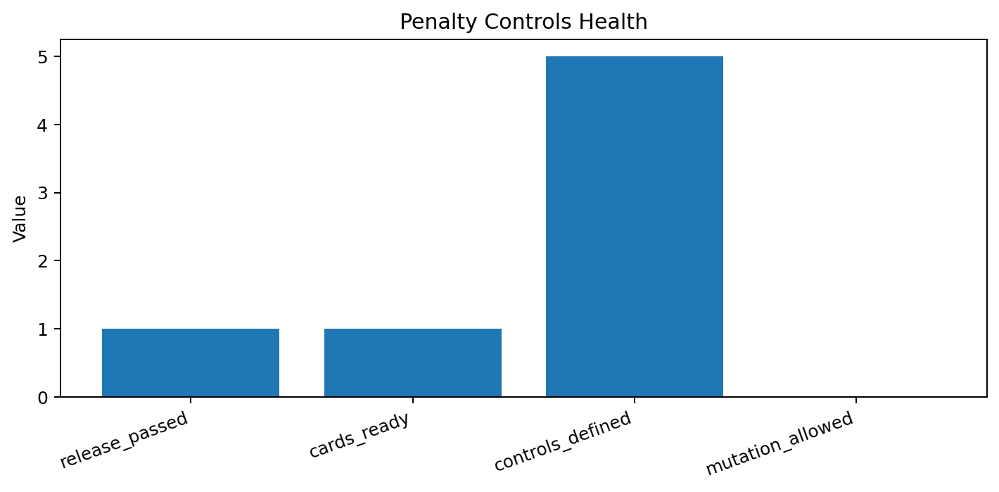

# Tau Scaling v0.7.6 Over/Under-Penalty Negative Controls

Generated: `2026-05-28T08:51:31.326873+00:00`

## Control Result

- Control status: `PENALTY_CONTROLS_DEFINED__REPORT_ONLY_NO_MUTATION`
- Release passed: `True`
- Boundary cards ready: `True`
- Control count: `5`
- Thresholds changed: `False`
- Classifier changed: `False`

## Controls

| Control | Risk | Boundary | Pressure | Expected behavior |
|---|---|---|---:|---|
| `over_penalty_high_support_claim` | `over_penalty` | `TSEK-C/TSEK-E` | 6 | `retain_or_explain_controlled_downgrade` |
| `under_penalty_sparse_evidence_claim` | `under_penalty` | `TSEK-B/TSEK-C` | 8 | `downgrade_or_block_promotion` |
| `missing_intermediate_tsek_d_path` | `boundary_gap` | `TSEK-C/TSEK-D/TSEK-E` | 8 | `explain_absence_or_add_future_scenario` |
| `reserved_tsek_a_overclaim_guard` | `overclaim` | `TSEK-A/TSEK-B` | 5 | `keep_tsek_a_reserved_without_external_evidence` |
| `gate_gap_penalty_alignment` | `gate_mapping` | `gate_family_to_tsek_score` | 1 | `report_only_no_threshold_change` |

## Interpretation

These controls define what must be tested before any threshold dry-run or classifier-policy change. They do not run a threshold change and do not alter classifier behavior.

## Next Tau Work

1. Convert these controls into report-only synthetic scenarios.
2. Compare current TSEK output against expected over/under-penalty behavior.
3. Separate true rejection from over-penalty collapse.
4. Preserve threshold and classifier mutation locks until dry-run evidence exists.

## Charts

## Boundary

Over/under-penalty negative controls are local classifier-governance analysis artifacts. They define test controls before threshold dry-runs. They do not create live approval, execute replay commands, create branches, mutate classifier behavior, apply calibration, change thresholds, or validate silicon, products, manufacturing, process nodes, benchmark superiority, or universal Tau Scaling law.
