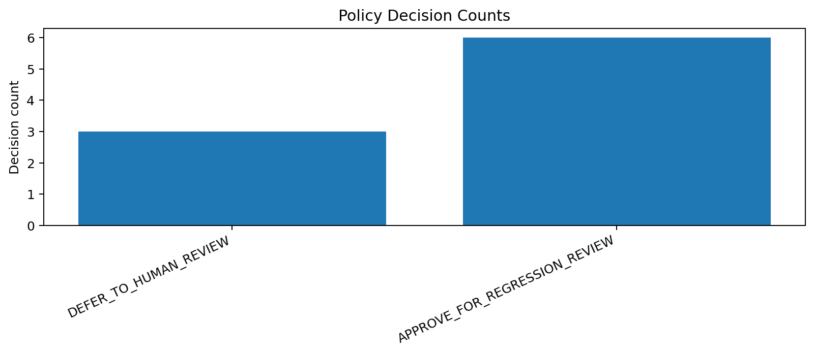
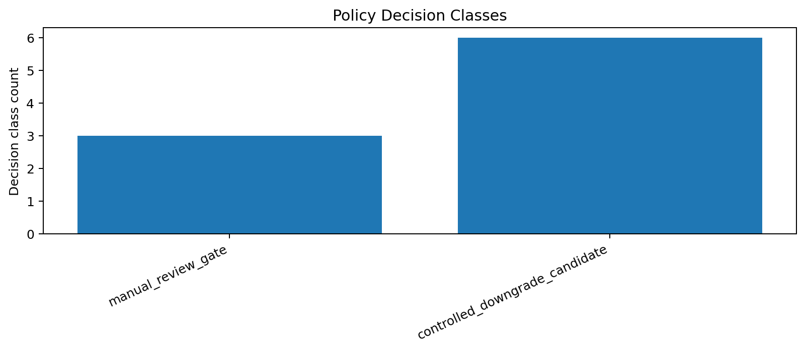
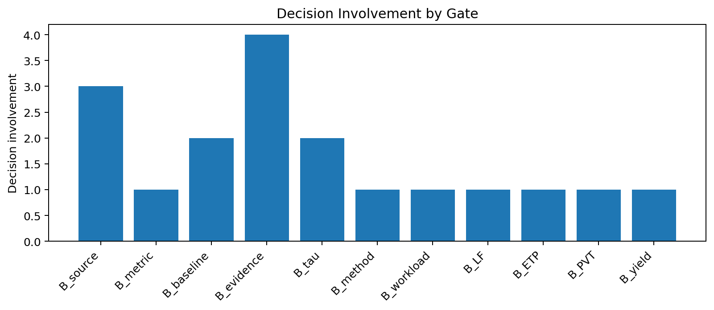

# Tau Scaling v0.4.8 Policy Decision Record

Generated: `2026-05-27T15:45:44.821856+00:00`

## Result

- Input impact cards: `9`
- Mutation allowed: `False`
- Policy enforced: `False`
- Final recommendation: `no_classifier_mutation__prepare_regression_review_for_controlled_downgrades`

## Decision Counts

| Decision | Count |
|---|---:|
| `DEFER_TO_HUMAN_REVIEW` | 3 |
| `APPROVE_FOR_REGRESSION_REVIEW` | 6 |

## Decision Rows

| Card | Gate pair | Current | Simulated | Impact | Decision | Mutation allowed |
|---|---|---|---|---|---|---:|
| `policy-impact-v0-4-7-001` | `B_source+B_metric` | `TSEK-C` | `HUMAN_REVIEW` | `manual_review_required` | `DEFER_TO_HUMAN_REVIEW` | `False` |
| `policy-impact-v0-4-7-002` | `B_source+B_baseline` | `TSEK-C` | `HUMAN_REVIEW` | `manual_review_required` | `DEFER_TO_HUMAN_REVIEW` | `False` |
| `policy-impact-v0-4-7-003` | `B_source+B_evidence` | `TSEK-C` | `HUMAN_REVIEW` | `manual_review_required` | `DEFER_TO_HUMAN_REVIEW` | `False` |
| `policy-impact-v0-4-7-004` | `B_baseline+B_tau` | `TSEK-C` | `TSEK-D` | `controlled_policy_downgrade` | `APPROVE_FOR_REGRESSION_REVIEW` | `False` |
| `policy-impact-v0-4-7-005` | `B_method+B_evidence` | `TSEK-C` | `TSEK-D` | `controlled_policy_downgrade` | `APPROVE_FOR_REGRESSION_REVIEW` | `False` |
| `policy-impact-v0-4-7-006` | `B_workload+B_tau` | `TSEK-C` | `TSEK-D` | `controlled_policy_downgrade` | `APPROVE_FOR_REGRESSION_REVIEW` | `False` |
| `policy-impact-v0-4-7-007` | `B_LF+B_ETP` | `TSEK-C` | `TSEK-D` | `controlled_policy_downgrade` | `APPROVE_FOR_REGRESSION_REVIEW` | `False` |
| `policy-impact-v0-4-7-008` | `B_PVT+B_evidence` | `TSEK-C` | `TSEK-D` | `controlled_policy_downgrade` | `APPROVE_FOR_REGRESSION_REVIEW` | `False` |
| `policy-impact-v0-4-7-009` | `B_yield+B_evidence` | `TSEK-C` | `TSEK-D` | `controlled_policy_downgrade` | `APPROVE_FOR_REGRESSION_REVIEW` | `False` |

## Charts

## Decision Lock

This record does not permit classifier mutation. It only converts impact cards into a governed decision surface.

## Boundary

Policy decision records are local classifier-governance artifacts only. They do not change classifier behavior and do not validate silicon, products, manufacturing, process nodes, benchmark superiority, or universal Tau Scaling law.
