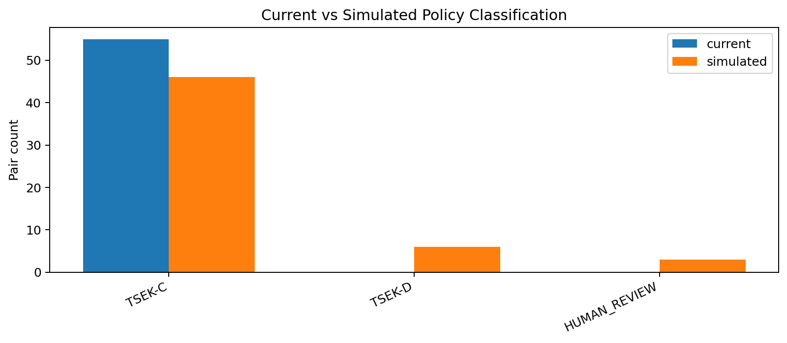
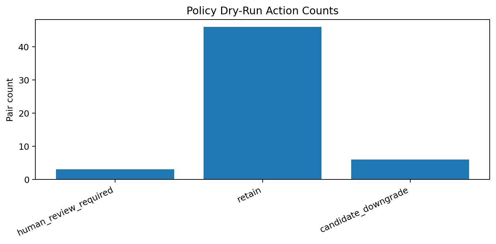
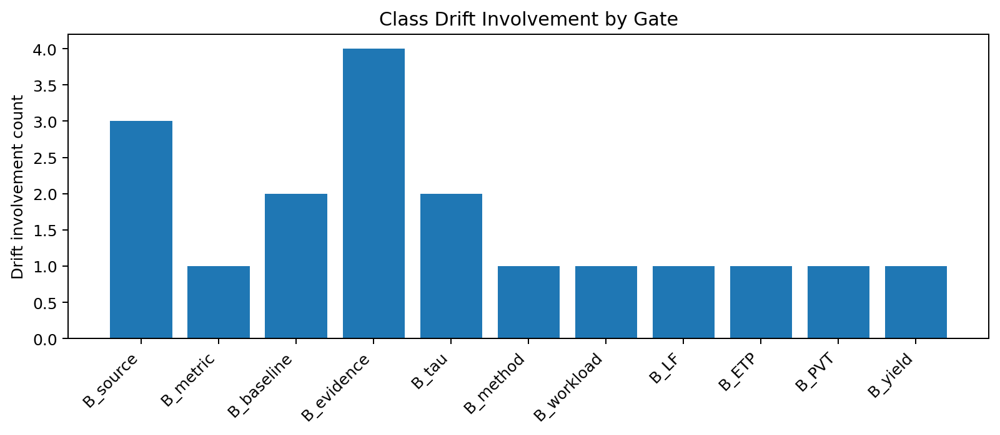

# Tau Scaling v0.4.6 Pair Policy Dry-Run Simulator

Generated: `2026-05-27T15:38:18.441796+00:00`

## Result

- Pair count: `55`
- Drift count: `9`
- Drift ratio: `0.1636`
- Downgrade count: `6`
- Human review count: `3`
- Hard reject count: `0`
- Over-penalty flag: `False`
- Recommendation: `safe_for_human_review_not_enforcement`
- Policy enforced: `False`

## Current vs Simulated Class Counts

| Class | Current | Simulated |
|---|---:|---:|
| `TSEK-C` | 55 | 46 |
| `TSEK-D` | 0 | 6 |
| `HUMAN_REVIEW` | 0 | 3 |

## Simulation Actions

| Action | Count |
|---|---:|
| `human_review_required` | 3 |
| `retain` | 46 |
| `candidate_downgrade` | 6 |

## Drift by Gate

| Gate | Drift involvement count |
|---|---:|
| `B_evidence` | 4 |
| `B_source` | 3 |
| `B_baseline` | 2 |
| `B_tau` | 2 |
| `B_ETP` | 1 |
| `B_LF` | 1 |
| `B_PVT` | 1 |
| `B_method` | 1 |
| `B_metric` | 1 |
| `B_workload` | 1 |
| `B_yield` | 1 |

## Dry-Run Rows

| Gate A | Gate B | Current | Simulated | Action | Drifted | Reason |
|---|---|---|---|---|---:|---|
| `B_source` | `B_metric` | `TSEK-C` | `HUMAN_REVIEW` | `human_review_required` | `True` | Source-boundary failures affect interpretability of the entire claim. |
| `B_source` | `B_baseline` | `TSEK-C` | `HUMAN_REVIEW` | `human_review_required` | `True` | Source-boundary failures affect interpretability of the entire claim. |
| `B_source` | `B_method` | `TSEK-C` | `TSEK-C` | `retain` | `False` | Paired failure is controlled and interpretable; no overclaim or hard rejection condition detected. |
| `B_source` | `B_workload` | `TSEK-C` | `TSEK-C` | `retain` | `False` | Paired failure is controlled and interpretable; no overclaim or hard rejection condition detected. |
| `B_source` | `B_tau` | `TSEK-C` | `TSEK-C` | `retain` | `False` | Paired failure is controlled and interpretable; no overclaim or hard rejection condition detected. |
| `B_source` | `B_LF` | `TSEK-C` | `TSEK-C` | `retain` | `False` | Paired failure is controlled and interpretable; no overclaim or hard rejection condition detected. |
| `B_source` | `B_ETP` | `TSEK-C` | `TSEK-C` | `retain` | `False` | Paired failure is controlled and interpretable; no overclaim or hard rejection condition detected. |
| `B_source` | `B_PVT` | `TSEK-C` | `TSEK-C` | `retain` | `False` | Paired failure is controlled and interpretable; no overclaim or hard rejection condition detected. |
| `B_source` | `B_yield` | `TSEK-C` | `TSEK-C` | `retain` | `False` | Paired failure is controlled and interpretable; no overclaim or hard rejection condition detected. |
| `B_source` | `B_evidence` | `TSEK-C` | `HUMAN_REVIEW` | `human_review_required` | `True` | Source-boundary failures affect interpretability of the entire claim. |
| `B_metric` | `B_baseline` | `TSEK-C` | `TSEK-C` | `retain` | `False` | Paired failure is controlled and interpretable; no overclaim or hard rejection condition detected. |
| `B_metric` | `B_method` | `TSEK-C` | `TSEK-C` | `retain` | `False` | Paired failure is controlled and interpretable; no overclaim or hard rejection condition detected. |
| `B_metric` | `B_workload` | `TSEK-C` | `TSEK-C` | `retain` | `False` | Paired failure is controlled and interpretable; no overclaim or hard rejection condition detected. |
| `B_metric` | `B_tau` | `TSEK-C` | `TSEK-C` | `retain` | `False` | Paired failure is controlled and interpretable; no overclaim or hard rejection condition detected. |
| `B_metric` | `B_LF` | `TSEK-C` | `TSEK-C` | `retain` | `False` | Paired failure is controlled and interpretable; no overclaim or hard rejection condition detected. |
| `B_metric` | `B_ETP` | `TSEK-C` | `TSEK-C` | `retain` | `False` | Paired failure is controlled and interpretable; no overclaim or hard rejection condition detected. |
| `B_metric` | `B_PVT` | `TSEK-C` | `TSEK-C` | `retain` | `False` | Paired failure is controlled and interpretable; no overclaim or hard rejection condition detected. |
| `B_metric` | `B_yield` | `TSEK-C` | `TSEK-C` | `retain` | `False` | Paired failure is controlled and interpretable; no overclaim or hard rejection condition detected. |
| `B_metric` | `B_evidence` | `TSEK-C` | `TSEK-C` | `retain` | `False` | Paired failure is controlled and interpretable; no overclaim or hard rejection condition detected. |
| `B_baseline` | `B_method` | `TSEK-C` | `TSEK-C` | `retain` | `False` | Paired failure is controlled and interpretable; no overclaim or hard rejection condition detected. |
| `B_baseline` | `B_workload` | `TSEK-C` | `TSEK-C` | `retain` | `False` | Paired failure is controlled and interpretable; no overclaim or hard rejection condition detected. |
| `B_baseline` | `B_tau` | `TSEK-C` | `TSEK-D` | `candidate_downgrade` | `True` | Tau improvements are not interpretable without workload and baseline context. |
| `B_baseline` | `B_LF` | `TSEK-C` | `TSEK-C` | `retain` | `False` | Paired failure is controlled and interpretable; no overclaim or hard rejection condition detected. |
| `B_baseline` | `B_ETP` | `TSEK-C` | `TSEK-C` | `retain` | `False` | Paired failure is controlled and interpretable; no overclaim or hard rejection condition detected. |
| `B_baseline` | `B_PVT` | `TSEK-C` | `TSEK-C` | `retain` | `False` | Paired failure is controlled and interpretable; no overclaim or hard rejection condition detected. |
| `B_baseline` | `B_yield` | `TSEK-C` | `TSEK-C` | `retain` | `False` | Paired failure is controlled and interpretable; no overclaim or hard rejection condition detected. |
| `B_baseline` | `B_evidence` | `TSEK-C` | `TSEK-C` | `retain` | `False` | Paired failure is controlled and interpretable; no overclaim or hard rejection condition detected. |
| `B_method` | `B_workload` | `TSEK-C` | `TSEK-C` | `retain` | `False` | Paired failure is controlled and interpretable; no overclaim or hard rejection condition detected. |
| `B_method` | `B_tau` | `TSEK-C` | `TSEK-C` | `retain` | `False` | Paired failure is controlled and interpretable; no overclaim or hard rejection condition detected. |
| `B_method` | `B_LF` | `TSEK-C` | `TSEK-C` | `retain` | `False` | Paired failure is controlled and interpretable; no overclaim or hard rejection condition detected. |
| `B_method` | `B_ETP` | `TSEK-C` | `TSEK-C` | `retain` | `False` | Paired failure is controlled and interpretable; no overclaim or hard rejection condition detected. |
| `B_method` | `B_PVT` | `TSEK-C` | `TSEK-C` | `retain` | `False` | Paired failure is controlled and interpretable; no overclaim or hard rejection condition detected. |
| `B_method` | `B_yield` | `TSEK-C` | `TSEK-C` | `retain` | `False` | Paired failure is controlled and interpretable; no overclaim or hard rejection condition detected. |
| `B_method` | `B_evidence` | `TSEK-C` | `TSEK-D` | `candidate_downgrade` | `True` | Evidence plus physical-disclosure failure weakens auditability beyond ordinary single-gate downgrade. |
| `B_workload` | `B_tau` | `TSEK-C` | `TSEK-D` | `candidate_downgrade` | `True` | Tau improvements are not interpretable without workload and baseline context. |
| `B_workload` | `B_LF` | `TSEK-C` | `TSEK-C` | `retain` | `False` | Paired failure is controlled and interpretable; no overclaim or hard rejection condition detected. |
| `B_workload` | `B_ETP` | `TSEK-C` | `TSEK-C` | `retain` | `False` | Paired failure is controlled and interpretable; no overclaim or hard rejection condition detected. |
| `B_workload` | `B_PVT` | `TSEK-C` | `TSEK-C` | `retain` | `False` | Paired failure is controlled and interpretable; no overclaim or hard rejection condition detected. |
| `B_workload` | `B_yield` | `TSEK-C` | `TSEK-C` | `retain` | `False` | Paired failure is controlled and interpretable; no overclaim or hard rejection condition detected. |
| `B_workload` | `B_evidence` | `TSEK-C` | `TSEK-C` | `retain` | `False` | Paired failure is controlled and interpretable; no overclaim or hard rejection condition detected. |
| `B_tau` | `B_LF` | `TSEK-C` | `TSEK-C` | `retain` | `False` | Paired failure is controlled and interpretable; no overclaim or hard rejection condition detected. |
| `B_tau` | `B_ETP` | `TSEK-C` | `TSEK-C` | `retain` | `False` | Paired failure is controlled and interpretable; no overclaim or hard rejection condition detected. |
| `B_tau` | `B_PVT` | `TSEK-C` | `TSEK-C` | `retain` | `False` | Paired failure is controlled and interpretable; no overclaim or hard rejection condition detected. |
| `B_tau` | `B_yield` | `TSEK-C` | `TSEK-C` | `retain` | `False` | Paired failure is controlled and interpretable; no overclaim or hard rejection condition detected. |
| `B_tau` | `B_evidence` | `TSEK-C` | `TSEK-C` | `retain` | `False` | Paired failure is controlled and interpretable; no overclaim or hard rejection condition detected. |
| `B_LF` | `B_ETP` | `TSEK-C` | `TSEK-D` | `candidate_downgrade` | `True` | LogicFolding viability and normalized tau gain are both central to the runtime claim path. |
| `B_LF` | `B_PVT` | `TSEK-C` | `TSEK-C` | `retain` | `False` | Paired failure is controlled and interpretable; no overclaim or hard rejection condition detected. |
| `B_LF` | `B_yield` | `TSEK-C` | `TSEK-C` | `retain` | `False` | Paired failure is controlled and interpretable; no overclaim or hard rejection condition detected. |
| `B_LF` | `B_evidence` | `TSEK-C` | `TSEK-C` | `retain` | `False` | Paired failure is controlled and interpretable; no overclaim or hard rejection condition detected. |
| `B_ETP` | `B_PVT` | `TSEK-C` | `TSEK-C` | `retain` | `False` | Paired failure is controlled and interpretable; no overclaim or hard rejection condition detected. |
| `B_ETP` | `B_yield` | `TSEK-C` | `TSEK-C` | `retain` | `False` | Paired failure is controlled and interpretable; no overclaim or hard rejection condition detected. |
| `B_ETP` | `B_evidence` | `TSEK-C` | `TSEK-C` | `retain` | `False` | Paired failure is controlled and interpretable; no overclaim or hard rejection condition detected. |
| `B_PVT` | `B_yield` | `TSEK-C` | `TSEK-C` | `retain` | `False` | Paired failure is controlled and interpretable; no overclaim or hard rejection condition detected. |
| `B_PVT` | `B_evidence` | `TSEK-C` | `TSEK-D` | `candidate_downgrade` | `True` | Evidence plus physical-disclosure failure weakens auditability beyond ordinary single-gate downgrade. |
| `B_yield` | `B_evidence` | `TSEK-C` | `TSEK-D` | `candidate_downgrade` | `True` | Evidence plus physical-disclosure failure weakens auditability beyond ordinary single-gate downgrade. |

## Charts

## Boundary

Pair policy dry-run simulates classifier-policy impact only. It does not change classifier behavior and does not validate silicon, products, manufacturing, process nodes, benchmark superiority, or universal Tau Scaling law.
