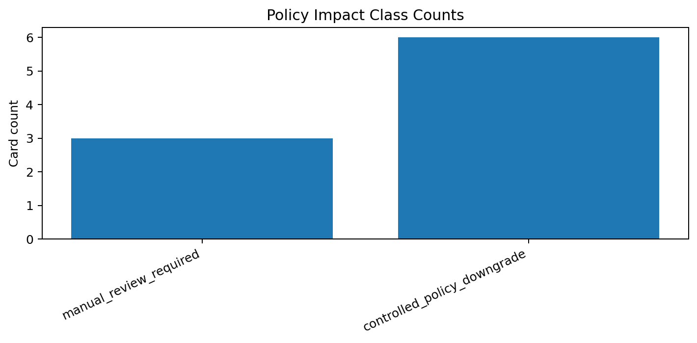
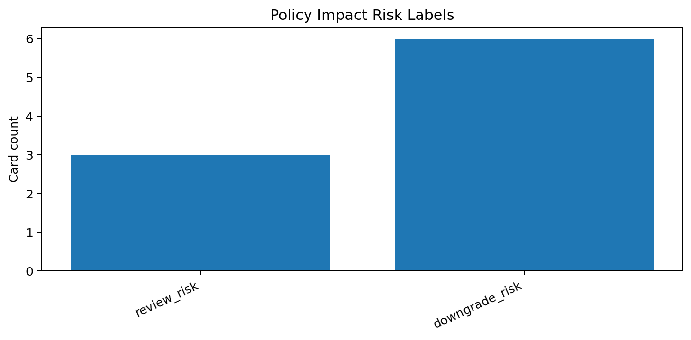
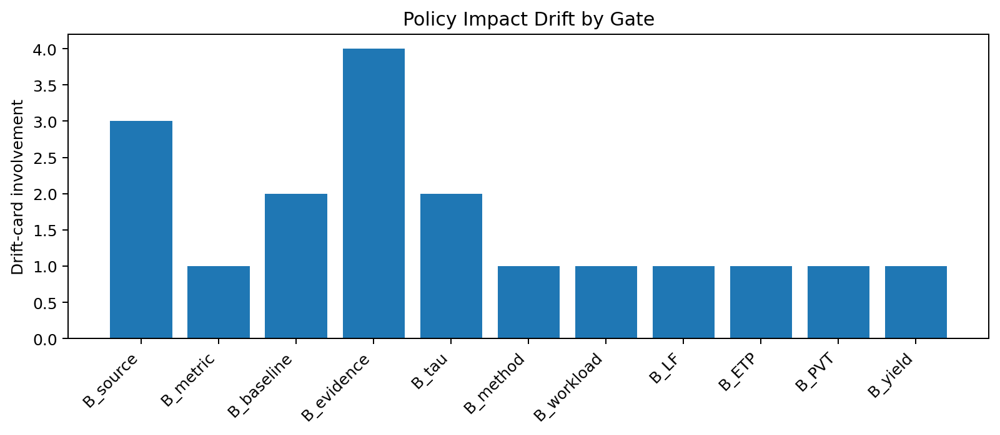

# Tau Scaling v0.4.7 Policy Impact Explanation Cards

Generated: `2026-05-27T15:45:43.429917+00:00`

## Result

- Input dry-run rows: `55`
- Drift cards: `9`
- Controlled downgrade cards: `6`
- Manual review cards: `3`
- Hard reject candidate cards: `0`
- Policy enforced: `False`

## Impact Classes

| Impact class | Count |
|---|---:|
| `manual_review_required` | 3 |
| `controlled_policy_downgrade` | 6 |

## Risk Labels

| Risk label | Count |
|---|---:|
| `review_risk` | 3 |
| `downgrade_risk` | 6 |

## Cards

| Card | Gate pair | Current | Simulated | Impact | Decision hint |
|---|---|---|---|---|---|
| [`policy-impact-v0-4-7-001`](cards/v0_4_7/policy-impact-v0-4-7-001.md) | `B_source+B_metric` | `TSEK-C` | `HUMAN_REVIEW` | `manual_review_required` | Do not enforce automatically; route to human policy review. |
| [`policy-impact-v0-4-7-002`](cards/v0_4_7/policy-impact-v0-4-7-002.md) | `B_source+B_baseline` | `TSEK-C` | `HUMAN_REVIEW` | `manual_review_required` | Do not enforce automatically; route to human policy review. |
| [`policy-impact-v0-4-7-003`](cards/v0_4_7/policy-impact-v0-4-7-003.md) | `B_source+B_evidence` | `TSEK-C` | `HUMAN_REVIEW` | `manual_review_required` | Do not enforce automatically; route to human policy review. |
| [`policy-impact-v0-4-7-004`](cards/v0_4_7/policy-impact-v0-4-7-004.md) | `B_baseline+B_tau` | `TSEK-C` | `TSEK-D` | `controlled_policy_downgrade` | Candidate controlled downgrade; explain and regression-test before enforcement. |
| [`policy-impact-v0-4-7-005`](cards/v0_4_7/policy-impact-v0-4-7-005.md) | `B_method+B_evidence` | `TSEK-C` | `TSEK-D` | `controlled_policy_downgrade` | Candidate controlled downgrade; explain and regression-test before enforcement. |
| [`policy-impact-v0-4-7-006`](cards/v0_4_7/policy-impact-v0-4-7-006.md) | `B_workload+B_tau` | `TSEK-C` | `TSEK-D` | `controlled_policy_downgrade` | Candidate controlled downgrade; explain and regression-test before enforcement. |
| [`policy-impact-v0-4-7-007`](cards/v0_4_7/policy-impact-v0-4-7-007.md) | `B_LF+B_ETP` | `TSEK-C` | `TSEK-D` | `controlled_policy_downgrade` | Candidate controlled downgrade; explain and regression-test before enforcement. |
| [`policy-impact-v0-4-7-008`](cards/v0_4_7/policy-impact-v0-4-7-008.md) | `B_PVT+B_evidence` | `TSEK-C` | `TSEK-D` | `controlled_policy_downgrade` | Candidate controlled downgrade; explain and regression-test before enforcement. |
| [`policy-impact-v0-4-7-009`](cards/v0_4_7/policy-impact-v0-4-7-009.md) | `B_yield+B_evidence` | `TSEK-C` | `TSEK-D` | `controlled_policy_downgrade` | Candidate controlled downgrade; explain and regression-test before enforcement. |

## Charts

## Boundary

Policy impact explanation cards explain dry-run classifier-policy effects only. They do not change classifier behavior and do not validate silicon, products, manufacturing, process nodes, benchmark superiority, or universal Tau Scaling law.
