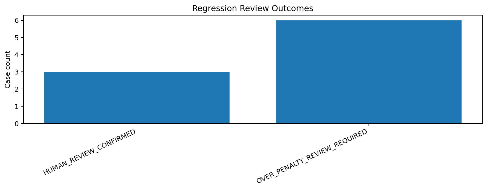
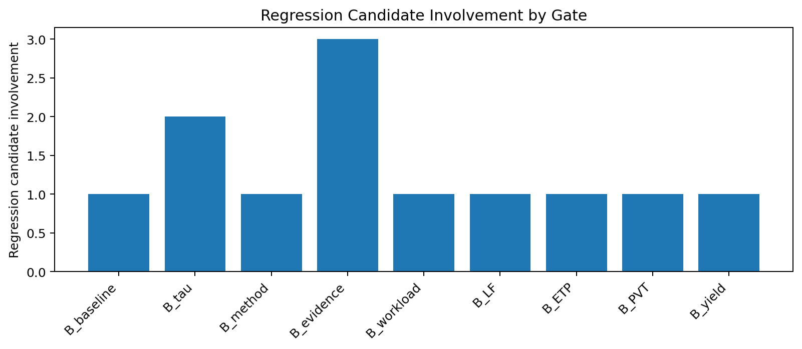
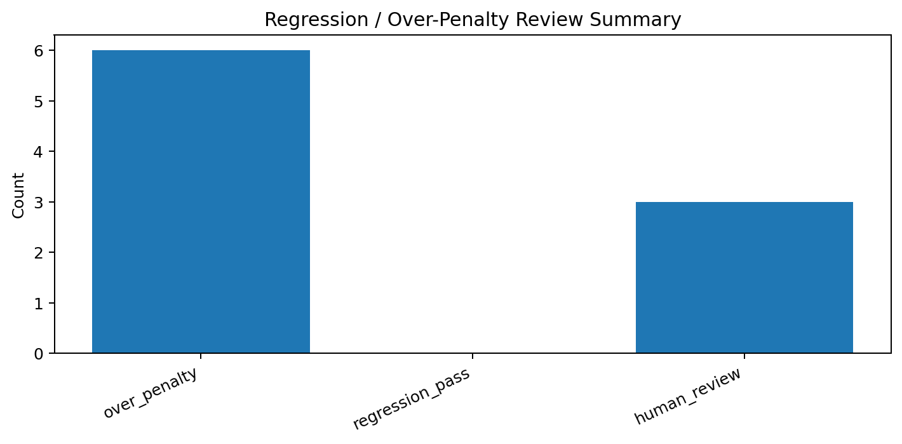

# Tau Scaling v0.4.9 Regression and Over-Penalty Review

Generated: `2026-05-27T15:38:24.059781+00:00`

## Result

- Input decision rows: `9`
- Controlled downgrade candidates: `6`
- Regression pass count: `0`
- Over-penalty count: `6`
- Human review confirmed count: `3`
- Mutation allowed: `False`
- Policy enforced: `False`
- Final recommendation: `do_not_enforce__over_penalty_review_required`

## Review Outcomes

| Outcome | Count |
|---|---:|
| `HUMAN_REVIEW_CONFIRMED` | 3 |
| `OVER_PENALTY_REVIEW_REQUIRED` | 6 |

## Review Rows

| Gate pair | Current | Simulated | Decision | Outcome | Over-penalty | Regression passed | Recommendation |
|---|---|---|---|---|---:|---:|---|
| `B_source+B_metric` | `TSEK-C` | `HUMAN_REVIEW` | `DEFER_TO_HUMAN_REVIEW` | `HUMAN_REVIEW_CONFIRMED` | `False` | `False` | Keep human-review routing. Do not convert to automatic downgrade. |
| `B_source+B_baseline` | `TSEK-C` | `HUMAN_REVIEW` | `DEFER_TO_HUMAN_REVIEW` | `HUMAN_REVIEW_CONFIRMED` | `False` | `False` | Keep human-review routing. Do not convert to automatic downgrade. |
| `B_source+B_evidence` | `TSEK-C` | `HUMAN_REVIEW` | `DEFER_TO_HUMAN_REVIEW` | `HUMAN_REVIEW_CONFIRMED` | `False` | `False` | Keep human-review routing. Do not convert to automatic downgrade. |
| `B_baseline+B_tau` | `TSEK-C` | `TSEK-D` | `APPROVE_FOR_REGRESSION_REVIEW` | `OVER_PENALTY_REVIEW_REQUIRED` | `True` | `False` | Do not enforce. Review evidence pressure, diagnostic support, and finding provenance. |
| `B_method+B_evidence` | `TSEK-C` | `TSEK-D` | `APPROVE_FOR_REGRESSION_REVIEW` | `OVER_PENALTY_REVIEW_REQUIRED` | `True` | `False` | Do not enforce. Review evidence pressure, diagnostic support, and finding provenance. |
| `B_workload+B_tau` | `TSEK-C` | `TSEK-D` | `APPROVE_FOR_REGRESSION_REVIEW` | `OVER_PENALTY_REVIEW_REQUIRED` | `True` | `False` | Do not enforce. Review evidence pressure, diagnostic support, and finding provenance. |
| `B_LF+B_ETP` | `TSEK-C` | `TSEK-D` | `APPROVE_FOR_REGRESSION_REVIEW` | `OVER_PENALTY_REVIEW_REQUIRED` | `True` | `False` | Do not enforce. Review evidence pressure, diagnostic support, and finding provenance. |
| `B_PVT+B_evidence` | `TSEK-C` | `TSEK-D` | `APPROVE_FOR_REGRESSION_REVIEW` | `OVER_PENALTY_REVIEW_REQUIRED` | `True` | `False` | Do not enforce. Review evidence pressure, diagnostic support, and finding provenance. |
| `B_yield+B_evidence` | `TSEK-C` | `TSEK-D` | `APPROVE_FOR_REGRESSION_REVIEW` | `OVER_PENALTY_REVIEW_REQUIRED` | `True` | `False` | Do not enforce. Review evidence pressure, diagnostic support, and finding provenance. |

## Charts

## Boundary

Regression and over-penalty review is local classifier-governance analysis only. It does not change classifier behavior and does not validate silicon, products, manufacturing, process nodes, benchmark superiority, or universal Tau Scaling law.
