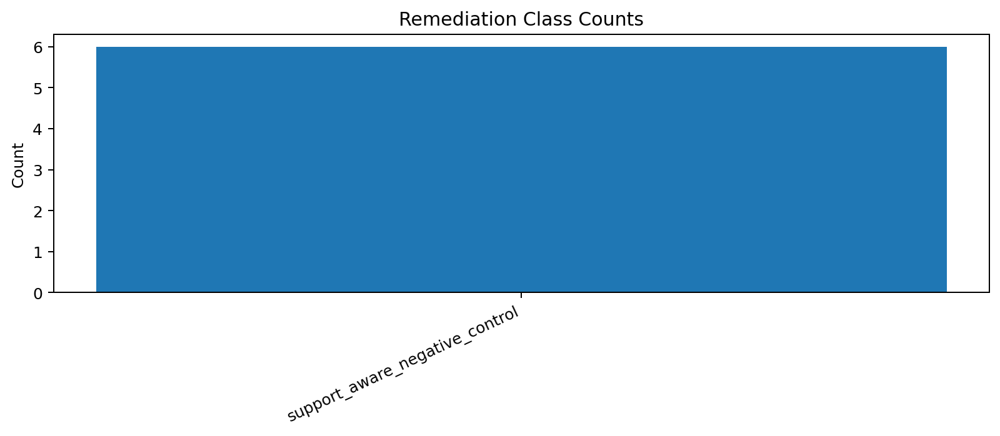
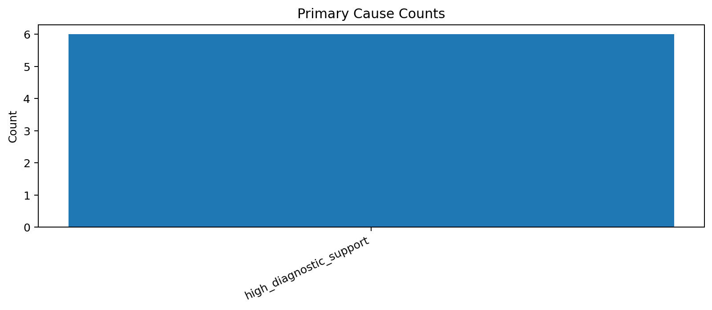
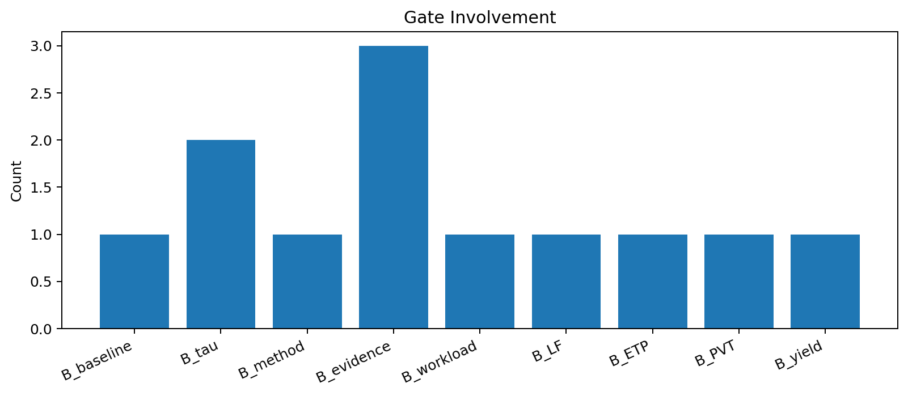

# Tau Scaling v0.5.3 Cause-Specific Remediation Plan

Generated: `2026-05-27T17:51:11.869965+00:00`

## Result

- Source cause cards: `6`
- Remediation task count: `6`
- Final recommendation: `build_support_aware_negative_controls_next`
- Mutation allowed: `False`
- Policy enforced: `False`

## Remediation Class Counts

| Class | Count |
|---|---:|
| `support_aware_negative_control` | 6 |

## Tasks

| Task | Gate pair | Class | Status | Action |
|---|---|---|---|---|
| `remediation-task-v0-5-3-001` | `B_baseline+B_tau` | `support_aware_negative_control` | `planned_not_applied` | Design a support-aware negative control before reconsidering downgrade pressure. |
| `remediation-task-v0-5-3-002` | `B_method+B_evidence` | `support_aware_negative_control` | `planned_not_applied` | Design a support-aware negative control before reconsidering downgrade pressure. |
| `remediation-task-v0-5-3-003` | `B_workload+B_tau` | `support_aware_negative_control` | `planned_not_applied` | Design a support-aware negative control before reconsidering downgrade pressure. |
| `remediation-task-v0-5-3-004` | `B_LF+B_ETP` | `support_aware_negative_control` | `planned_not_applied` | Design a support-aware negative control before reconsidering downgrade pressure. |
| `remediation-task-v0-5-3-005` | `B_PVT+B_evidence` | `support_aware_negative_control` | `planned_not_applied` | Design a support-aware negative control before reconsidering downgrade pressure. |
| `remediation-task-v0-5-3-006` | `B_yield+B_evidence` | `support_aware_negative_control` | `planned_not_applied` | Design a support-aware negative control before reconsidering downgrade pressure. |

## Charts

## Boundary

Cause-specific remediation planning is local classifier-governance planning only. It does not change classifier behavior and does not validate silicon, products, manufacturing, process nodes, benchmark superiority, or universal Tau Scaling law.
