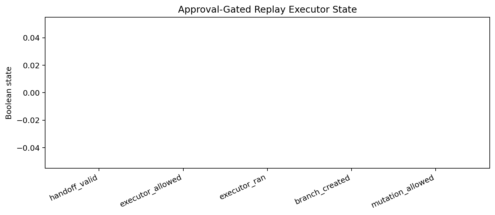
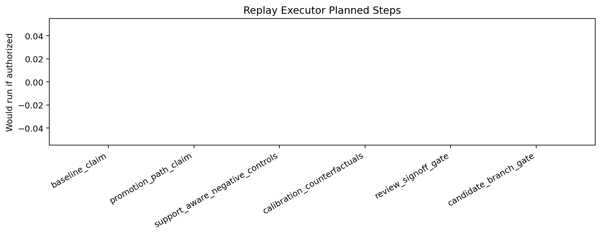
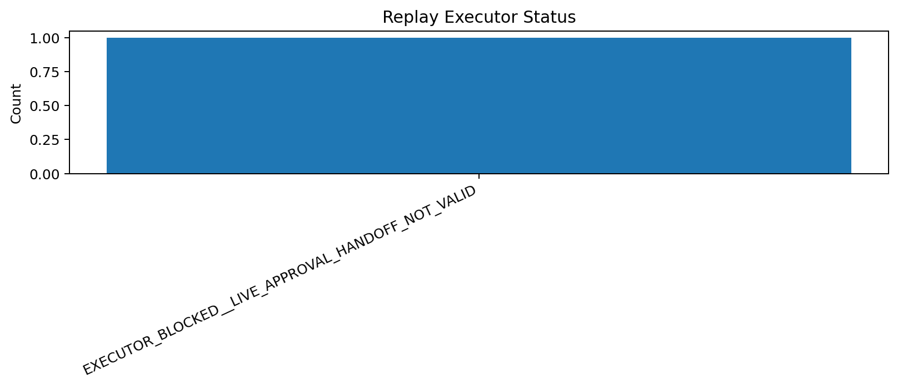

# Tau Scaling v0.6.7 Approval-Gated Replay Executor

Generated: `2026-05-28T07:59:49.853360+00:00`

## Executor Result

- Executor status: `EXECUTOR_BLOCKED__LIVE_APPROVAL_HANDOFF_NOT_VALID`
- Handoff status: `HANDOFF_BLOCKED__NO_LIVE_APPROVAL`
- Handoff valid: `False`
- Executor allowed: `False`
- Executor ran: `False`
- Branch created: `False`
- Mutation allowed: `False`
- Application allowed: `False`

## Executor Plan

| Step | Would run if authorized | Executed now | Command |
|---|---|---|---|
| `baseline_claim` | `False` | `False` | `python -m tau_scaling run-claim --seed configs/seeds/logicfolding_claim_card.json` |
| `promotion_path_claim` | `False` | `False` | `python -m tau_scaling run-claim --seed configs/seeds/logicfolding_promotion_path_claim_card.json` |
| `support_aware_negative_controls` | `False` | `False` | `python scripts/benchmarks/run_support_aware_negative_controls.py` |
| `calibration_counterfactuals` | `False` | `False` | `python scripts/benchmarks/run_calibration_counterfactuals.py` |
| `review_signoff_gate` | `False` | `False` | `python scripts/benchmarks/run_review_signoff_gate.py` |
| `candidate_branch_gate` | `False` | `False` | `python scripts/benchmarks/run_candidate_branch_gate.py` |

## Block Reason

Live approval handoff is not valid for replay. Executor remains blocked.

## Charts

## Boundary

Approval-gated replay executors are local classifier-governance execution-boundary artifacts. This report does not execute replay commands by default, does not create branches, does not mutate classifier behavior, does not apply calibration, and does not validate silicon, products, manufacturing, process nodes, benchmark superiority, or universal Tau Scaling law.
