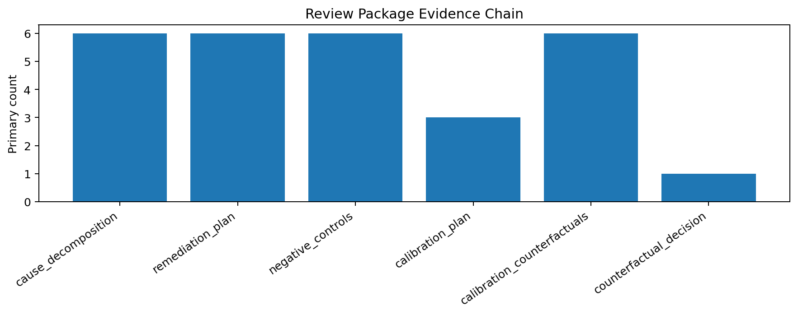
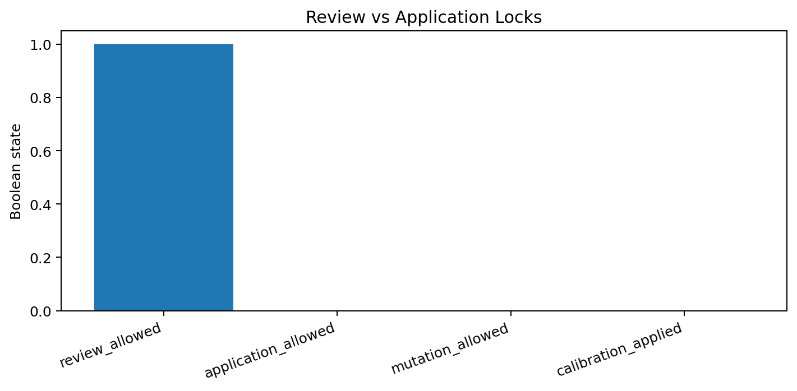
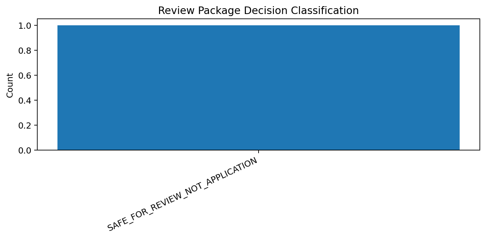

# Tau Scaling v0.5.8 Review Package and Evidence Bundle

Generated: `2026-05-28T07:32:53.928487+00:00`

## Review Decision

- Review package status: `READY_FOR_HUMAN_REVIEW_NOT_APPLICATION`
- Decision class: `SAFE_FOR_REVIEW_NOT_APPLICATION`
- Selected report-only threshold: `0.8`
- Review allowed: `True`
- Application allowed: `False`
- Mutation allowed: `False`
- Policy enforced: `False`
- Calibration applied: `False`

## Evidence Chain

| Stage | Source | Primary metric | Count | Status |
|---|---|---|---:|---|
| cause_decomposition | `reports/over_penalty_causes/latest_over_penalty_cause_decomposition.json` | `cause_card_count` | 6 | `loaded` |
| remediation_plan | `reports/remediation_plan/latest_cause_specific_remediation_plan.json` | `remediation_task_count` | 6 | `loaded` |
| negative_controls | `reports/negative_controls/latest_support_aware_negative_controls.json` | `passed_control_count` | 6 | `loaded` |
| calibration_plan | `reports/calibration_plan/latest_disabled_calibration_plan.json` | `admissible_threshold_count` | 3 | `loaded` |
| calibration_counterfactuals | `reports/calibration_counterfactuals/latest_calibration_counterfactuals.json` | `safe_candidate_count` | 6 | `loaded` |
| counterfactual_decision | `reports/counterfactual_decision/latest_counterfactual_decision_record.json` | `review_allowed` | 1 | `SAFE_FOR_REVIEW_NOT_APPLICATION` |

## Bundle Files

| Bundle Item | Path |
|---|---|
| cause_decomposition | `reports/over_penalty_causes/latest_over_penalty_cause_decomposition.json` |
| remediation_plan | `reports/remediation_plan/latest_cause_specific_remediation_plan.json` |
| negative_controls | `reports/negative_controls/latest_support_aware_negative_controls.json` |
| calibration_plan | `reports/calibration_plan/latest_disabled_calibration_plan.json` |
| calibration_counterfactuals | `reports/calibration_counterfactuals/latest_calibration_counterfactuals.json` |
| counterfactual_decision | `reports/counterfactual_decision/latest_counterfactual_decision_record.json` |

## Charts

## Final Recommendation

Send this package to review. Do not apply calibration, mutate classifier behavior, or enforce policy from this package alone.

## Boundary

Review packages are local classifier-governance evidence bundles. They do not change classifier behavior and do not validate silicon, products, manufacturing, process nodes, benchmark superiority, or universal Tau Scaling law.
