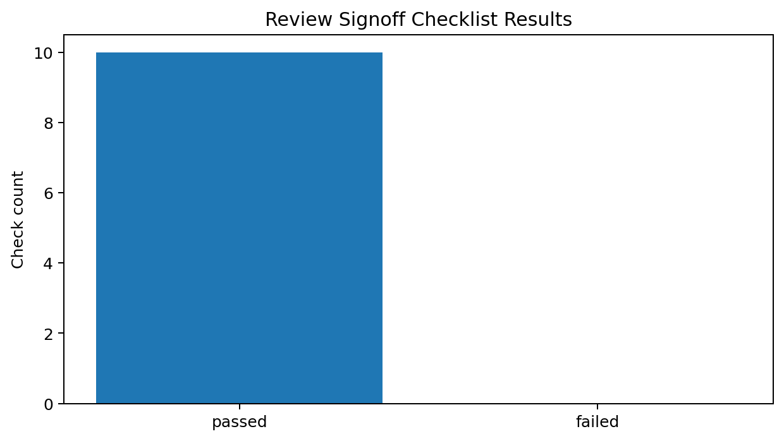
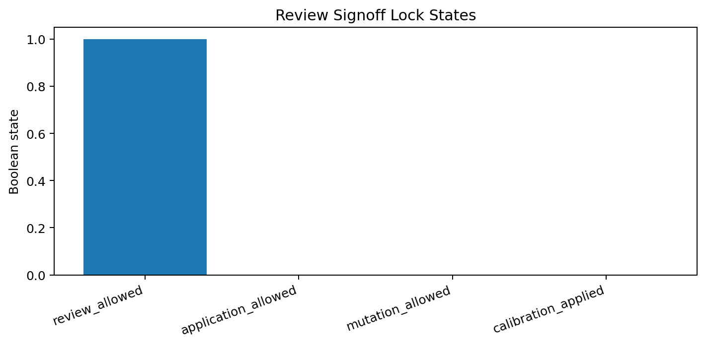
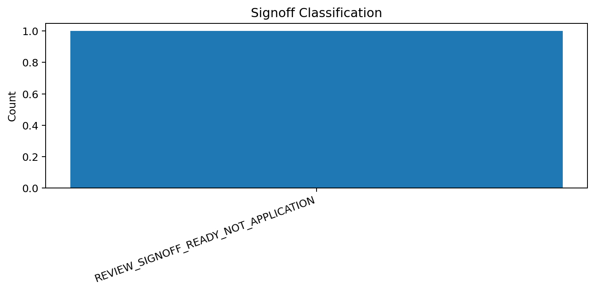

# Tau Scaling v0.5.9 Review Checklist and Signoff Gate

Generated: `2026-05-28T07:35:36.589236+00:00`

## Signoff Result

- Signoff status: `REVIEW_SIGNOFF_READY_NOT_APPLICATION`
- Checklist pass count: `10`
- Checklist fail count: `0`
- Review allowed: `True`
- Application allowed: `False`
- Mutation allowed: `False`
- Calibration applied: `False`
- Final recommendation: `Human review may begin. Application and mutation remain blocked.`

## Checklist

| Check | Passed | Observed | Description |
|---|---|---|---|
| `evidence_bundle_complete` | `True` | `missing_inputs=0` | All v0.5.2-v0.5.7 evidence inputs are present. |
| `review_status_ready` | `True` | `READY_FOR_HUMAN_REVIEW_NOT_APPLICATION` | Review package status is READY_FOR_HUMAN_REVIEW_NOT_APPLICATION. |
| `decision_safe_for_review` | `True` | `SAFE_FOR_REVIEW_NOT_APPLICATION` | Decision class is SAFE_FOR_REVIEW_NOT_APPLICATION. |
| `review_allowed_true` | `True` | `True` | Review is allowed. |
| `application_allowed_false` | `True` | `False` | Application is not allowed. |
| `mutation_allowed_false` | `True` | `False` | Classifier mutation is not allowed. |
| `policy_enforced_false` | `True` | `False` | Policy is not enforced. |
| `calibration_applied_false` | `True` | `False` | Calibration is not applied. |
| `threshold_present` | `True` | `0.8` | A selected report-only threshold is present. |
| `non_claim_boundary_present` | `True` | `boundary_present` | Boundary/non-claim language is present. |

## Charts

## Boundary

Review signoff gates are local classifier-governance signoff artifacts. They do not change classifier behavior and do not validate silicon, products, manufacturing, process nodes, benchmark superiority, or universal Tau Scaling law.
