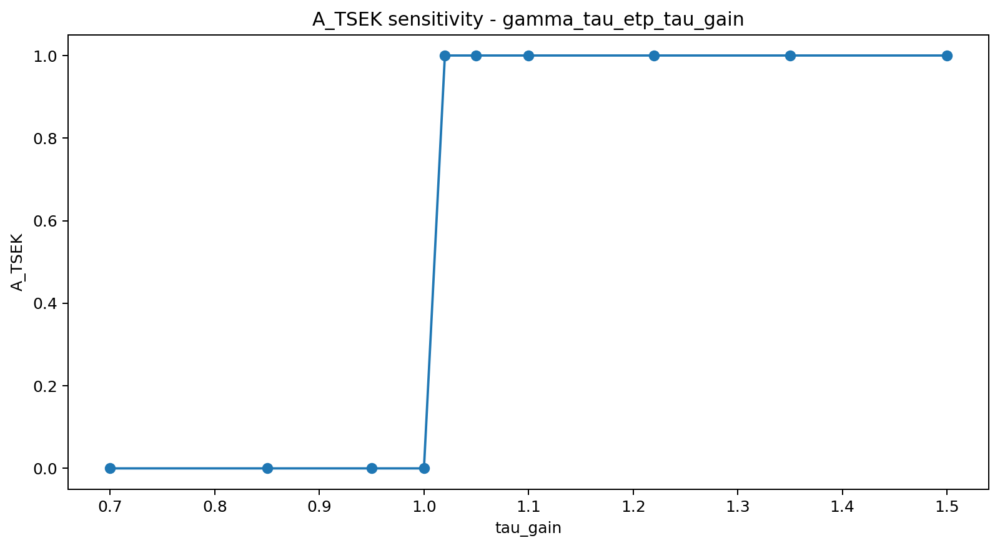
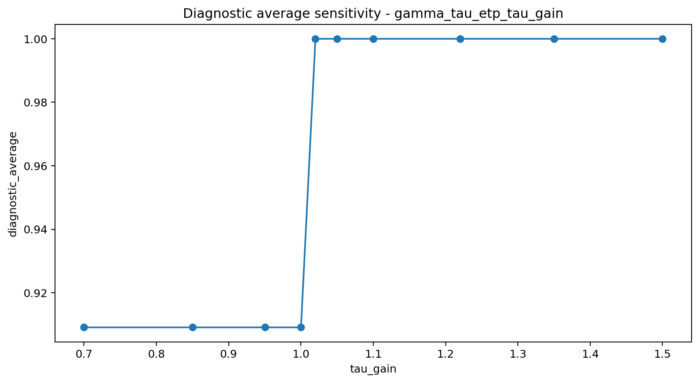
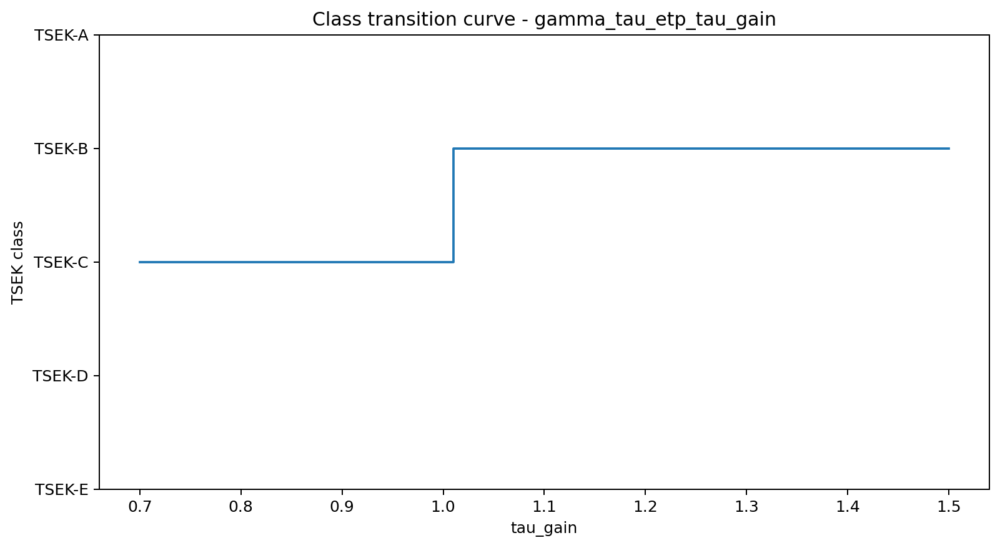
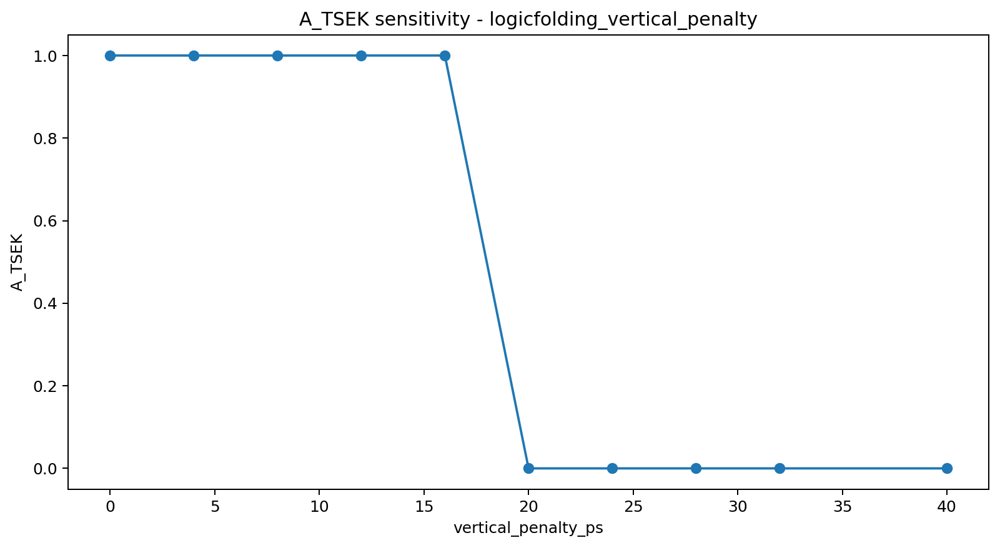
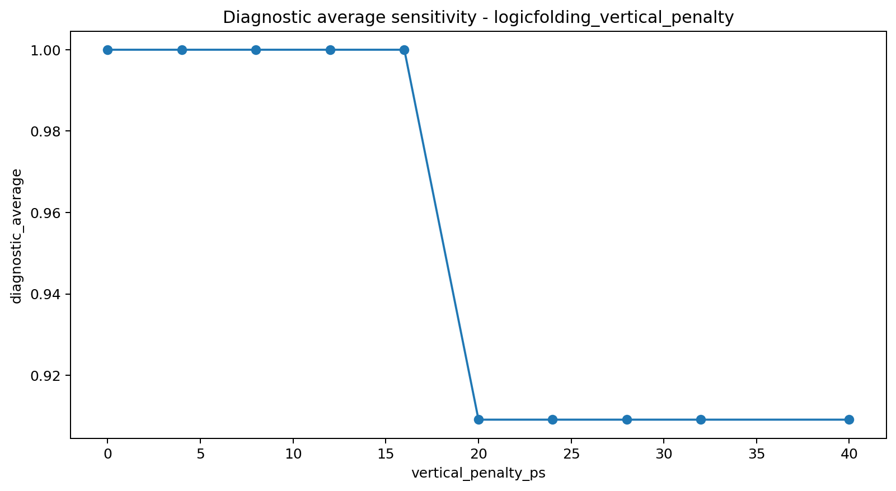
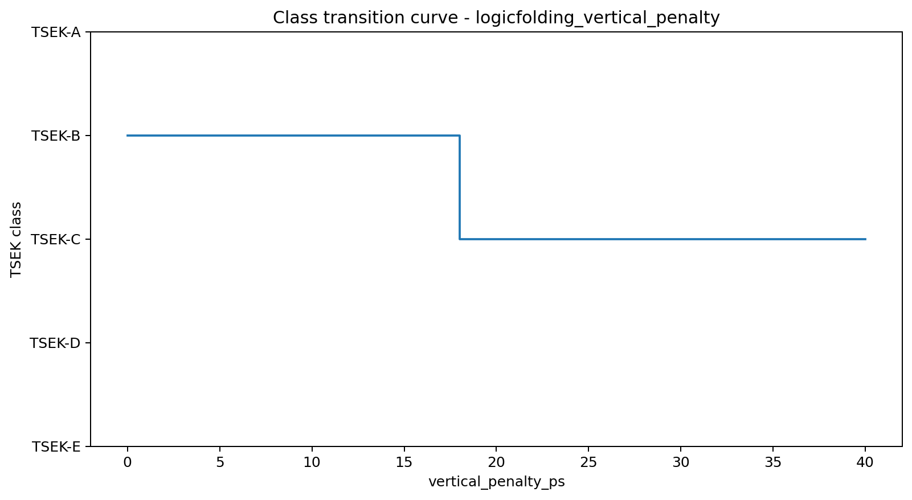
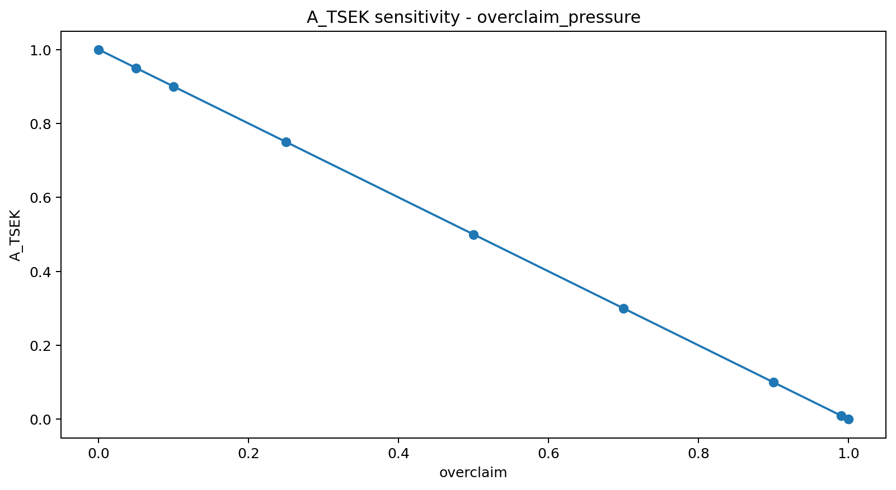
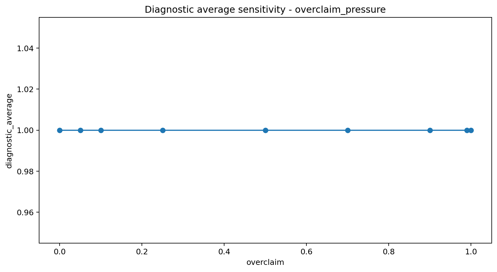
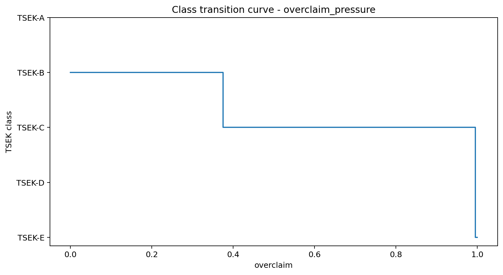
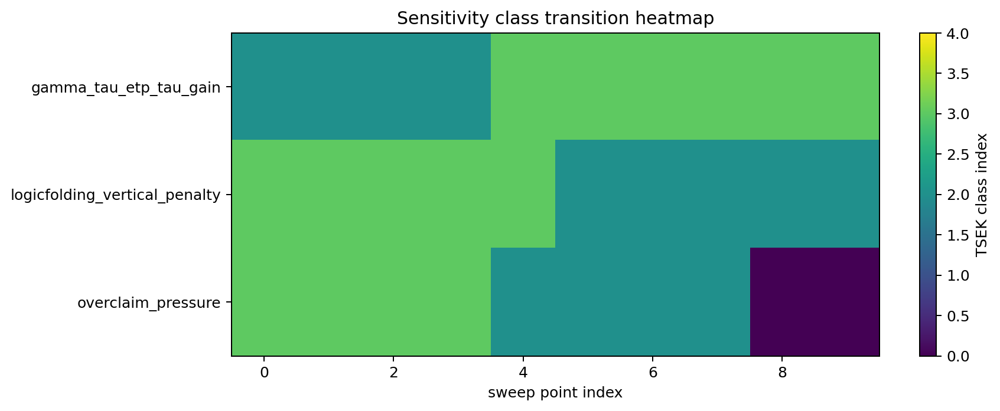

# Tau Scaling v0.4.1 Synthetic Gate Sensitivity Sweep

Generated: `2026-05-26T15:22:34.633044+00:00`

## Result

- Total sweep points: `29`
- Mean elapsed ms: `36.3852`
- Chart count: `10`

## Sweep Summary

| Sweep | Points | Classes | A_TSEK range | Diagnostic avg range | Transitions |
|---|---:|---|---|---|---|
| `gamma_tau_etp_tau_gain` | 10 | TSEK-B:6, TSEK-C:4 | 0.0..1.0 | 0.9091..1.0 | TSEK-C->TSEK-B @ 1.0..1.02 |
| `logicfolding_vertical_penalty` | 10 | TSEK-B:5, TSEK-C:5 | 0.0..1.0 | 0.9091..1.0 | TSEK-B->TSEK-C @ 16.0..20.0 |
| `overclaim_pressure` | 9 | TSEK-B:4, TSEK-C:4, TSEK-E:1 | 0.0..1.0 | 1.0..1.0 | TSEK-B->TSEK-C @ 0.25..0.5; TSEK-C->TSEK-E @ 0.99..1.0 |

## Charts

## Boundary

Sensitivity sweeps are synthetic local runtime diagnostics only. They are not silicon validation, product validation, manufacturing validation, process-node equivalence, benchmark superiority proof, or universal Tau Scaling proof.
