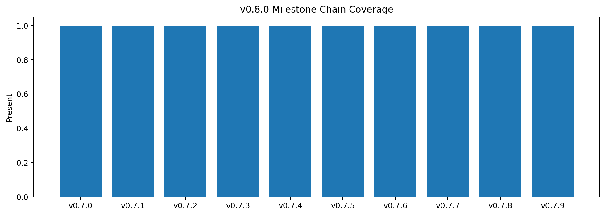
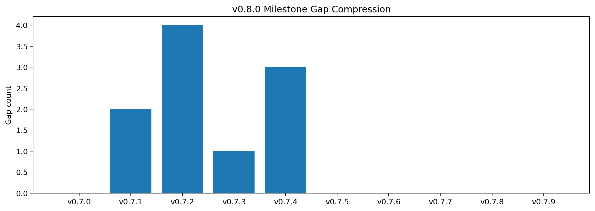
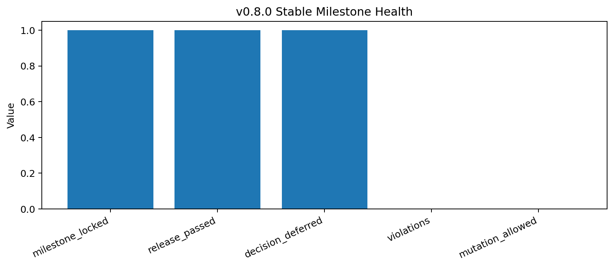

# Tau Scaling v0.8.0 Stable Tau Threshold Governance Milestone

Generated: `2026-05-28T09:04:48.379268+00:00`

## Milestone Result

- Milestone status: `STABLE_TAU_THRESHOLD_GOVERNANCE_MILESTONE_LOCKED__NO_MUTATION`
- Milestone locked: `True`
- Threshold decision: `DEFER_THRESHOLD_CHANGE_PENDING_MORE_EVIDENCE`
- Release passed: `True`
- Threshold governance locked: `True`
- Violation count: `0`
- Missing count: `0`

## Milestone Chain

| Version | Artifact | Status | Gaps | Threshold changed | Classifier changed | Mutation |
|---|---|---|---:|---:|---:|---:|
| `v0.7.0` | `approval_corridor` | `APPROVAL_CORRIDOR_MILESTONE_LOCKED__NO_EXECUTION_NO_MUTATION` | 0 | `False` | `False` | `False` |
| `v0.7.1` | `tau_mechanics` | `TAU_MECHANICS_REVIEW_READY__TARGETED_GAPS_IDENTIFIED` | 2 | `False` | `False` | `False` |
| `v0.7.2` | `tau_vector` | `TAU_VECTOR_SEMANTICS_LEDGER_READY__TARGETED_FIELDS_IDENTIFIED` | 4 | `False` | `False` | `False` |
| `v0.7.3` | `gate_algebra` | `GATE_ALGEBRA_MAP_READY__TARGETED_GATE_GAPS_IDENTIFIED` | 1 | `False` | `False` | `False` |
| `v0.7.4` | `threshold_review` | `TSEK_THRESHOLD_BOUNDARY_REVIEW_READY__NO_THRESHOLD_CHANGE` | 3 | `False` | `False` | `False` |
| `v0.7.5` | `boundary_cards` | `TSEK_BOUNDARY_CARDS_READY__NO_THRESHOLD_CHANGE` | 0 | `False` | `False` | `False` |
| `v0.7.6` | `penalty_controls` | `PENALTY_CONTROLS_DEFINED__REPORT_ONLY_NO_MUTATION` | 0 | `False` | `False` | `False` |
| `v0.7.7` | `threshold_sensitivity` | `THRESHOLD_SENSITIVITY_DRY_RUN_READY__REPORT_ONLY_NO_MUTATION` | 0 | `False` | `False` | `False` |
| `v0.7.8` | `threshold_decision` | `THRESHOLD_DECISION_RECORDED__NO_MUTATION` | 0 | `False` | `False` | `False` |
| `v0.7.9` | `threshold_governance` | `THRESHOLD_GOVERNANCE_SUMMARY_LOCKED__DEFER_CHANGE_NO_MUTATION` | 0 | `False` | `False` | `False` |

## Stable Decision

The stable v0.8.0 decision is to **defer threshold change pending more evidence**. The system found real pressure surfaces, but not enough evidence to tune thresholds or mutate classifier behavior.

## Explicit Locks

```text
thresholds_changed: false
classifier_changed: false
mutation_allowed: false
application_allowed: false
calibration_applied: false
candidate_branch_created: false
```

## What This Milestone Means

v0.8.0 closes the first Tau mechanics return arc: approval containment, tau semantics, gate algebra, threshold review, boundary cards, penalty controls, dry-run, decision record, and governance summary.

## Next Work

1. Add more scenario evidence for the two high-attention threshold pressures.
2. Keep thresholds frozen unless human review explicitly requests a candidate branch.
3. Keep classifier mutation disabled.
4. Use v0.8.x for evidence expansion, not threshold tuning.

## Charts







## Boundary

Stable Tau threshold governance milestones are local classifier-governance milestone artifacts. They package evidence, dry-runs, and decisions into a stable release surface. They do not create live approval, execute replay commands, create branches, mutate classifier behavior, apply calibration, change thresholds, or validate silicon, products, manufacturing, process nodes, benchmark superiority, or universal Tau Scaling law.
