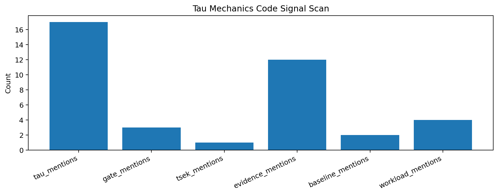
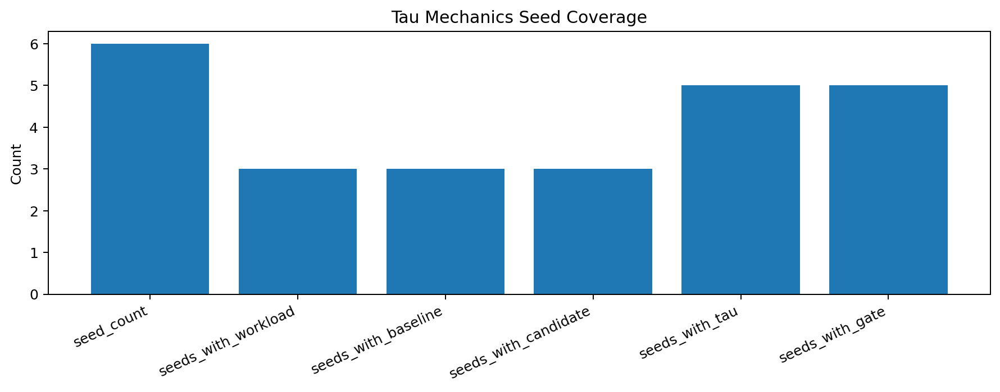
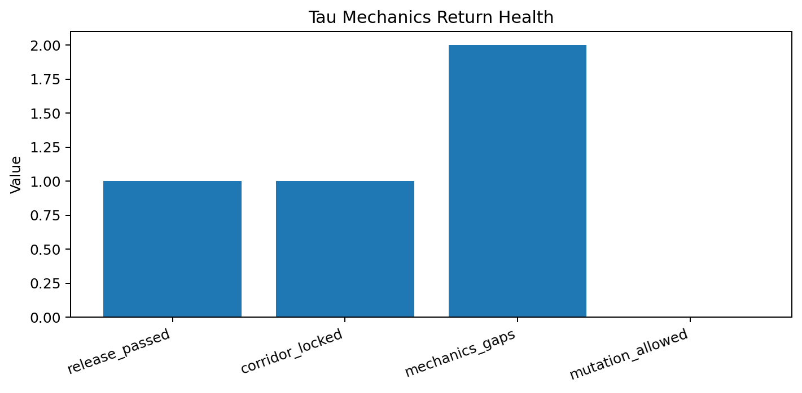

# Tau Scaling v0.7.1 Tau Mechanics Return Review

Generated: `2026-05-28T08:33:03.885101+00:00`

## Review Result

- Mechanics status: `TAU_MECHANICS_REVIEW_READY__TARGETED_GAPS_IDENTIFIED`
- Release passed: `True`
- Approval corridor locked: `True`
- Seed count: `6`
- Gap count: `2`
- Mutation allowed: `False`

## Core Code Signals

| Signal | Count |
|---|---:|
| `tau_mentions` | 17 |
| `gate_mentions` | 3 |
| `tsek_mentions` | 1 |
| `evidence_mentions` | 12 |
| `baseline_mentions` | 2 |
| `workload_mentions` | 4 |

## Seed Coverage

| Seed | Workload | Baseline | Candidate | Tau | Gate |
|---|---:|---:|---:|---:|---:|
| `configs/seeds/codex_tau_vector_toy.json` | `True` | `True` | `True` | `True` | `True` |
| `configs/seeds/edge_surface_boundary_toy.json` | `False` | `False` | `False` | `False` | `False` |
| `configs/seeds/gamma_tau_etp_toy.json` | `False` | `False` | `False` | `True` | `True` |
| `configs/seeds/logicfolding_claim_card.json` | `True` | `True` | `True` | `True` | `True` |
| `configs/seeds/logicfolding_promotion_path_claim_card.json` | `True` | `True` | `True` | `True` | `True` |
| `configs/seeds/monte_carlo_stress_toy.json` | `False` | `False` | `False` | `True` | `True` |

## Targeted Gaps

- `some_seed_cards_do_not_surface_tau_terms`
- `some_seed_cards_do_not_surface_gate_terms`

## Next Tau Work

1. Define the tau-vector field names and units more explicitly.
2. Separate gate algebra from classifier scoring in documentation and tests.
3. Review TSEK threshold definitions and downgrade/promotion boundaries.
4. Connect synthetic gate suite outputs back to claim-card evidence requirements.
5. Add negative controls for tau-vector overfitting and gate over-penalty.

## Charts

## Boundary

Tau mechanics return reviews are local classifier-governance analysis artifacts. They inspect runtime mechanics and evidence surfaces. They do not create live approval, execute replay commands, create branches, mutate classifier behavior, apply calibration, or validate silicon, products, manufacturing, process nodes, benchmark superiority, or universal Tau Scaling law.
