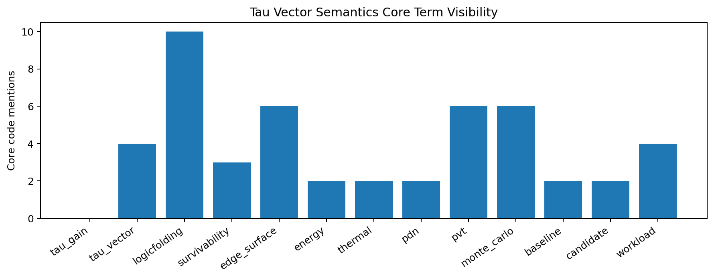
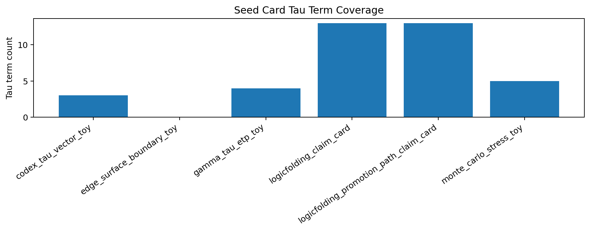
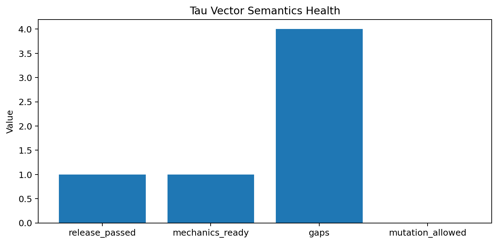

# Tau Scaling v0.7.2 Tau Vector Semantics Ledger

Generated: `2026-05-28T08:35:59.374406+00:00`

## Ledger Result

- Semantics status: `TAU_VECTOR_SEMANTICS_LEDGER_READY__TARGETED_FIELDS_IDENTIFIED`
- Release passed: `True`
- Mechanics ready: `True`
- Seed count: `6`
- Gap count: `4`

## Tau Term Ledger

| Term | Core count | Status |
|---|---:|---|
| `tau_gain` | 0 | `seed_or_report_only` |
| `tau_vector` | 4 | `core_visible` |
| `logicfolding` | 10 | `core_visible` |
| `survivability` | 3 | `core_visible` |
| `edge_surface` | 6 | `core_visible` |
| `energy` | 2 | `core_visible` |
| `thermal` | 2 | `core_visible` |
| `pdn` | 2 | `core_visible` |
| `pvt` | 6 | `core_visible` |
| `monte_carlo` | 6 | `core_visible` |
| `baseline` | 2 | `core_visible` |
| `candidate` | 2 | `core_visible` |
| `workload` | 4 | `core_visible` |

## Seed Semantics

| Seed | Tau terms | Workload | Baseline | Candidate | Gate |
|---|---:|---:|---:|---:|---:|
| `configs/seeds/codex_tau_vector_toy.json` | 3 | `True` | `True` | `True` | `True` |
| `configs/seeds/edge_surface_boundary_toy.json` | 0 | `False` | `False` | `False` | `False` |
| `configs/seeds/gamma_tau_etp_toy.json` | 4 | `False` | `False` | `False` | `True` |
| `configs/seeds/logicfolding_claim_card.json` | 13 | `True` | `True` | `True` | `True` |
| `configs/seeds/logicfolding_promotion_path_claim_card.json` | 13 | `True` | `True` | `True` | `True` |
| `configs/seeds/monte_carlo_stress_toy.json` | 5 | `False` | `False` | `False` | `True` |

## Targeted Gaps

- `some_seed_cards_do_not_explicitly_surface_tau_terms`
- `some_seed_cards_do_not_explicitly_surface_gate_terms`
- `some_seed_cards_do_not_explicitly_surface_baseline_terms`
- `tau_vector_or_tau_gain_semantics_need_more_explicit_core_naming`

## Next Tau Work

1. Convert implicit tau terms into an explicit tau-vector schema table.
2. Define field-level semantics: what each tau component means, what evidence supports it, and which gates consume it.
3. Add claim-card negative controls for overloaded tau fields.
4. Review TSEK score sensitivity to individual tau-vector components.

## Charts

## Boundary

Tau vector semantics ledgers are local classifier-governance analysis artifacts. They document semantics and evidence surfaces. They do not create live approval, execute replay commands, create branches, mutate classifier behavior, apply calibration, or validate silicon, products, manufacturing, process nodes, benchmark superiority, or universal Tau Scaling law.
