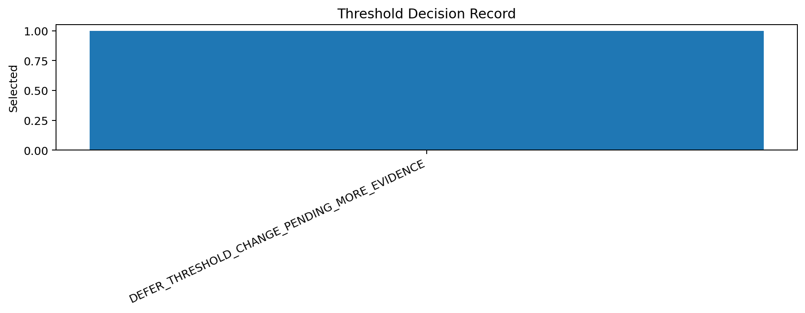
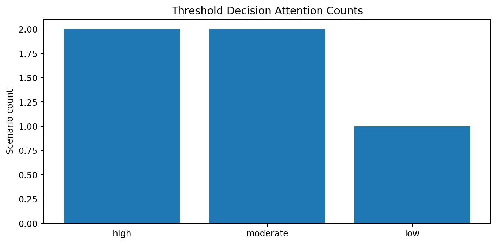
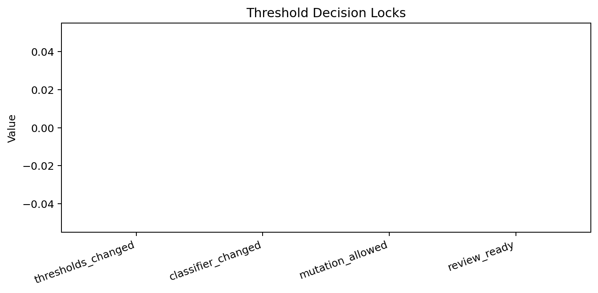

# Tau Scaling v0.7.8 Threshold Decision Record

Generated: `2026-05-28T09:01:43.052617+00:00`

## Decision Result

- Decision status: `THRESHOLD_DECISION_RECORDED__NO_MUTATION`
- Threshold decision: `DEFER_THRESHOLD_CHANGE_PENDING_MORE_EVIDENCE`
- Rationale: High-attention threshold pressure exists; threshold tuning is not justified without additional evidence and review.
- Release passed: `True`
- Dry-run ready: `True`
- Controls ready: `True`
- Boundary cards ready: `True`

## Attention Counts

- High attention: `2`
- Moderate attention: `2`
- Low attention: `1`
- Scenario count: `5`

## Explicit Locks

```text
thresholds_changed: false
classifier_changed: false
mutation_allowed: false
application_allowed: false
calibration_applied: false
```

## Interpretation

This decision record converts the report-only sensitivity dry-run into a governance decision. It does not tune thresholds, alter classifier scoring, or authorize mutation.

## Next Tau Work

1. If decision is report-only review-ready, prepare a human-readable summary of the pressure surfaces.
2. If decision is deferred, gather additional scenario evidence before any candidate branch.
3. If decision is rejected, freeze current thresholds and document why.
4. Preserve no-threshold-change and no-classifier-mutation locks.

## Charts







## Boundary

Threshold decision records are local classifier-governance decision artifacts. They convert report-only dry-run evidence into a non-mutating decision. They do not create live approval, execute replay commands, create branches, mutate classifier behavior, apply calibration, change thresholds, or validate silicon, products, manufacturing, process nodes, benchmark superiority, or universal Tau Scaling law.
