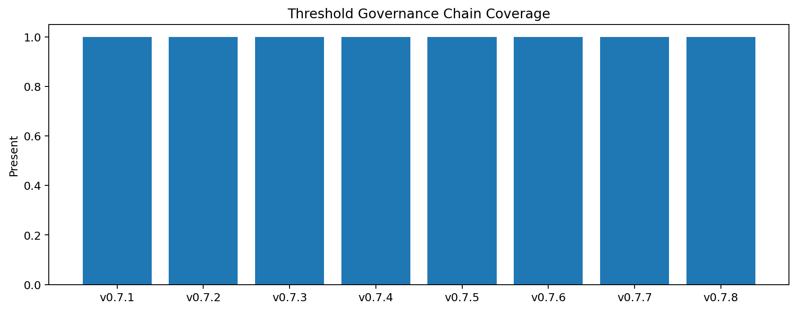
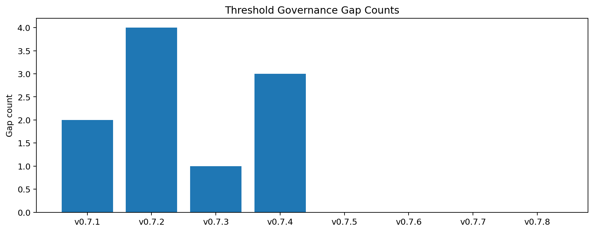
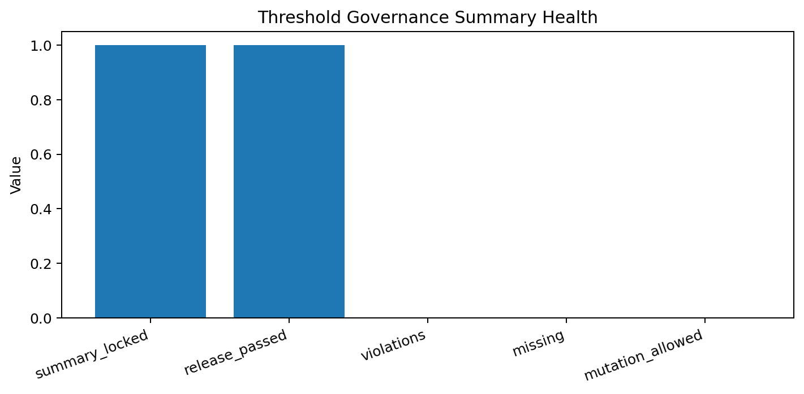

# Tau Scaling v0.7.9 Threshold Governance Summary

Generated: `2026-05-28T09:01:44.539236+00:00`

## Summary Result

- Summary status: `THRESHOLD_GOVERNANCE_SUMMARY_LOCKED__DEFER_CHANGE_NO_MUTATION`
- Summary locked: `True`
- Threshold decision: `DEFER_THRESHOLD_CHANGE_PENDING_MORE_EVIDENCE`
- Release passed: `True`
- Violation count: `0`
- Missing count: `0`

## Threshold Decision

- Decision status: `THRESHOLD_DECISION_RECORDED__NO_MUTATION`
- Rationale: High-attention threshold pressure exists; threshold tuning is not justified without additional evidence and review.
- Scenario count: `5`
- High attention count: `2`

## v0.7.x Chain

| Version | Artifact | Status | Gaps | Threshold changed | Classifier changed | Mutation |
|---|---|---|---:|---:|---:|---:|
| `v0.7.1` | `tau_mechanics` | `TAU_MECHANICS_REVIEW_READY__TARGETED_GAPS_IDENTIFIED` | 2 | `False` | `False` | `False` |
| `v0.7.2` | `tau_vector` | `TAU_VECTOR_SEMANTICS_LEDGER_READY__TARGETED_FIELDS_IDENTIFIED` | 4 | `False` | `False` | `False` |
| `v0.7.3` | `gate_algebra` | `GATE_ALGEBRA_MAP_READY__TARGETED_GATE_GAPS_IDENTIFIED` | 1 | `False` | `False` | `False` |
| `v0.7.4` | `threshold_review` | `TSEK_THRESHOLD_BOUNDARY_REVIEW_READY__NO_THRESHOLD_CHANGE` | 3 | `False` | `False` | `False` |
| `v0.7.5` | `boundary_cards` | `TSEK_BOUNDARY_CARDS_READY__NO_THRESHOLD_CHANGE` | 0 | `False` | `False` | `False` |
| `v0.7.6` | `penalty_controls` | `PENALTY_CONTROLS_DEFINED__REPORT_ONLY_NO_MUTATION` | 0 | `False` | `False` | `False` |
| `v0.7.7` | `sensitivity` | `THRESHOLD_SENSITIVITY_DRY_RUN_READY__REPORT_ONLY_NO_MUTATION` | 0 | `False` | `False` | `False` |
| `v0.7.8` | `decision` | `THRESHOLD_DECISION_RECORDED__NO_MUTATION` | 0 | `False` | `False` | `False` |

## Governance Conclusion

The current threshold decision is **defer threshold change pending more evidence**. This is the correct outcome because report-only sensitivity found high-attention pressure while preserving all mutation and threshold locks.

## Explicit Locks

```text
thresholds_changed: false
classifier_changed: false
mutation_allowed: false
application_allowed: false
calibration_applied: false
```

## Next Tau Work

1. Freeze current thresholds unless human review requests a candidate branch.
2. Add more scenario evidence for high-attention pressure surfaces.
3. Preserve current classifier until stronger evidence exists.
4. Consider v0.8.0 as a stable Tau threshold governance milestone.

## Charts







## Boundary

Threshold governance summaries are local classifier-governance milestone artifacts. They summarize threshold review, controls, dry-runs, and decisions. They do not create live approval, execute replay commands, create branches, mutate classifier behavior, apply calibration, change thresholds, or validate silicon, products, manufacturing, process nodes, benchmark superiority, or universal Tau Scaling law.
