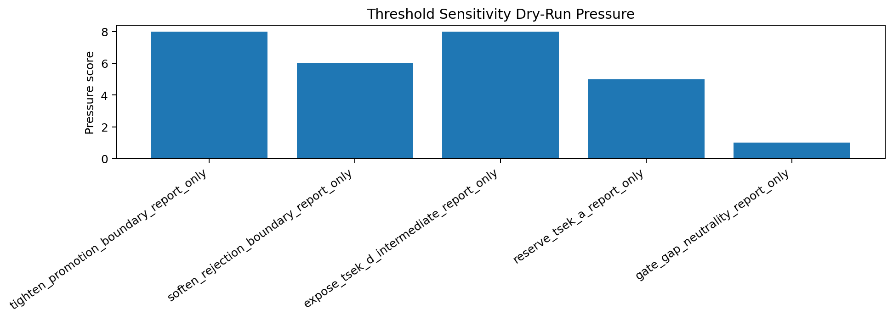
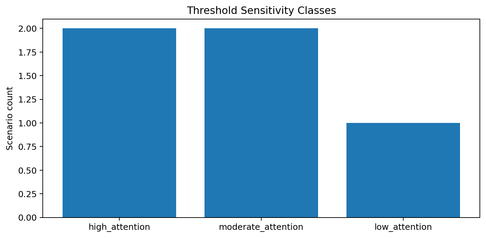
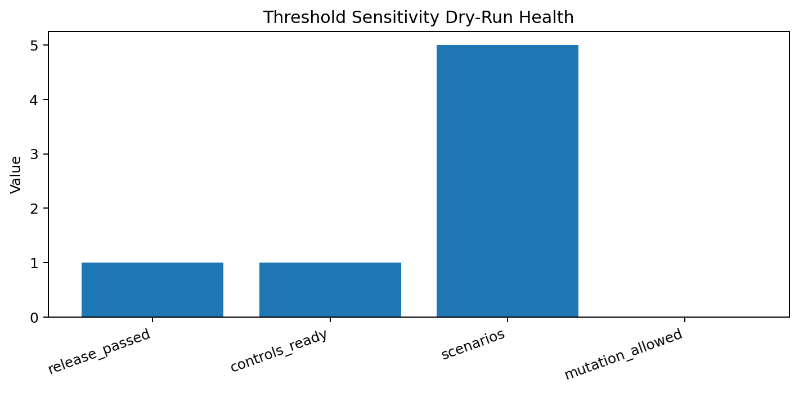

# Tau Scaling v0.7.7 Threshold Sensitivity Dry-Run

Generated: `2026-05-28T08:54:46.347007+00:00`

## Dry-Run Result

- Dry-run status: `THRESHOLD_SENSITIVITY_DRY_RUN_READY__REPORT_ONLY_NO_MUTATION`
- Release passed: `True`
- Controls ready: `True`
- Scenario count: `5`
- Thresholds changed: `False`
- Classifier changed: `False`

## Report-Only Scenarios

| Scenario | Direction | Target | Pressure | Sensitivity |
|---|---|---|---:|---|
| `tighten_promotion_boundary_report_only` | `promotion_harder` | `TSEK-B/TSEK-C` | 8 | `high_attention` |
| `soften_rejection_boundary_report_only` | `rejection_harder_to_trigger` | `TSEK-C/TSEK-E` | 6 | `moderate_attention` |
| `expose_tsek_d_intermediate_report_only` | `intermediate_visibility` | `TSEK-C/TSEK-D/TSEK-E` | 8 | `high_attention` |
| `reserve_tsek_a_report_only` | `strong_class_guard` | `TSEK-A/TSEK-B` | 5 | `moderate_attention` |
| `gate_gap_neutrality_report_only` | `no_direct_penalty` | `gate_family_to_tsek_score` | 1 | `low_attention` |

## Interpretation

This dry-run only models where threshold sensitivity should be inspected. It does not change thresholds, class logic, or runtime classifier behavior.

## Next Tau Work

1. Convert high-attention sensitivity scenarios into a decision record.
2. Decide whether any scenario deserves a future candidate branch proposal.
3. Keep all changes report-only until explicit human review.
4. Preserve local-runtime evidence boundary.

## Charts

## Boundary

Threshold sensitivity dry-runs are local classifier-governance analysis artifacts. They model sensitivity pressure using report-only controls. They do not create live approval, execute replay commands, create branches, mutate classifier behavior, apply calibration, change thresholds, or validate silicon, products, manufacturing, process nodes, benchmark superiority, or universal Tau Scaling law.
