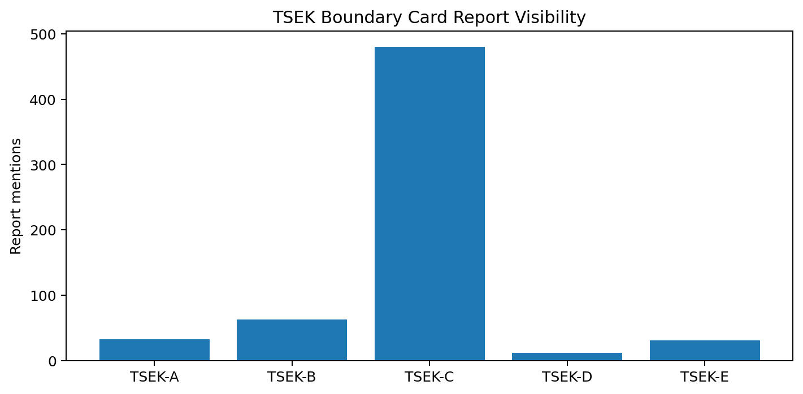
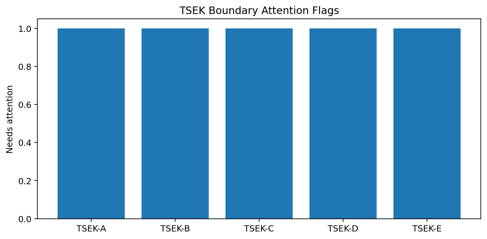
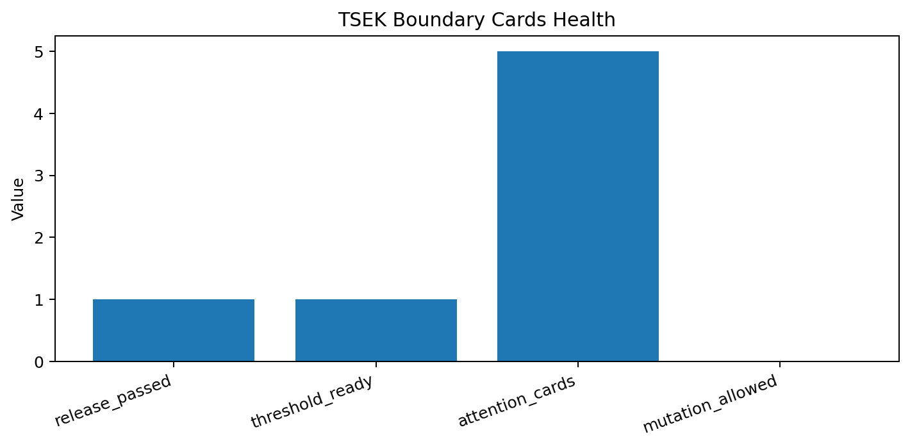

# Tau Scaling v0.7.5 TSEK Boundary Explanation Cards

Generated: `2026-05-28T08:43:27.607788+00:00`

## Card Result

- Card status: `TSEK_BOUNDARY_CARDS_READY__NO_THRESHOLD_CHANGE`
- Release passed: `True`
- Threshold review ready: `True`
- Card count: `5`
- Attention cards: `5`
- Thresholds changed: `False`
- Classifier changed: `False`

## Boundary Cards

| Class | Role | Report mentions | Core mentions | Needs attention | Default action |
|---|---|---:|---:|---:|---|
| `TSEK-A` | `reserved_strong_claim_class` | 32 | 0 | `True` | `keep_unassigned_without_external_evidence` |
| `TSEK-B` | `stronger_local_evidence_class` | 63 | 0 | `True` | `allow_local_strong_evidence_label_only` |
| `TSEK-C` | `bounded_baseline_or_partial_evidence_class` | 480 | 0 | `True` | `preserve_controlled_downgrade` |
| `TSEK-D` | `weak_or_high_uncertainty_class` | 12 | 0 | `True` | `explain_weakness_without_rejection` |
| `TSEK-E` | `rejected_or_severe_failure_class` | 31 | 0 | `True` | `reject_or_block_promotion` |

## Interpretation

These cards explain class boundaries. They do not tune thresholds, alter downgrade policy, or mutate the classifier.

## Next Tau Work

1. Build over/under-penalty negative controls for the class boundaries flagged here.
2. Ensure TSEK-D and TSEK-A absence/presence is intentional rather than accidental.
3. Separate evidence sufficiency from hard-gate collapse in explanation language.
4. Keep thresholds unchanged until dry-run sensitivity evidence exists.

## Charts

## Boundary

TSEK boundary explanation cards are local classifier-governance analysis artifacts. They explain class-boundary semantics without changing classifier behavior. They do not create live approval, execute replay commands, create branches, mutate classifier behavior, apply calibration, or validate silicon, products, manufacturing, process nodes, benchmark superiority, or universal Tau Scaling law.
