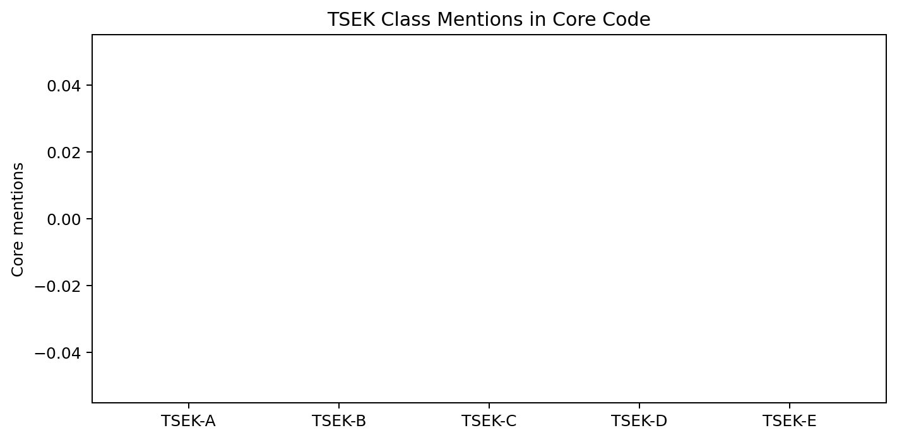
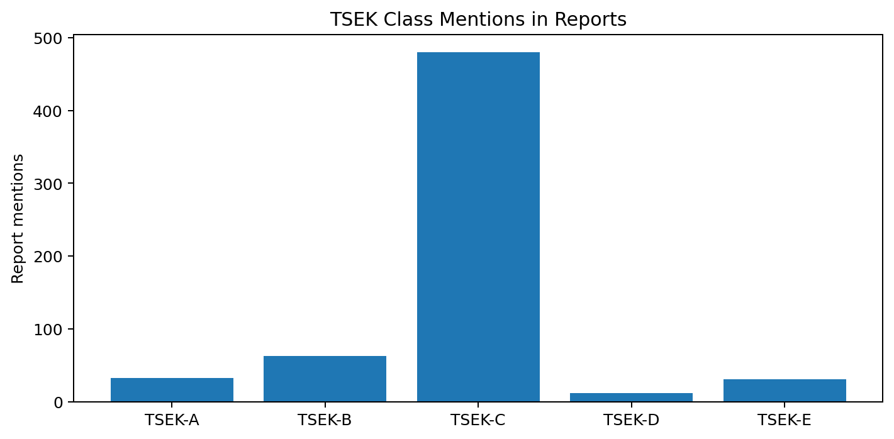
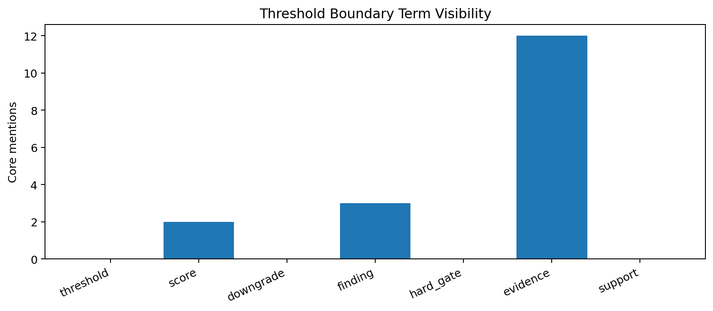

# Tau Scaling v0.7.4 TSEK Threshold Boundary Review

Generated: `2026-05-28T08:40:17.414916+00:00`

## Review Result

- Threshold review status: `TSEK_THRESHOLD_BOUNDARY_REVIEW_READY__NO_THRESHOLD_CHANGE`
- Release passed: `True`
- Gate algebra ready: `True`
- Gap count: `3`
- Mutation allowed: `False`

## Core TSEK Class Visibility

| Class | Core mentions | Report mentions |
|---|---:|---:|
| `TSEK-A` | 0 | 32 |
| `TSEK-B` | 0 | 63 |
| `TSEK-C` | 0 | 480 |
| `TSEK-D` | 0 | 12 |
| `TSEK-E` | 0 | 31 |

## Threshold Term Visibility

| Term | Core mentions |
|---|---:|
| `threshold` | 0 |
| `score` | 2 |
| `downgrade` | 0 |
| `finding` | 3 |
| `hard_gate` | 0 |
| `evidence` | 12 |
| `support` | 0 |

## Numeric Literals Observed

```text
0.0
```

## Targeted Gaps

- `tsek_classes_not_visible_in_core_code`
- `threshold_terms_not_explicit_in_classifier_scan`
- `downgrade_terms_not_explicit_in_classifier_scan`

## Boundary Decision

This layer is **review-only**. It does not alter thresholds, class weights, downgrade logic, support constraints, or classifier behavior.

## Next Tau Work

1. Build a TSEK threshold table from current classifier logic.
2. Add non-mutating threshold explanation cards for each class boundary.
3. Compare observed report class distributions against expected downgrade/promotion pathways.
4. Design under-penalty and over-penalty negative controls before any threshold change.

## Charts







## Boundary

TSEK threshold boundary reviews are local classifier-governance analysis artifacts. They inspect current threshold/class-boundary visibility without changing classifier behavior. They do not create live approval, execute replay commands, create branches, mutate classifier behavior, apply calibration, or validate silicon, products, manufacturing, process nodes, benchmark superiority, or universal Tau Scaling law.
